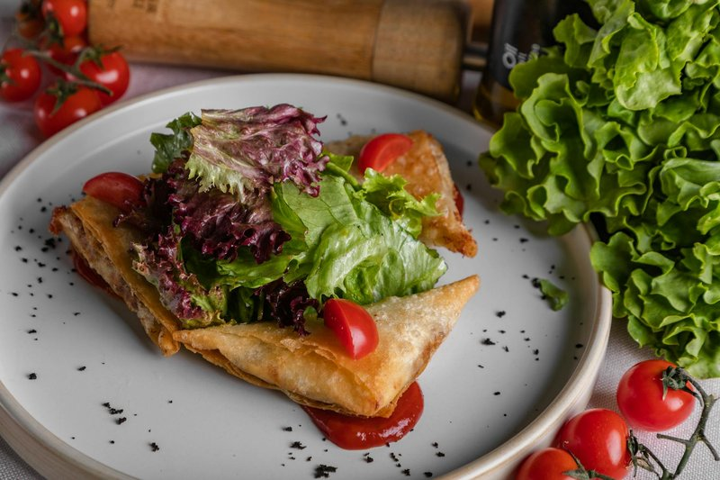

# Yemeni Sambusa

*Yemen's samosa: small triangular fried pastries filled with spiced minced lamb, onion and chilli. The traditional Ramadan iftar snack.*

**Serves:** 6 (makes about 24)

**Prep Time:** 40 minutes

**Cook Time:** 20 minutes

## Overview
Yemeni sambusa are the small triangular fried pastries that turn up at every Ramadan iftar table across the Arabian Peninsula, filled with spiced minced lamb, onion and a fresh green chilli kick, deep-fried till the wrapper shatters at the first bite and served with a wedge of lemon and a small bowl of sahawiq for dipping. The whole production hangs on two technical moves: cool the filling completely before folding (warm filling steams the pastry from inside and destroys the seal), and use spring-roll pastry strips folded by the flag method for the clean triangular shape. Brown lamb mince hard in oil in a wide pan, breaking it up as it cooks, then pour off the excess fat. Add finely chopped onion for 5 minutes till soft, then garlic, ginger and the spice mix (cumin, coriander, cinnamon, cardamom and turmeric) for a minute till the spices toast and the kitchen fills with Sana'a-souk aroma. Add a finely chopped green chilli, splash in 100 ml of water and simmer 5 minutes till the pan is dry, then off the heat with chopped coriander, parsley and a squeeze of lemon. Season generously, spread on a tray to cool completely. Cut spring-roll pastry sheets into long 8 cm wide strips, mix a paste of plain flour with three tablespoons of water for sealing. Place a strip on the board, drop a teaspoon of cooled filling at the bottom-right corner, fold the corner up to the left edge into a triangle, then continue folding the triangle up the strip in the flag-fold style, brush the tail with flour paste and tuck to seal. Heat oil to 170°C and fry in batches of six for two and a half to three minutes turning till deep gold and crisp, drain on kitchen paper. Stack on a plate and eat warm with lemon wedges and a small bowl of sahawiq for dipping; the first three or four folds will be wobbly, but the muscle memory clicks in by the fifth.

## Ingredients

### Filling
- 400 g lamb mince (or beef)
- 2 tablespoons vegetable oil
- 1 onion (medium, very finely chopped)
- 4 garlic cloves (crushed)
- 1 thumb fresh ginger (grated)
- 1 ½ teaspoons ground cumin
- 1 ½ teaspoons ground coriander
- ½ teaspoon ground cinnamon
- ½ teaspoon ground cardamom
- ½ teaspoon ground turmeric
- 1 fresh green chilli (very finely chopped)
- 3 tablespoons fresh coriander (chopped)
- 3 tablespoons fresh parsley (chopped)
- ½ lemon (juice)
- salt
- pepper

### Wrapping and frying
- 24 spring-roll pastry sheets (cut into 8 x 25 cm strips)
- 2 tablespoons plain flour (with 3 tablespoons water)
- 1 litre vegetable oil for deep frying
- Lemon wedges and sahawiq, to serve

## Method

### Stage 1 - Filling
1. Heat the oil in a wide pan over medium-high heat.
1. Brown the lamb hard, breaking it up; pour off excess fat.
1. Add the onion; cook 5 minutes until soft.
1. Stir in garlic, ginger and all the spices; cook 1 minute.
1. Add the chilli; splash in 100 ml water; simmer 5 minutes until dry.
1. Stir in coriander, parsley, lemon juice; season generously with salt and pepper.
1. Spread on a tray; cool completely.

### Stage 2 - Fold
1. Place a pastry strip on the board; put a teaspoon of cooled filling at the bottom-right corner.
1. Fold the corner up to the left edge into a triangle.
1. Continue folding the triangle up the length of the strip - flag fold style.
1. At the tail, brush with flour-water paste; tuck and seal.

### Stage 3 - Fry
1. Heat the oil to 170°C in a deep pan.
1. Fry in batches of 6, 2 ½-3 minutes total, turning, until deep gold and crisp.
1. Drain on kitchen paper.

### Stage 4 - Serve
1. Stack on a plate; eat warm with lemon wedges and sahawiq for dipping.

## Notes
- **Cool filling:** Cannot stress this enough - warm filling steams the pastry from inside and destroys the seal.
- **Fold practice:** The first three or four samosas will be wobbly. After that, the muscle memory clicks in.
- **Make ahead and freeze:** Fold all 24, freeze on a tray, bag. Fry from frozen, adding 1 minute per side.

## Storage
- Refrigerate 2 days; re-crisp at 200°C for 6 minutes.
- Freeze unfried up to 2 months.
