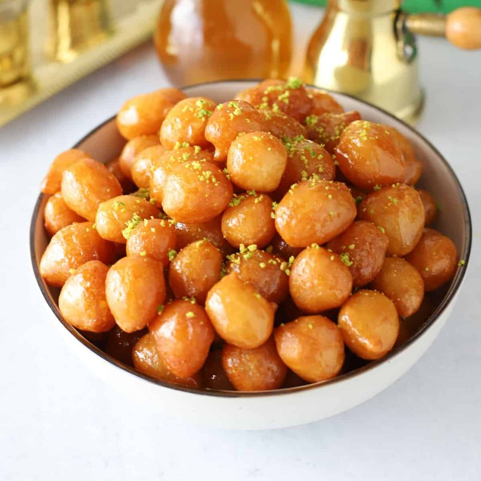

# Zalabia

*Yemen's after-iftar sweet: small cardamom-and-saffron-scented fried dough balls drenched in honey. Crisp shell, soft middle, sticky-glazed top.*

**Serves:** 6 (makes about 30 small balls)

**Prep Time:** 10 minutes (plus 1 hour rising)

**Cook Time:** 20 minutes

## Overview
A loose, slightly slack yeasted batter (no kneading) rises for 1 hour. Small balls are scooped with two teaspoons or by hand-squeeze, dropped into hot oil at 170°C, fried until golden, drained briefly, then soaked in honey while still warm. The cardamom and saffron flavour the batter; the honey sets a glossy thin coat on the outside.

## Ingredients

### Batter
- 350 g plain flour
- 50 g cornflour
- 1 sachet (7 g) fast-action yeast
- 2 tablespoons caster sugar
- ½ teaspoon salt
- ½ teaspoon ground cardamom
- 1 large pinch saffron threads (bloomed in 1 tablespoon hot water)
- 400 ml warm water (more if needed)
- 1 litre vegetable oil for deep frying

### Honey soak
- 250 g dark honey
- 100 ml water
- 1 tablespoon lemon juice

## Method

### Stage 1 - Batter
1. Whisk flour, cornflour, yeast, sugar, salt and cardamom in a bowl.
1. Add the saffron-water and the warm water gradually; whisk to a thick, sticky batter (like pancake batter but slightly stiffer).
1. Cover; rest in a warm spot 1 hour until visibly bubbly and almost doubled.

### Stage 2 - Honey soak
1. Warm the honey, water and lemon juice in a small pan until just combined and pourable.
1. Keep on a low heat - the syrup needs to be warm but not boiling.

### Stage 3 - Fry
1. Heat the oil to 170°C in a wide deep pan.
1. Wet your hand; scoop the batter and squeeze through your thumb-and-forefinger fist into the hot oil (or use two teaspoons dipped in water).
1. Fry in batches of 6-8 small balls, 2-3 minutes total, turning, until deep gold all over.
1. Lift onto kitchen paper for 5 seconds to drain.

### Stage 4 - Soak
1. While still hot, dunk each ball into the warm honey syrup for 5 seconds, lift, drain on a wire rack.
1. Repeat with all balls.

### Stage 5 - Serve
1. Stack on a plate. Eat warm, by twos or threes, with strong cardamom tea or coffee.

## Notes
- **Soak briefly:** A 5-second dip glazes; longer makes them spongy.
- **Saffron and cardamom:** Yemeni signature. Skip the saffron if you don't have it; double the cardamom slightly to compensate.
- **Warm syrup is the key:** Cold syrup glues to the surface and slides off; hot syrup soaks into the warm dough and sets thin and glossy.

## Storage
- Best fresh, eaten warm. Keep 2 days at room temperature in a tin; they soften as they sit.
- Don't refrigerate - the honey crystallises.
