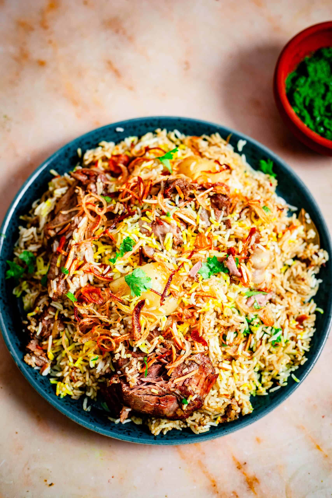

# Zurbian

*Yemen's spiced lamb biryani: basmati rice cooked through with marinated lamb, sliced potato, fresh tomato, fried onion, fresh herbs and the traditional Yemeni-Indian "hawaij" spice mix, slow-baked in a sealed pot till the rice goes layered and golden. The Hadhrami coast-to-Mukalla biryani that arrived from India and went thoroughly Yemeni.*

**Serves:** 6

**Prep Time:** 40 minutes (plus 2 hours marination)

**Cook Time:** 2 hours

## Overview
Zurbian is one of Yemen's most beloved festive dishes: a biryani-style spiced rice-and-meat one-pot that arrived with the trade routes from India and was thoroughly absorbed into Yemeni cooking, particularly in the southern Hadhramawt region. Marinated lamb pieces (bone-in shoulder or leg, slow-cooked till falling-apart tender) layered with parboiled basmati rice, sliced potato, fried onion, fresh tomato, mint and coriander, doused with saffron-and-cardamom-infused milk and oil, sealed and slow-baked till the rice has absorbed the lamb juices. Celebration food in Yemen; it appears at weddings, Eid feasts and major family gatherings, often served on a large communal platter to be eaten with the hands. Hawaij (the Yemeni warm-spice blend of black pepper, cumin, coriander, cardamom and turmeric, plus sometimes cloves, cinnamon and ginger) is what makes zurbian Yemeni rather than generic biryani. The proper zurbian has distinct layers; you should see strata of lamb, rice, potato and herbs when you spoon onto a plate.

## Ingredients

### Lamb and marinade
- 1.2 kg bone-in lamb shoulder or leg (cut into 6 cm pieces by the butcher)
- 200 g plain yogurt
- 4 tablespoons olive oil (or ghee)
- 2 large onions (sliced; 1 for the marinade, 1 for frying separately)
- 8 garlic cloves (crushed)
- 1 thumb (4 cm) fresh ginger (finely grated)
- 3 large tomatoes (chopped)
- 3 tablespoons tomato paste
- 2 tablespoons hawaij spice mix (or substitute: 2 teaspoons each of ground cumin, coriander, black pepper, cardamom, plus 1 teaspoon turmeric)
- 1 tablespoon ground cumin
- 1 tablespoon ground coriander
- 1 teaspoon ground cinnamon
- 1 teaspoon ground turmeric
- 2 teaspoons fine sea salt
- 1 teaspoon ground black pepper

### Rice
- 500 g basmati rice (rinsed 2-3 times)
- 2 tablespoons fine sea salt (for parboiling)
- 1 cinnamon stick
- 4 cardamom pods
- 3 cloves
- 2 bay leaves

### Layer ingredients
- 3 medium potatoes (peeled, sliced 5 mm thick)
- 2 large tomatoes (sliced)
- 1 large bunch fresh coriander (chopped)
- 1 small bunch fresh mint (chopped)
- 4 tablespoons olive oil (for frying the second onion and potatoes)
- 60 g raisins (optional)

### Saffron-milk infusion
- ½ teaspoon saffron threads
- 100 ml warm milk
- 50 g butter (melted)
- 2 tablespoons rose water (optional but very Yemeni)

### To serve
- Yogurt
- Fresh chopped salad
- Yemeni hot sauce (sahawiq if you have it)
- Lemon wedges

## Method

### Stage 1 - Marinate the lamb (1-2 hours)
1. In a wide bowl, combine 1 sliced onion, the crushed garlic, grated ginger, yogurt, hawaij, cumin, coriander, cinnamon, turmeric, salt and pepper.
2. Add the lamb pieces; toss to coat thoroughly.
3. Cover and refrigerate at least 2 hours (or overnight).

### Stage 2 - Cook the lamb
1. Heat 4 tablespoons of olive oil in a large heavy casserole over medium heat.
2. Add the marinated lamb (with all the marinade); cook for 8-10 minutes, stirring, till the meat is browned on all sides.
3. Add the chopped tomatoes and tomato paste.
4. Pour in 600 ml of hot water; bring to a simmer.
5. Cover with the lid slightly ajar; simmer 1-1.5 hours till the lamb is properly tender (a fork should slide through easily).
6. The cooking liquid will reduce and become a rich gravy.
7. Take off the heat.

### Stage 3 - Fry the second onion and potatoes
1. While the lamb cooks, slice the second onion into rings.
2. Heat 3 tablespoons of olive oil in a separate pan over medium heat.
3. Fry the onion rings for 8-10 minutes till deeply golden-brown and slightly crisp.
4. Lift out with a slotted spoon; drain on kitchen paper. The fried onions are a key element of zurbian.
5. In the same pan, lightly fry the potato slices in 2-3 batches for 2 minutes per side till lightly golden but not cooked through.

### Stage 4 - Parboil the rice
1. Bring a large pot of water to a rolling boil.
2. Add 2 tablespoons of salt, the cinnamon stick, cardamom pods, cloves and bay leaves.
3. Drain the rinsed rice; add to the boiling water.
4. Boil 5-6 minutes till the rice is about 70% cooked (still firm in the centre when bitten).
5. Drain immediately; spread on a wide tray to stop cooking.

### Stage 5 - Make the saffron-milk infusion
1. Place the saffron threads in a small heatproof cup.
2. Pour the warm milk over; let stand 5 minutes to infuse.
3. Stir in the melted butter and rose water.

### Stage 6 - Assemble the layers
1. Preheat the oven to 160°C (320°F).
2. In a large heavy ovenproof pot (Dutch oven), layer as follows:
3. Bottom: half of the cooked lamb pieces with some of its gravy.
4. Next: a layer of the fried potato slices.
5. Next: half of the parboiled rice.
6. Next: half of the fried onions, half of the chopped coriander and mint, the raisins (if using).
7. Next: the remaining lamb pieces with the rest of the gravy.
8. Next: the sliced fresh tomatoes.
9. Next: the remaining parboiled rice.
10. Top: the remaining fried onions and chopped herbs.

### Stage 7 - Add the saffron-milk and seal
1. Drizzle the saffron-milk-butter infusion over the top layer; the colour will streak through the rice during baking.
2. Drizzle the remaining cooking liquid from the lamb (if any) over.
3. Seal the pot tightly with foil under the lid (the foil helps create a steam-tight seal).

### Stage 8 - Slow-bake
1. Place in the preheated oven; bake 45 minutes.
2. Don't lift the lid during baking; the steam-and-pressure cooks the rice through and absorbs the lamb flavours.

### Stage 9 - Rest and serve
1. Take out of the oven; let rest sealed for 10 minutes.
2. Lift the lid and foil; the rice should look properly cooked, with golden streaks where the saffron-milk penetrated and the herbs visible.
3. Tip onto a large warm communal platter; the layers should be visible.
4. Garnish with extra fresh coriander.
5. Serve immediately with yogurt, salad, hot sauce and lemon wedges.

## Notes
- **Hawaij is essential:** the Yemeni warm-spice blend is what makes zurbian distinctive. Available at Yemeni and Middle Eastern markets; or mix your own (see substitute mix in ingredients).
- **Bone-in lamb gives proper flavour:** the bones release flavour into the gravy. Boneless cuts work but are less flavourful.
- **Slow-cook the lamb properly:** 1-1.5 hours of slow simmer is essential. Don't try to rush; tough lamb ruins zurbian.
- **Parboil the rice carefully:** the rice should be 70% cooked when drained; it finishes in the oven. Fully-cooked rice gives a mushy zurbian.
- **Seal the pot tightly:** the steam in the sealed pot is what cooks the layered rice perfectly. Foil + lid gives the best seal.

## Variations
- **Chicken zurbian:** swap the lamb for whole chicken pieces; reduce cooking to 35 minutes. Common everyday Yemeni variation.
- **Hadhrami fish zurbian:** swap the lamb for firm white fish (kingfish, hamour, snapper); reduce cooking; add 1 tablespoon dried lime powder. Coastal Yemeni specialty.
- **Vegetable zurbian:** skip the meat; double the potatoes; add 200 g of chickpeas and 200 g of cubed pumpkin. Less traditional but works for vegetarian guests.
- **Spicier zurbian:** double the hawaij; add 2 small green chillies to the lamb cooking; finish with sahawiq (Yemeni chilli sauce). Properly fierce variation.

## Serving
- On a large communal platter, often placed at the centre of the table and eaten with the hands or with bread (Yemeni khubz tawa or lahoh). Yogurt and salad in small bowls around the platter. At Yemeni weddings, Eid feasts, and major family gatherings. Drink: Yemeni qishr (cardamom-and-ginger coffee), karkadeh (hibiscus drink), or simply water.

## Storage
- Keeps refrigerated 4 days; the flavour deepens noticeably overnight.
- Reheat in a covered oven dish at 160°C / 320°F for 25-30 minutes till hot through.
- The lamb and rice keep well together.
- Freezes 3 months in portioned containers; defrost in the fridge.
- Day-old zurbian is excellent for lunch; sometimes served at room temperature with extra lemon and herbs.
