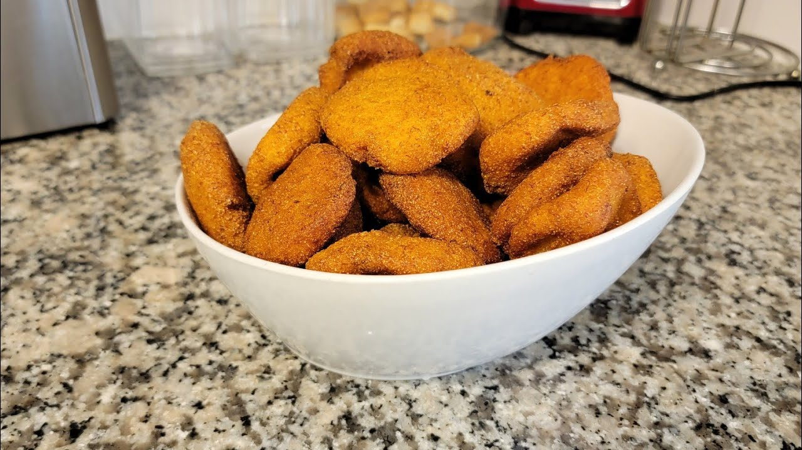

# Chitumbuwa

*Zimbabwe's banana fritters: ripe mashed bananas mixed with flour, sugar, cinnamon, vanilla and a touch of baking powder, dropped by the spoonful into hot oil and fried till the outside crisps golden and the inside stays soft and sweet. The street-market sweet snack and after-school treat across Zimbabwe and southern Africa.*

**Serves:** 4-6 (makes about 20 fritters)

**Prep Time:** 15 minutes

**Cook Time:** 20 minutes

## Overview
Chitumbuwa is Zimbabwe's beloved street-market banana fritter, a sweet snack sold from carts in Harare's market squares and at every primary school gate across the country: very ripe bananas mashed thoroughly and mixed with flour, sugar, cinnamon, vanilla and baking powder into a thick spoonable batter, dropped by the spoonful into hot oil and deep-fried till the outside is deep golden-brown and crisp and the inside stays soft and sweet. The traditional Zimbabwean after-school treat: pantry-simple, quick, naturally sweet from the bananas. Also sold at funerals, weddings and church gatherings, where they appear in large foil trays alongside tea or chibuku (the local sorghum beer). The bananas must be properly black-spotted yellow, soft and sweet; under-ripe gives a starchy bland fritter. The batter wants thick-pancake consistency, soft enough to drop from a spoon. Fry at 170 to 175 °C; too hot and the outside burns before the inside cooks, too cool and they go greasy.

## Ingredients

- 4 large very ripe bananas (about 500 g peeled weight)
- 250 g plain flour
- 80 g caster sugar (or palm sugar)
- 1 ½ teaspoons baking powder
- ½ teaspoon ground cinnamon
- ¼ teaspoon ground nutmeg
- Pinch of fine sea salt
- 1 teaspoon vanilla extract
- 1 large egg
- 50 ml whole milk (more or less depending on banana wateriness)
- Vegetable oil for deep-frying (about 1 litre)

### Optional additions
- 30 g sultanas or chopped dates
- 2 tablespoons desiccated coconut
- Zest of 1 lemon (or orange)

### To finish
- Caster sugar for dusting (about 3 tablespoons)
- Ground cinnamon for dusting (1 teaspoon)
- Honey for drizzling (optional)

## Method

### Stage 1 - Mash the bananas
1. Peel the bananas; place in a wide bowl.
2. Mash with a fork or potato masher till mostly smooth (some small chunks are fine for texture).

### Stage 2 - Mix the batter
1. To the mashed bananas, add the egg and vanilla extract.
2. Whisk to combine.
3. Sift in the flour, sugar, baking powder, cinnamon, nutmeg and salt.
4. Stir gently with a wooden spoon till just combined.
5. Add the milk gradually; the batter should be thick but spoonable. Start with 30 ml; add up to 50 ml if needed.
6. The consistency should be like thick cake batter; it should drop from a spoon but hold its shape briefly.
7. Stir in any optional additions (sultanas, coconut, citrus zest).

### Stage 3 - Heat the oil
1. Pour vegetable oil into a deep heavy saucepan or wok to a depth of 7-8 cm.
2. Heat over medium-high heat till 170-175°C (340-350°F).
3. Test with a small spoonful of batter; it should rise immediately and brown in 2-3 minutes.

### Stage 4 - Fry the fritters
1. Drop heaped tablespoons of batter into the hot oil; don't overcrowd; fry 4-5 at a time.
2. The fritters will puff up and float to the surface.
3. Turn gently with a slotted spoon after 90 seconds; fry the other side.
4. Total cooking time: 3-4 minutes per batch till deep golden all over.
5. Lift out with a slotted spoon; drain briefly on kitchen paper.
6. Continue with the remaining batter in batches.

### Stage 5 - Serve immediately
1. Combine the caster sugar with the cinnamon in a small bowl.
2. Dust the warm fritters generously with the cinnamon sugar.
3. Drizzle with honey if desired.
4. Serve while hot and the outside is crisp.

## Notes
- **Very ripe bananas are essential:** the dish depends on banana sweetness. Yellow-with-black-spots is the right ripeness. Under-ripe bananas give bland heavy fritters.
- **Don't overmix the batter:** mix just till combined. Overmixing develops the gluten and gives tough rubbery fritters.
- **Oil at 170-175°C:** too hot and the outside burns before the inside cooks; too cool and the fritters absorb oil. The drop-test gives a good indication.
- **Eat while warm:** chitumbuwa is best fresh out of the pan when the outside is still crisp. They go off-texture as they cool.
- **Spaced fritters:** don't overcrowd the oil; 4-5 at a time gives proper crisping. Overcrowded fritters steam each other.

## Variations
**Sweet potato chitumbuwa:** swap half the banana for boiled-and-mashed sweet potato; gives an earthier autumn-leaning version. Common in some rural Zim communities.
**Coconut chitumbuwa:** add 60 g of desiccated coconut to the batter; gives a tropical version common in Mashonaland.
**Spiced chitumbuwa:** double the cinnamon, add ½ teaspoon of ground ginger and ¼ teaspoon of allspice; gives a properly festive Christmas-friendly version.
**Apple chitumbuwa:** add 1 grated apple to the batter for extra fruit; common modern variation in city kitchens.

## Serving
With strong sweet milky tea (the Zimbabwean way: strong tea, full-cream milk, plenty of sugar). Or with cold maheu (the fermented maize drink). At children's parties, after-school snacks, church gatherings, weddings, funerals; chitumbuwa appears at every kind of Zimbabwean gathering. Some adults dip in honey; some pair with a cup of coffee.

## Storage
- Best eaten warm and fresh; the crispness fades as they cool.
- Keeps in a sealed container at room temperature 1 day; refrigerated 3 days.
- Reheat in a hot oven (180°C / 350°F) for 5-6 minutes till the outside crisps again, or in an air fryer at 180°C for 3-4 minutes.
- Don't microwave; they go limp and rubbery.
- The batter is best used fresh; if you must keep it, refrigerate 24 hours.
- Cooked fritters freeze 2 months; reheat from frozen in a hot oven for 8-10 minutes.
