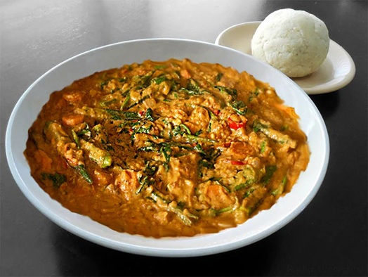

<!-- TODO: hero image undersized, refresh from Pexels or hand-curate -->
# Dovi

*Zimbabwe's peanut stew: chicken or beef simmered in a thick mahogany peanut-butter sauce sharpened with tomato and onion. Eat with sadza.*

**Serves:** 4

**Prep Time:** 15 minutes

**Cook Time:** 1 hour

## Overview
Dovi is Zimbabwe's peanut stew: chicken (or beef) simmered slow in a thick mahogany-coloured peanut sauce sharpened with tomato, onion and paprika, finished with shredded greens that cut the richness, eaten with mounds of sadza for scooping. The peanut butter is the whole dish, so use 100% peanut butter (just peanuts, maybe salt). The sweetened palm-oil supermarket brands turn the sauce gluey and cloying. Stir the peanut butter into a reduced tomato base till smooth, then loosen with hot stock to a thick brown sauce that coats a wooden spoon. Watch the bottom of the pot; peanut butter catches fast if you walk away. Shredded covo (Zimbabwean collard greens) or spinach goes in for the last five minutes till wilted and the sauce turns glossy. Spooned into wide bowls with sadza on the side for scooping.

## Ingredients

- 8 boneless skinless chicken thighs (or 1 whole chicken, jointed)
- 2 tablespoons vegetable oil
- 2 onions (large, chopped)
- 4 garlic cloves (crushed)
- 1 thumb fresh ginger (grated)
- 4 tomatoes (grated) or 1 (400 g) tin chopped tomatoes
- 1 tablespoon paprika
- 1 teaspoon ground cumin
- ½ teaspoon chilli powder
- 200 g smooth peanut butter (unsweetened, no palm oil)
- 600 ml hot chicken stock
- 200 g spinach (or covo, collard) leaves (shredded)
- salt
- pepper

## Method

### Stage 1 - Brown and soften
1. Season the chicken; brown in the oil over medium-high heat 5 minutes per side. Set aside.
1. In the same pot, soften the onion 8-10 minutes; add garlic and ginger, cook 1 minute.

### Stage 2 - Build the sauce
1. Stir in the paprika, cumin and chilli; toast 30 seconds.
1. Add the grated tomato; reduce until jammy (5 minutes).
1. Stir in the peanut butter until smooth. Loosen with 200 ml of the stock; it should look like a thick brown sauce.

### Stage 3 - Braise
1. Return the chicken. Pour over the rest of the stock; bring to a low simmer.
1. Cover; cook 35-40 minutes on a low heat, stirring once or twice so the peanut butter doesn't catch on the bottom.
1. Stir in the spinach; cook 5 minutes until wilted and the sauce is glossy.

### Stage 4 - Serve
1. Taste and adjust salt. Sauce should coat a spoon but not be pasty - add a splash of stock if needed.
1. Spoon into wide bowls with sadza for scooping.

## Notes
- **Peanut butter quality:** Use 100% peanut butter (no sugar, no palm oil). Sweetened brands turn the sauce gluey and cloying.
- **Stir to prevent catching:** Peanut butter sticks if you walk away. Once a minute is plenty.
- **Greens:** Covo (Zimbabwean collard) is the classic; spinach is the easy swap. Don't skip them - they cut the richness.

## Storage
- Refrigerate 3 days. The sauce will thicken; loosen with stock or water when reheating.
- Freezes 2 months. Stir well after thawing - the peanut butter and water can split.
