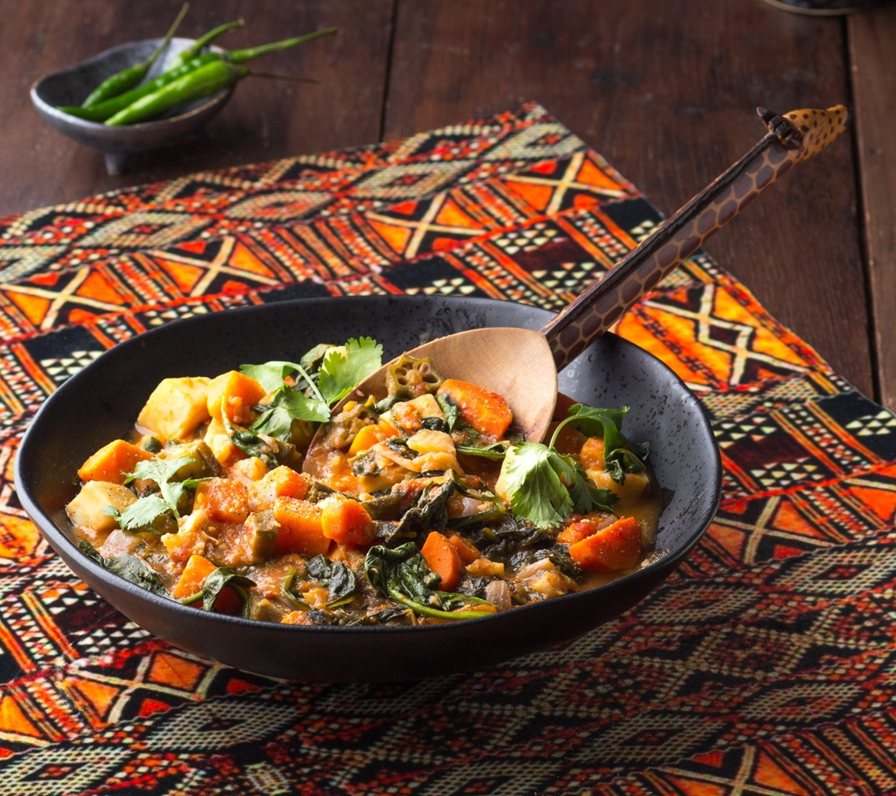

# Huku Ne Dovi

*Zimbabwe's chicken in peanut butter sauce: bone-in chicken pieces slow-braised with onion, garlic, tomato and a generous amount of unsweetened peanut butter, simmered down to a thick orange-brown stew. The Shona national dish, eaten with sadza and a vegetable side.*

**Serves:** 4-6

**Prep Time:** 20 minutes

**Cook Time:** 1 hour

## Overview
Huku ne dovi (literally "chicken with peanut butter" in Shona; huku = chicken, dovi = peanut butter) is the Shona national chicken dish: bone-in chicken slow-braised with onion, garlic, tomato and a generous spoonful of unsweetened peanut butter into a thick orange-brown stew that coats the chicken in a glossy velvety sauce. Peanut butter is Zimbabwe's flavour anchor; it turns up across the kitchen (manhanga ne dovi = pumpkin in peanut butter, muriwo une dovi = greens in peanut butter, nhopi = sweet potato in peanut butter), and huku ne dovi is the meat-and-peanut answer to all of them. A close cousin to West African and Mozambican peanut stews (mafé, matata), but plainer and less spice-heavy, with the peanut butter doing the talking. The peanut butter has to be unsweetened and natural; the sweetened supermarket brands (Skippy, Jif) make the sauce cloying. The proper Zimbabwean style is rough-textured, peanuts and salt only. The sauce wants to be thick but pourable, coating rather than pasty.

## Ingredients

- 1.2 kg bone-in chicken pieces (thighs, drumsticks; or 1 whole chicken cut into 8 pieces)
- 3 tablespoons vegetable oil
- 2 large onions (finely sliced)
- 6 garlic cloves (crushed)
- 1 thumb (3 cm) fresh ginger (finely grated)
- 4 medium tomatoes (chopped); or 1 tin (400 g) chopped tomatoes
- 3 tablespoons tomato paste
- 1 teaspoon curry powder (mild Madras or Zimbabwean curry powder if available)
- 1 teaspoon ground turmeric
- 1 teaspoon ground cumin
- 1 small fresh red chilli (deseeded, chopped; optional)
- 2 bay leaves
- 600 ml hot chicken stock (or water)
- 300 g unsweetened smooth natural peanut butter (no sugar added)
- 1 ½ teaspoons fine sea salt
- 1 teaspoon ground black pepper
- 1 tablespoon brown sugar (optional, to balance acidity)
- 2 tablespoons fresh coriander (chopped, to finish)

### To serve
- Sadza (Zimbabwean stiff maize porridge; see existing sadza recipe)
- Muriwo une dovi (greens with peanut butter) or any sautéed greens
- Hot sauce or Zimbabwean piri-piri sauce (optional)

## Method

### Stage 1 - Brown the chicken
1. Heat 2 tablespoons of the oil in a large heavy casserole or wide saucepan over medium-high heat.
2. Pat the chicken pieces dry with kitchen paper.
3. Season the chicken with salt and pepper.
4. Brown the chicken in batches; 4-5 minutes per side till deeply golden. Don't overcrowd the pan; work in 2 batches.
5. Transfer the browned chicken to a plate.

### Stage 2 - Sweat the aromatics
1. Reduce the heat to medium; add the remaining tablespoon of oil if needed.
2. Add the sliced onions; cook 8-10 minutes till soft and starting to caramelise at the edges.
3. Add the crushed garlic and grated ginger; cook 1 minute till fragrant.
4. Add the chopped fresh chilli (if using).

### Stage 3 - Build the sauce base
1. Add the tomato paste; cook 2 minutes till deepened in colour.
2. Add the chopped tomatoes; cook 5-7 minutes till they break down and the mixture thickens.
3. Stir in the curry powder, turmeric and cumin; cook 30 seconds till fragrant.

### Stage 4 - Return the chicken and simmer
1. Return the browned chicken pieces (and any juices) to the pan.
2. Add the bay leaves.
3. Pour in the hot chicken stock; the chicken should be mostly submerged.
4. Bring to a low simmer.
5. Cover with the lid slightly ajar; cook 30 minutes till the chicken is cooked through and tender.

### Stage 5 - Add the peanut butter
1. In a small bowl, soften the peanut butter by mixing it with about 200 ml of the hot cooking liquid from the pan; whisk till the peanut butter is fully incorporated and forms a smooth paste.
2. This pre-mixing prevents the peanut butter from sitting in a lump.
3. Stir the peanut butter mixture back into the pan; stir to combine.
4. Add the salt, pepper and brown sugar (if using).
5. Continue to simmer uncovered for 15-20 minutes; the sauce will thicken into a rich orange-brown coating around the chicken.
6. Stir occasionally to prevent the peanut butter from sticking to the bottom.

### Stage 6 - Finish
1. Take off the heat.
2. Taste; adjust salt and pepper.
3. Stir in the chopped coriander.

### Stage 7 - Serve
1. Spoon a generous portion of sadza onto each plate.
2. Place 2-3 pieces of huku ne dovi alongside with plenty of the peanut sauce.
3. Add a portion of greens.
4. Serve immediately.

## Notes
- **Natural unsweetened peanut butter only:** sweetened peanut butter (the everyday US brands) gives a wrong-tasting sweet sauce. Look for "natural" or "100% peanuts" peanut butter. Roasted peanuts ground in a food processor work in a pinch.
- **Brown the chicken properly:** the fond from browning gives the proper sauce depth. Don't skip. Deep golden, not pale.
- **Pre-mix the peanut butter:** the peanut butter sits in a lump if added directly to hot liquid. Pre-mix with a ladle of cooking liquid first to make a smooth paste, then stir into the pan.
- **Don't over-thicken:** the sauce should be thick but pourable. Over-thickened goes pasty. If the sauce is too thick, add a splash of hot water or stock.
- **Bone-in chicken for flavour:** the bones release flavour into the sauce. Boneless cuts work but give less depth.

## Variations
- **Beef huku ne dovi (nyama ye dovi):** swap the chicken for 800 g of cubed beef stewing meat; increase cooking time to 90 minutes for the beef to tender. Less traditional but excellent.
- **Spicier version:** add 1 whole Scotch bonnet pepper or 2 bird's eye chillies along with the aromatics; gives a properly fierce Zim variation common in Mashonaland.
- **Vegetarian dovi (with mushrooms and peanuts):** swap the chicken for 600 g of large mushrooms and 1 large aubergine (cubed); cook the same way. Surprisingly excellent.
- **With dried fish:** add 100 g of dried small fish (kapenta-style, available at African markets) along with the chicken; gives a savoury depth common in some rural Zimbabwean variants.

## Serving
- On warm plates with a mound of sadza (the traditional Zim accompaniment), a portion of greens (muriwo une dovi or simple sautéed kale/collards) and the chicken-peanut sauce ladled over. Eat with the right hand (Zimbabwean tradition): tear off a small piece of sadza, pinch into a small ball, dip into the peanut sauce, pick up some chicken with it, eat. Drink: maheu (Zimbabwean fermented maize drink), Mazoe orange (the local cordial), or beer.

## Storage
- Keeps refrigerated 4 days; the flavour deepens noticeably overnight (many Zimbabweans say it's better the next day).
- Reheat gently in a covered pan with a splash of water (or stock) over low heat; the peanut butter can split if reheated too aggressively.
- Freezes 3 months in portioned containers; defrost in the fridge and reheat gently.
- Day-old huku ne dovi is excellent with fresh sadza for lunch; or stirred through rice as a quick dinner.
- Don't microwave aggressively; the peanut butter sauce splits.
