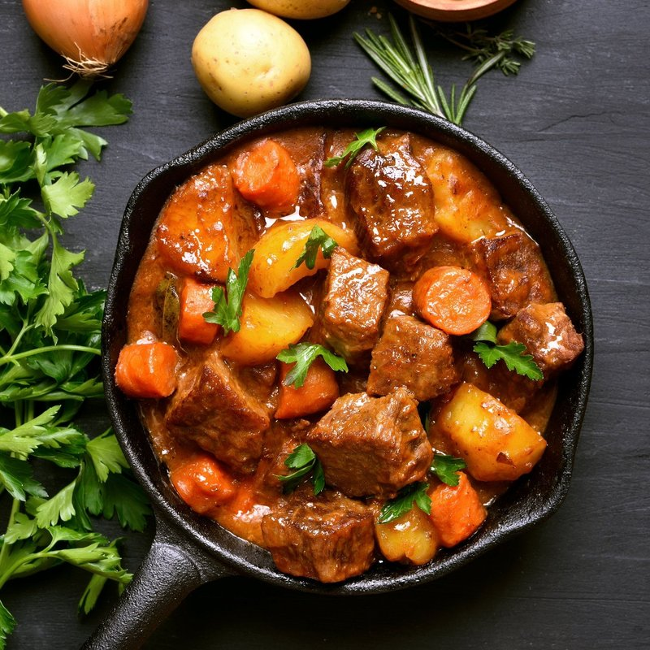

# Nyama Stew

*Zimbabwe's weekday plate: chunks of beef slowly braised with onion, tomato and garlic till the gravy is dark and clinging. Eaten with sadza.*

**Serves:** 4

**Prep Time:** 15 minutes

**Cook Time:** 1 hour 45 minutes

## Overview
Nyama stew is the everyday Zimbabwean weekday plate, chunks of beef shin slow-braised with onion, tomato, garlic and a stock cube till the meat falls apart and the gravy turns dark and clinging, ladled next to a generous mound of sadza for the right hand to scoop both at once. The point of the dish is the gravy more than the chunks of meat; thin watery sauce makes a poor sadza scoop, so don't rush the reduction. Cut beef shin into 3 cm chunks (shin gives the gelatinous body that thickens the sauce; stewing chuck works too but the gravy is leaner), pat dry and brown hard in batches in a heavy pot till each piece has a deep colour all over, lifting onto a plate as you go (don't crowd the pan or the beef steams instead of searing). Soften two big sliced onions in the same oil for 8 to 10 minutes till pale gold, stir in crushed garlic, paprika and black pepper for a minute, then add grated tomato (skins discarded) and tomato puree to reduce hard for 5 to 7 minutes till the mixture turns thick and oil pools at the edges. Return the beef with a crumbled stock cube and an optional split chilli, pour in 500 ml of hot water and bring to a simmer. Cover and cook on the lowest heat for an hour and a quarter, stirring occasionally; the beef should be fork-tender and the sauce thick and clinging by the end. If the gravy is still thin, uncover for the last 10 minutes to reduce. Taste, adjust salt, scatter chopped coriander across the top, serve in a wide bowl with sadza and a side of muriwo une dovi alongside.

## Ingredients

- 700 g beef shin (or stewing chuck, cut into 3 cm chunks)
- 3 tablespoons vegetable oil
- 2 onions (large, finely sliced)
- 4 garlic cloves (crushed)
- 4 tomatoes (large, grated, skins discarded)
- 1 tablespoon tomato puree
- 1 beef stock cube (or 2 teaspoons salt)
- 1 teaspoon ground black pepper
- 1 teaspoon paprika
- 1 fresh chilli (split, optional)
- 500 ml hot water
- Fresh coriander (to finish)

## Method

### Stage 1 - Brown the meat
1. Heat 2 tablespoons of the oil in a heavy pot over medium-high heat.
1. Pat the beef dry; brown on all sides in batches, transferring to a plate as you go. Don't crowd the pan.

### Stage 2 - Build the base
1. Add the remaining oil; soften the onions over medium heat 8-10 minutes until pale gold.
1. Stir in the garlic, paprika and pepper; cook 1 minute.
1. Add the grated tomato and tomato puree; reduce until thick and oil pools at the edges (5-7 minutes).

### Stage 3 - Braise
1. Return the beef and any juices. Crumble in the stock cube. Add chilli if using.
1. Pour in the hot water; bring to a simmer.
1. Cover and cook on the lowest heat 1 hour 15 minutes, stirring occasionally. Beef should be fork-tender; sauce thick and clinging.
1. If the gravy is thin, uncover for the last 10 minutes to reduce.

### Stage 4 - Serve
1. Taste and adjust salt. Scatter coriander.
1. Serve with sadza and muriwo une dovi.

## Notes
- **Slow and low:** Hard chunks of shin need 90 minutes minimum. Rushing this gives leathery meat in pale sauce. The reward for waiting is the gravy.
- **Grated tomato:** Better than chopped here. The skins discard; the flesh dissolves into the sauce. Use a box grater.
- **Sadza is the point:** Serve in a wide bowl with the sadza beside it; the diner scoops both with the right hand.

## Storage
- Refrigerate 3 days. Reheat covered with a splash of water over low heat; better the next day.
- Freezes 2 months.
