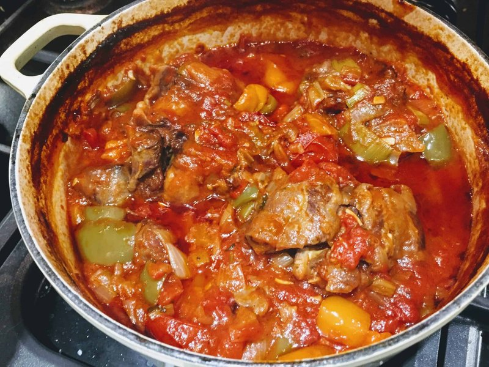

# Zimbabwean Oxtail Stew

*Bone-in oxtail braised for three hours with onion, tomato, garlic and a stock cube until the gelatinous meat slides off in shreds and the sauce is dark and glossy. A Sunday-lunch project, eaten with sadza or rice and a sharp tomato-and-onion relish. Not subtle, but right.*

**Serves:** 4

**Prep Time:** 20 minutes

**Cook Time:** 3 hours

## Overview
Oxtail browns hard in batches so the fond builds. Onion, garlic and tomato cook down in the same pot; stock, bay and a beef cube go in; the oxtail returns and braises covered on the lowest heat for three hours. The meat should slide off the bone with a fork. Skim the fat at the end, it's significant.

## Ingredients

- 1 ½ kg oxtail (cut into 3-4 cm pieces - ask the butcher)
- 3 tablespoons vegetable oil
- 2 onions (large, chopped)
- 6 garlic cloves (crushed)
- 1 thumb fresh ginger (grated)
- 4 tomatoes (large, grated) or 1 (400 g) tin
- 2 tablespoons tomato puree
- 1 tablespoon paprika
- 1 teaspoon ground black pepper
- 1 beef stock cube
- 2 bay leaves
- 1 fresh chilli (whole, split)
- 1 litre hot water
- 2 carrots (cut into 2 cm chunks, optional)
- Salt to taste

## Method

### Stage 1 - Brown
1. Pat the oxtail very dry. Season with salt.
1. Heat 2 tablespoons oil in a heavy pot. Brown the oxtail hard in batches, 4-5 minutes per side. Set aside on a plate.

### Stage 2 - Base
1. Pour off all but 2 tablespoons of fat. Add the onion; soften 10 minutes on medium until deep gold.
1. Add garlic, ginger, paprika and pepper; cook 1 minute.
1. Stir in the grated tomato and tomato puree; reduce until thick and oil splits out (8 minutes).

### Stage 3 - Braise
1. Return the oxtail with any resting juices. Crumble in the stock cube. Add bay and chilli.
1. Pour in the hot water - the oxtail should be just covered. Bring to a simmer.
1. Cover; transfer to a 150°C (130°C fan) oven for 2 ½ hours. Add carrots (if using) at the 2 hour mark.
1. The meat should slide off the bone with a fork; if not, give it another 30 minutes.

### Stage 4 - Finish
1. Lift out the bay and chilli. Skim the surface fat - there's a lot.
1. If the sauce is thin, simmer uncovered 10 minutes on the stovetop. It should coat a spoon.
1. Taste; adjust salt.
1. Serve with sadza, rice or pap. A tomato-onion-coriander relish on the side cuts the richness.

## Notes
- **Don't skip the browning:** Oxtail is fatty and bony; the depth comes from a hard sear. Pale-brown stew tastes pale.
- **Skim:** A litre of beef fat sits on top of an unskimmed oxtail. Either skim with a ladle, refrigerate overnight and lift it off solid, or both.
- **Same-day vs next-day:** Better next-day, like all braises - the gelatin in the bones sets the sauce, and reheating loosens it back.

## Storage
- Refrigerate 4 days. Reheat covered with a splash of water on low.
- Freezes 3 months.
