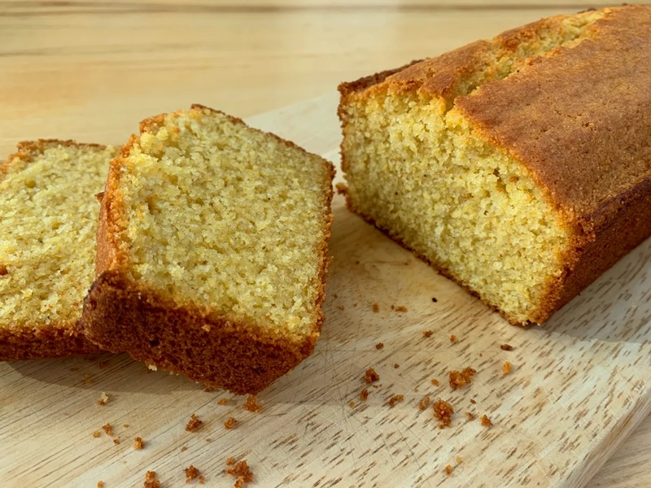

# Chimodho

*Zimbabwe's steamed cornbread: a sweet, dense, slightly chewy maize-meal bake steamed inside a covered pot till firm. Eaten with morning tea.*

**Serves:** 6 (makes 1 round loaf)

**Prep Time:** 10 minutes

**Cook Time:** 1 hour

## Overview
Maize meal, plain flour, sugar, baking powder and salt are mixed dry; warm water and oil bring it together into a thick batter. The batter is poured into a greased tin, covered tightly with foil, and steamed inside a pot (sitting on a trivet or upturned saucer above water) for an hour. The result is a dense, moist loaf with no crust, more pudding than bread.

## Ingredients

- 300 g white maize meal (mealie meal)
- 150 g plain flour
- 100 g caster sugar (more for sweeter)
- 1 tablespoon baking powder
- ½ teaspoon salt
- 350 ml warm water
- 4 tablespoons vegetable oil
- Extra oil for greasing

## Method

### Stage 1 - Mix the batter
1. Whisk the maize meal, flour, sugar, baking powder and salt in a large bowl.
1. Add the warm water and oil; stir to a thick, smooth batter (consistency of porridge).

### Stage 2 - Prepare the steamer
1. Generously oil a 20 cm round cake tin or heatproof bowl.
1. Pour in the batter; smooth the top.
1. Cover the tin tightly with foil.
1. Place a small trivet or upturned saucer in the bottom of a large lidded pot; pour in 5 cm of water; sit the tin on top.

### Stage 3 - Steam
1. Bring the water to a boil; reduce to a steady simmer.
1. Cover; steam 1 hour. Check the water every 20 minutes; top up with boiling water if it runs low.
1. A skewer inserted into the centre should come out clean.

### Stage 4 - Cool
1. Lift the tin out carefully; remove the foil.
1. Cool 10 minutes in the tin, then turn out onto a plate.
1. Slice into wedges. Eat warm with butter and tea, or cool and pack for later.

## Notes
- **Steaming is the technique:** Don't bake - the texture goes wrong. Steaming keeps the loaf moist and dense, which is the point.
- **Sugar adjusts:** Some make it almost cake-sweet (150 g sugar); some leave it almost savoury (50 g). 100 g is the middle.
- **Variations:** Roast peanuts, sultanas or grated apple can fold into the batter. Keep them small so they cook evenly.

## Storage
- Wrap in foil; keeps 3 days at room temperature.
- Slices well cold; toasts in a dry pan with butter.
