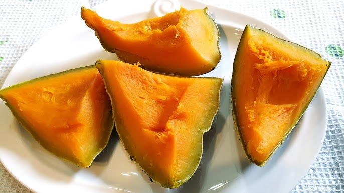

# Manhanga

*Sweet boiled pumpkin mashed with butter, sugar and a pinch of salt. A side, a snack, or a quick supper with leftover sadza. The pumpkin used in Zimbabwe is dense and floury (closer to kabocha than to the watery jack-o-lantern pumpkin); cook it until a fork goes through cleanly, then mash by hand.*

**Serves:** 4

**Prep Time:** 10 minutes

**Cook Time:** 25 minutes

## Overview
Pumpkin chunks boil in salted water until tender. Drain, return to the dry pot, dry off any surface moisture over low heat, then mash with butter, a spoonful of sugar (or honey) and salt. Eat warm. A teaspoon of cinnamon or grated ginger lifts it; some homes add a splash of milk or peanut butter.

## Ingredients

- 1 kg pumpkin (kabocha, butternut or red-kuri - dense, floury types), peeled and cut into 4 cm chunks
- 1 teaspoon salt
- 50 g unsalted butter
- 2 tablespoons brown sugar (or honey)
- ½ teaspoon ground cinnamon (optional)
- 50 ml whole milk (optional, for a softer mash)

## Method

### Stage 1 - Boil
1. Put the pumpkin chunks in a wide pot; add the salt and just enough water to cover.
1. Bring to a boil; cook 12-15 minutes until a fork pierces easily.

### Stage 2 - Dry
1. Drain in a colander; return to the dry pot.
1. Place over low heat 1-2 minutes, shaking occasionally, to steam off the surface water.

### Stage 3 - Mash
1. Add the butter, sugar, cinnamon and milk (if using).
1. Mash with a potato masher to a chunky-smooth texture (or smooth if preferred).
1. Taste; adjust salt and sugar.

### Stage 4 - Serve
1. Pile into a bowl. Eat warm alongside sadza, stew, or as a quick snack on its own.

## Notes
- **Pumpkin type:** Wet pumpkins (carving / jack-o-lantern) make watery mash. Use kabocha, butternut, red kuri or any dense winter squash.
- **Sweet not sugary:** A spoon of sugar lifts the pumpkin's natural sweetness; more turns it into pudding. Adjust to taste.
- **Peanut butter swap:** Replace butter with 2 tablespoons smooth peanut butter for a different (and deeply Zimbabwean) finish.

## Storage
- Refrigerate 3 days; reheat in a microwave or covered pan.
- Doesn't freeze well - turns watery.
