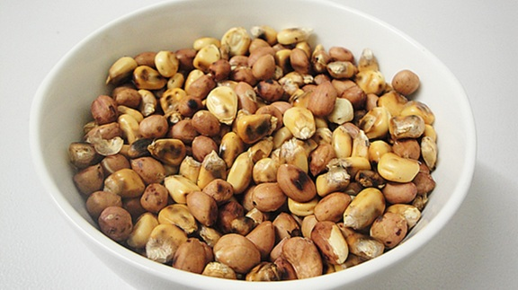

# Maputi

*Zimbabwe's roadside snack: dried maize kernels tossed in a hot pan till they crackle, split and puff into pale nutty bites. Salt is the only seasoning.*

**Serves:** 4 as a snack

**Prep Time:** 2 minutes

**Cook Time:** 10 minutes

## Overview
Dried white maize kernels (the same ones that grind into mealie meal) are heated in a heavy dry pan over medium heat. They crackle, jump and split open, some puff slightly, others stay whole and toasted. A pinch of oil keeps things moving; salt finishes. Faster than popcorn, denser, less puffy, more savoury.

## Ingredients

- 200 g dried white maize kernels (whole, not cracked, or popcorn kernels at a stretch)
- 1 tablespoon vegetable oil
- ½ teaspoon salt

## Method

### Stage 1 - Heat the pan
1. Heat a heavy-bottomed, dry pot or wok over medium heat 2 minutes.
1. Add the oil and salt; swirl.

### Stage 2 - Toast
1. Tip in the maize kernels in a single layer (cook in two batches if needed).
1. Cover with a lid (leaving a small gap for steam).
1. Shake the pan every 30 seconds - the kernels start to crackle, split and pop within 2-3 minutes.

### Stage 3 - Finish
1. Continue shaking until the popping slows to once every few seconds (about 5-6 minutes total).
1. Tip into a bowl immediately - some will keep popping in the residual heat.
1. Toss with extra salt if you like.

### Stage 4 - Eat
1. Eat warm by the handful.

## Notes
- **Real maputi vs popcorn:** Traditional maputi uses dried white maize, which toasts and splits rather than fully popping. It's denser and chewier than popcorn. If you can't find whole white maize, popcorn kernels work but the result is fluffier.
- **No oil version:** Hardcore maputi is made with no oil at all - just a dry pan and a lot of shaking. Easier with a small pinch of oil to prevent burning.
- **Sweet variant:** Some toss the warm maputi with sugar, but salt is the everyday default.

## Storage
- Keeps 1 week in a sealed jar at room temperature. Re-crisp in a hot dry pan if they go soft.
