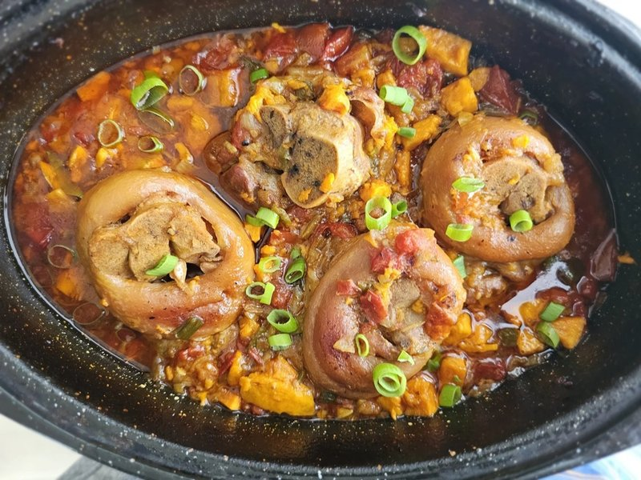

# Mazondo

*Zimbabwe's spicy stewed cow trotters: a sticky, gelatinous, deeply savoury sharing dish, simmered long with onion, tomato, garlic and chilli.*

**Serves:** 6 as a starter

**Prep Time:** 15 minutes

**Cook Time:** 3 hours 30 minutes

## Overview
The trotters get a hard initial boil to set the meat and start releasing gelatin; the water is changed. Onion, tomato and spices build a hot, dense gravy; the trotters re-enter for a long slow simmer until the gelatin gives. The sauce thickens as it cools, glazing every piece. Heat is part of the point.

## Ingredients

- 1 ½ kg cow trotters (cleaned, cut into pieces by the butcher - 4-6 cm chunks)
- 3 tablespoons vegetable oil
- 2 onions (large, chopped)
- 6 garlic cloves (crushed)
- 1 thumb fresh ginger (grated)
- 1 (400 g) tin chopped tomatoes
- 2 tablespoons tomato puree
- 2 tablespoons paprika (mix of sweet and smoked)
- 1 teaspoon ground black pepper
- 2 teaspoons chilli powder (or to taste)
- 2 beef stock cubes
- 2 bay leaves
- 2 fresh red chillies (split)
- 200 ml hot water
- Salt to taste

## Method

### Stage 1 - First boil
1. Place the trotters in a large pot; cover with cold water.
1. Bring to a hard boil; skim the heavy scum that rises. Boil 10 minutes.
1. Drain; rinse the trotters; wash the pot.

### Stage 2 - Slow cook
1. Return the trotters to the pot; cover with fresh hot water by 3 cm; add 1 stock cube and 1 bay leaf.
1. Simmer covered 2 hours until the meat is tender and pulls easily from the bone. Top up water as needed.
1. Drain, reserving 300 ml of the cooking liquor.

### Stage 3 - Sauce
1. In another large pot, heat the oil; soften the onion 8 minutes.
1. Add garlic, ginger, paprika, pepper and chilli powder; cook 1 minute.
1. Stir in tinned tomato and tomato puree; reduce 6-7 minutes until thick.
1. Crumble in the second stock cube. Add the remaining bay, fresh chillies, and the 300 ml reserved cooking liquor + 200 ml hot water.

### Stage 4 - Combine
1. Add the cooked trotters; stir to coat in the sauce.
1. Simmer uncovered 45 minutes - the sauce reduces and glazes the trotters; the gelatin thickens it.
1. Taste; adjust salt and chilli.

### Stage 5 - Serve
1. Tip onto a wide platter. Eat with sadza and a beer. The right hand is the right utensil.

## Notes
- **Ask the butcher to chop:** Trotters are bone-heavy and impossible to cut at home. They should arrive in 4-6 cm pieces, split lengthwise where possible.
- **First boil is for cleanliness:** The skim that rises is alarming; the second boil is in clean water with the spices.
- **Gelatin:** The sauce thickens dramatically as it cools - this is the gelatin. Reheat gently with a splash of water to loosen.

## Storage
- Refrigerate 3 days. The sauce sets like jelly cold - that's correct.
- Freezes 2 months.
