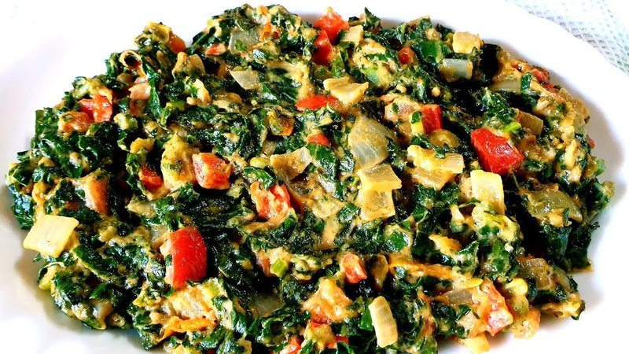

# Muriwo Une Dovi

*Zimbabwe's collard greens: stewed with onion, tomato and a heaped spoon of peanut butter that melts into the leaves. Eat alongside sadza.*

**Serves:** 4

**Prep Time:** 10 minutes

**Cook Time:** 25 minutes

## Overview
Muriwo une dovi is Zimbabwe's collard greens with peanut butter, the sidekick to sadza on a thousand weekday tables: shredded greens stewed with onion and tomato and finished with a heaped spoon of smooth peanut butter that melts into the leaves to coat them in a glossy savoury sauce. Use proper smooth unsweetened peanut butter (no sugar, no palm oil). The supermarket sweetened American-style brands wreck the dish. Covo is the traditional Zimbabwean collard; outside the country use kale, cavolo nero, spring greens or American collard. Spinach is the wrong choice; it overcooks and bleeds water. The sauce wants to be glossy and coating-the-spoon thick, not pooled or pasty.

## Ingredients

- 500 g collard greens, covo, spring greens (or cavolo nero, stems removed, leaves shredded)
- 2 tablespoons vegetable oil
- 1 onion (large, finely chopped)
- 2 garlic cloves (crushed)
- 2 tomatoes (medium, chopped) or ½ (400 g) tin chopped tomatoes
- ½ teaspoon salt
- ¼ teaspoon ground black pepper
- 3 tablespoons smooth peanut butter (unsweetened)
- 100 ml hot water

## Method

### Stage 1 - Soften the base
1. Heat the oil in a wide pan over medium heat.
1. Soften the onion 6-7 minutes until pale gold.
1. Add the garlic; cook 30 seconds.
1. Add the tomato; cook 4-5 minutes until thick and the oil splits out.

### Stage 2 - Wilt the greens
1. Add the shredded greens in two or three additions, stirring as they wilt.
1. Sprinkle in salt and pepper. Cover; reduce to low; cook 8-10 minutes until tender.

### Stage 3 - Finish with peanut butter
1. Whisk the peanut butter with the hot water to a loose sauce.
1. Stir into the greens. Cook uncovered 2-3 minutes, the sauce should coat the leaves and look glossy, not pasty.
1. Taste; adjust salt.

### Stage 4 - Serve
1. Tip into a serving bowl. Eat alongside sadza and any stew or dovi.

## Notes
- **Greens choice:** Covo (Zimbabwean collard) is the original; in the UK / US use kale, cavolo nero, spring greens or collard greens. Spinach overcooks and bleeds water, skip it.
- **Peanut butter quality:** Smooth, unsweetened, no palm oil. Sweetened American-style brands ruin the dish.
- **Don't drown it:** The peanut sauce coats the greens, not braises them. If it pools at the bottom, cook off the excess.

## Storage
- Refrigerate 3 days. Reheats well in a covered pan with a splash of water.
