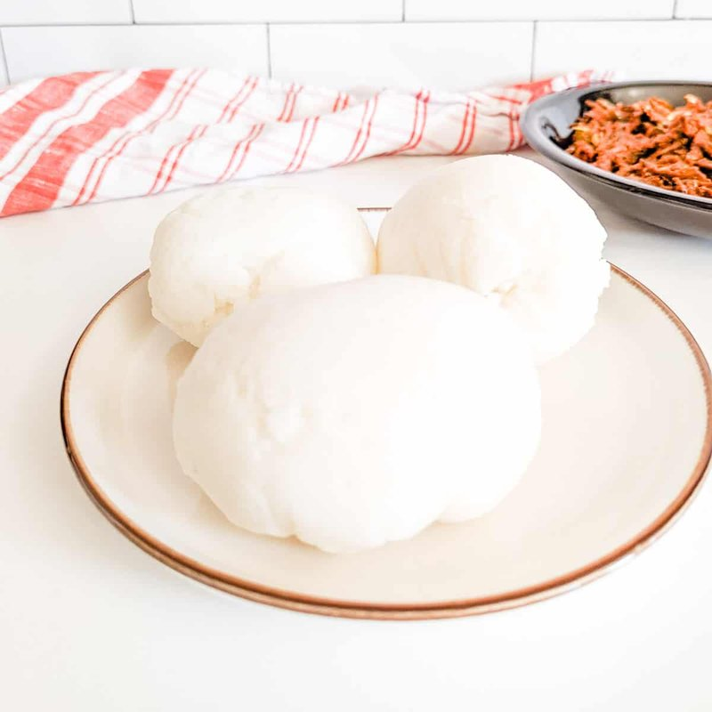

# Sadza

*Zimbabwe's staple: white-maize meal cooked with water into a stiff glossy porridge. Eaten with the right hand, rolled into a ball and used to scoop stew.*

**Serves:** 4

**Prep Time:** 5 minutes

**Cook Time:** 25 minutes

## Overview
Sadza is Zimbabwe's defining staple, a stiff glossy porridge of white maize meal cooked with water that anchors almost every meal in the country; you tear off a piece with your right hand, roll it into a small ball between your fingers, press a dent into it with your thumb and use it to scoop nyama stew, dovi or muriwo into your mouth. The build is two-stage and the stirring is the work; sadza is made by hand strength more than by heat. Whisk 150 g of maize meal with 400 ml of cold water in a heavy-bottomed pot to a smooth slurry without lumps (whisking the meal into cold water first is the only way to avoid lumps; tossing dry meal into boiling water guarantees them). Add the remaining 800 ml of water and bring to a steady boil over medium-high heat, stirring often, then reduce to medium-low and stir constantly for four or five minutes till you have a thick loose porridge (this first thickening is sometimes eaten as breakfast porridge on its own). Now start adding the remaining maize meal a small handful at a time, stirring hard with a wooden spoon or proper mugoti paddle between each addition. The porridge stiffens with each handful; keep going till you've added about another 300 g (you may not use it all) and the sadza pulls cleanly from the sides of the pot and forms a smooth dense mass. Underworked sadza is sticky and pale; well-worked sadza is glossy and pulls in clean ribbons, so don't be tempted to stop stirring early. Smooth the top, reduce heat to the lowest setting, cover tightly and steam for 5 more minutes so the inside finishes and the raw-meal taste cooks off. Stir once more to bring it together, turn out onto a wooden board or plate, cut into wedges or scoop into balls with a wet hand. Eat warm, scooping stew, dovi or muriwo.

## Ingredients

- 500 g white maize meal (mealie meal)
- 1.2 litres water
- ¼ teaspoon salt (optional)

## Method

### Stage 1 - Slurry
1. In a heavy-bottomed pot, whisk 150 g of the maize meal with 400 ml of the water to a smooth slurry (no lumps).
1. Add the remaining 800 ml water; bring to a steady boil over medium-high heat, stirring often.
1. Once boiling, reduce the heat to medium-low; stir constantly for 4-5 minutes until you have a thick, loose porridge (this is the first cook, sometimes eaten as porridge for breakfast).

### Stage 2 - Build to sadza
1. Begin adding the remaining maize meal a small handful at a time, stirring hard with a wooden spoon or paddle between each addition.
1. After each handful the porridge stiffens; keep going until you've added about 300 g more (you may not use it all) and the sadza pulls clean from the sides when stirred and forms a smooth, dense mass.

### Stage 3 - Steam
1. Smooth the top; reduce heat to the lowest setting; cover tightly.
1. Cook 5 minutes - the steam finishes the inside and removes any raw-meal taste.
1. Stir once more to bring it together; turn out onto a wooden board or plate.

### Stage 4 - Serve
1. Cut into wedges or scoop into balls with a wet hand. Eat warm, scooping stew, dovi or muriwo.

## Notes
- **The slurry trick:** Whisking the cold meal with cold water first prevents lumps. Tossing dry meal into boiling water guarantees them.
- **Stir hard:** Sadza is built by stirring, not heat. Underworked sadza is sticky and pale; well-worked sadza is glossy and pulls in clean ribbons.
- **Mugoti:** A flat wooden paddle is the right tool. A wooden spoon works if the handle is sturdy.

## Storage
- Best fresh. Eats well cold (rolled into balls and fried in oil for breakfast the next day).
- Don't refrigerate longer than 24 hours - it dries out and reheats badly.
