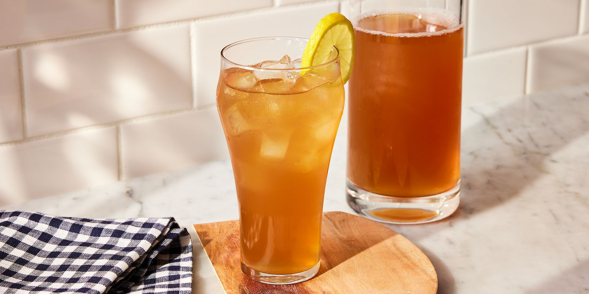

# Arnold Palmer

*Half lemonade, half iced tea, named for the golfer who ordered it that way and kept on doing it for forty years.*

**Serves:** 2

**Prep Time:** 3 minutes

**Cook Time:** 0 minutes (assumes you have lemonade and iced tea already made)

## Overview
The Arnold Palmer is one of the great two-ingredient drinks, named for the American golfer who supposedly ordered it that way at a course in Latrobe and kept doing it for the rest of his career. The ratio that bears his name is supposedly fifty-fifty lemonade and iced tea, though Palmer himself reportedly preferred about a third lemonade to two thirds tea (a heavier tea hand than the 50:50 most bars pour). Both halves want to be cold and strong; the dilution of melting ice will mellow them in the glass. Pour the tea in first, then the lemonade carefully down the back of a spoon if you want the half-and-half layered effect for a moment before it merges. Garnish is the same as either parent drink: a lemon wheel and a sprig of mint. Drink it on a hot afternoon between courses of anything, ideally outdoors.

## Ingredients

### The drink
- 350 ml [Iced Tea](../classic/iced-tea.md), well chilled
- 350 ml [Lemonade](../classic/lemonade.md), well chilled

### To serve
- Plenty of ice cubes
- 2 lemon wheels
- 2 fresh mint sprigs

## Method

### Stage 1 - Chill the components
1. Make sure both the iced tea and the lemonade are properly cold; warm components against ice will dilute the drink too fast.

### Stage 2 - Build
1. Fill two tall glasses with ice cubes (right up to the brim; the more ice, the slower the dilution).
1. Pour 175 ml of cold iced tea into each glass (slightly more if you want a Palmer-leaning ratio, half if you want the bar-standard 50:50).
1. Slowly pour 175 ml of cold lemonade down the back of a spoon held just above the surface of the tea; the lemonade is lighter and will float briefly before mixing.

### Stage 3 - Serve
1. Garnish with a lemon wheel and a sprig of mint.
1. Serve immediately with a long spoon for the inevitable stir.

## Notes
- **Palmer's ratio vs the standard.** A "true" Arnold Palmer per the man himself was roughly one third lemonade to two thirds tea. The 50:50 split is the bar default. Both are correct; the heavier-tea version drinks more like a long iced tea with a citrus twist, the half-and-half more like a sweet refresher.
- **Both parents need to be strong.** A weak iced tea or a thin lemonade ends up underwhelming after dilution. Brew strong, mix proper lemonade.
- **Layered presentation lasts seconds.** The drinks merge within 30 seconds of pouring; if you want the photo-friendly split look, drink it fast.

## Variations
- **Tequila Sunrise's distant cousin.** Add a shot of vodka or bourbon per glass to turn an Arnold Palmer into a "John Daly" (named for another golfer, who took his Palmer with a kick).
- **Peach Palmer.** Use a peach iced tea instead of plain; lemonade stays the same.

## Storage
- Drink immediately; the ice will dilute past the sweet spot within 20 minutes.
- The two component drinks store separately as per their own recipes.
