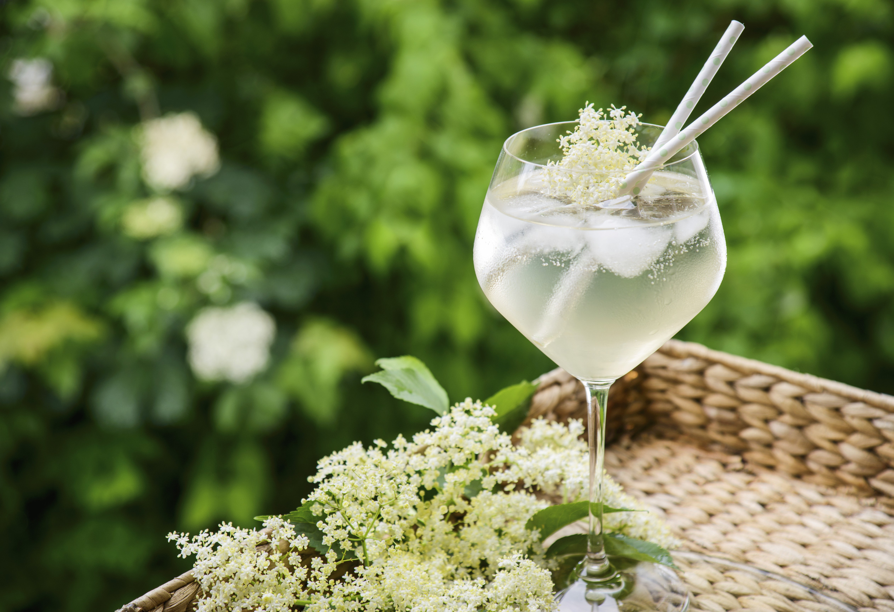

# Elderflower Cordial

*The first weekend of June: heavy cream-coloured umbels of elderflower steeped overnight with lemon, sugar and citric acid, bottled and rationed all summer.*

**Serves:** makes about 1.5 litres of cordial (each litre dilutes to roughly 6 to 8 glasses)

**Prep Time:** 30 minutes (plus 24 hours steeping)

**Cook Time:** 10 minutes

## Overview
Elderflower cordial is what you make the weekend the elders bloom along the lanes, ideally in the first half of June. You pick clean heavy flowerheads in the late morning when the dew has gone and the blossoms have opened, shake out any insects, and steep them overnight with sugar syrup, lemon zest and juice, and a spoonful of citric acid (which sharpens the flavour and keeps it for longer). The next day you strain through muslin into bottles and stash in a cool dark cupboard, and one good afternoon's foraging gives you a summer's worth of long drinks. Dilute about one part cordial to six parts cold water or chilled sparkling water; serve in a tall glass with ice, a slice of lemon and a sprig of fresh mint. It's also the one homemade thing that genuinely improves a gin and tonic, and the base of a hundred summer desserts.

## Ingredients

### Forage
- 25 fresh elderflower heads (heavy, cream-coloured, picked the morning of brewing; shake off insects without washing if you can)

### Cordial
- 1.5 litres water
- 1500 g granulated sugar
- 4 unwaxed lemons (zest in wide strips with a vegetable peeler; juice reserved)
- 50 g citric acid (from any pharmacy or brewing supplier; not optional, this is the preservative)

### To serve
- Cold still or sparkling water (about 6 parts to 1 part cordial)
- Plenty of ice cubes
- Lemon slices
- Fresh mint sprigs

## Method

### Stage 1 - Prep the flowers
1. Look over the flowerheads and pick out any obvious insects with a soft brush; do not rinse the flowers unless absolutely necessary (water washes off the pollen and the volatile aromatics).
1. Snip off the thickest stalks with scissors; the smaller stems can stay.

### Stage 2 - Make the syrup
1. Tip the water and sugar into a large saucepan.
1. Heat over medium, stirring, until the sugar has completely dissolved.
1. Bring to a low simmer for 2 to 3 minutes, then take off the heat.

### Stage 3 - Steep
1. Add the lemon zest strips, lemon juice and citric acid to the hot syrup; stir.
1. Lay the elderflower heads carefully on top, pushing them gently down so they're submerged.
1. Cover the pan with a tea towel or large lid and leave at room temperature for 24 hours. The kitchen will smell extraordinary.

### Stage 4 - Strain and bottle
1. Set a fine sieve lined with a double layer of muslin over a clean jug or wide bowl.
1. Pour the cordial through; let it drip through naturally rather than pressing the flowers (pressing extracts bitterness).
1. Decant into clean sterilised glass bottles (a kettle's worth of boiling water poured into and out of each bottle is enough to sterilise).
1. Seal and store in a cool dark cupboard.

### Stage 5 - Serve
1. To make a glass, pour roughly 4 tablespoons of cordial into a tall glass.
1. Top up with cold still or sparkling water (a 1:6 ratio is a good starting point; sweeter palates may want more cordial).
1. Add ice, a slice of lemon and a sprig of mint.

## Notes
- **Pick the right flowers.** Heavy, cream-coloured umbels with most flowers open. Anything brown or wilted goes off in the bottle. The smell when you put your face into a fresh head should be lemony and floral; if it smells of cat pee, leave it (occasionally happens with old or shaded specimens).
- **Citric acid is the keeper.** Without it the cordial keeps maybe a week; with it, three months in the cupboard and six in the fridge.
- **Don't press the flowers when straining.** Drip is slower but cleaner; pressing extracts the bitter tannins from the stems.
- **Sterilise the bottles.** Boiling water rinses are enough for cordial; a fungal bloom is the failure mode if you skip it.

## Variations
- **Elderflower and rose.** Add a handful of fresh unsprayed rose petals (cream or pink, not dark red which goes brown) with the elderflowers.
- **Elderflower and ginger.** Add a 5 cm piece of fresh ginger, sliced, to the syrup before steeping.

## Storage
- Cool dark cupboard: 3 months sealed.
- Refrigerator once opened: 6 weeks.
- Freezes well in ice-cube trays for 6 months; pop a cube into a glass and top with sparkling water.
