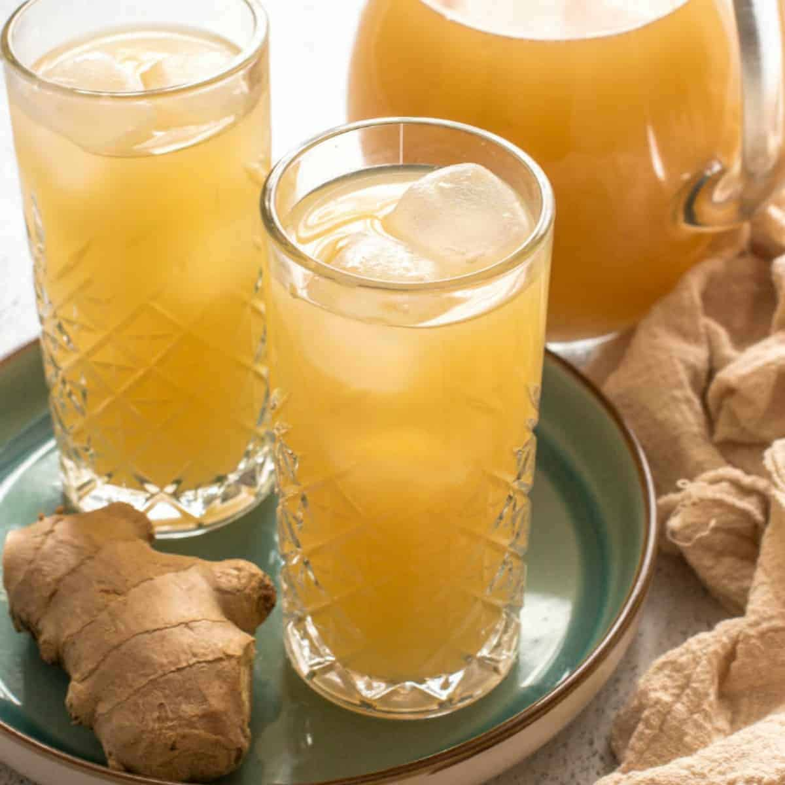

# Ginger Beer

*Ginger root grated hard into a syrup, sharpened with lemon and a slow ferment from a sourdough-style "ginger bug", carbonated in the bottle and properly fiery.*

**Serves:** 6 to 8 (makes 1.5 litres)

**Prep Time:** 20 minutes (plus 5 days for the ginger bug, plus 2 to 4 days for the bottle ferment)

**Cook Time:** 10 minutes

## Overview
Homemade ginger beer is a low-effort weekend project that ferments quietly on the counter for a few days and then carbonates itself in the bottle, with a bite that bottled commercial versions can't touch. The drink starts with a "ginger bug", which is a wild-yeast starter you make over five days by feeding grated ginger and sugar to a jar of water; it's the same idea as a sourdough starter but quicker. Once the bug is active you simmer a strong ginger-and-lemon syrup, mix it with cold water and a few spoonfuls of the bug, decant into pressure-rated bottles, and let it ferment at room temperature for two to four days until properly fizzy. The result is sharp, herbaceous, alive in the mouth, lightly alcoholic (under 0.5 percent if you bottle on day two; a bit higher if you let it run longer). Drink it neat in a tall glass with plenty of ice, or use as the mixer that turns any whisky or dark rum into something interesting.

## Ingredients

### Ginger bug (start 5 days ahead)
- 250 ml warm water (filtered if your tap water is heavily chlorinated)
- 2 tablespoons grated fresh ginger (with the skin on, organic if possible for wild yeasts)
- 2 tablespoons granulated sugar

### Daily feed (days 2 to 5)
- 1 tablespoon grated fresh ginger
- 1 tablespoon granulated sugar

### Ginger syrup
- 120 g fresh ginger (peeled and finely grated, about 150 g unpeeled)
- 150 g granulated sugar
- 600 ml water
- 2 lemons (zest in strips, plus 80 ml fresh juice)

### To finish
- 750 ml cold water
- 6 tablespoons active ginger bug (the cloudy liquid, not the ginger sediment)

### To serve
- Plenty of ice cubes
- Lemon wheels
- A sprig of mint

## Method

### Stage 1 - Start the ginger bug (5 days ahead)
1. Combine the 250 ml warm water, 2 tablespoons grated ginger and 2 tablespoons sugar in a clean glass jar.
1. Stir to dissolve the sugar, cover loosely with a square of muslin held by an elastic band (the bug needs air), and leave at room temperature.
1. Each day for the next 4 days, stir in 1 tablespoon of fresh grated ginger and 1 tablespoon of sugar.
1. By day 5 you should see small bubbles rising and a faintly yeasty, gingery smell. That means it's alive and ready to use.

### Stage 2 - Make the syrup
1. Put the grated ginger, sugar, water and lemon zest strips into a saucepan.
1. Bring to a simmer over medium heat, stirring to dissolve the sugar.
1. Simmer gently for 8 to 10 minutes; the syrup should reduce slightly and taste sharply of ginger.
1. Take off the heat and leave to cool to lukewarm (above 30°C kills the yeast).
1. Strain through a fine sieve, pressing the ginger pulp gently to extract the syrup.

### Stage 3 - Build the brew
1. Pour the cooled syrup into a clean 2-litre jug.
1. Add the lemon juice and the 750 ml cold water.
1. Stir in 6 tablespoons of the cloudy ginger-bug liquid (avoiding the ginger sediment at the bottom of the bug jar).

### Stage 4 - Bottle and ferment
1. Decant into pressure-rated swing-top bottles (this matters; thin glass bottles can shatter). Leave 4 cm of headspace.
1. Seal the bottles and leave at room temperature for 2 days for a mild fizz, 3 to 4 days for a vigorous one.
1. "Burp" each bottle once daily by briefly cracking the seal to release pressure.
1. After day 2, test by chilling one bottle for an hour and opening it over a sink; if it hisses and the drink is properly fizzy, refrigerate the rest. If still flat, give it another day.

### Stage 5 - Serve
1. Refrigerate finished bottles to halt the fermentation.
1. Pour over a tall glass full of ice; garnish with a lemon wheel and a sprig of mint.

## Notes
- **Wild yeasts vary.** Some ginger bugs come alive in 3 days, others take 7. If yours hasn't bubbled by day 5, give it another 2 days of feeding before declaring it dead.
- **Use pressure-rated bottles.** Swing-top bottles or rated glass bottles. Standard glass bottles can explode if the ferment runs hot.
- **Burp daily during the bottle ferment.** This isn't optional; it controls the pressure and stops accidents.
- **Keep the bug going.** Save 100 ml of the liquid after using it, top up with fresh water, ginger and sugar, and the bug carries on indefinitely.

## Variations
- **Spiced ginger beer.** Add 3 cardamom pods, a 5 cm cinnamon stick and 4 cloves to the syrup. Strain out with the ginger.
- **Quick non-ferment version.** Skip the bug entirely: combine the cooled syrup with chilled sparkling water at serving time. Fizz comes from the bottle, not the ferment, and the drink is fresh rather than complex.

## Storage
- Refrigerate finished bottles up to 2 weeks; the ferment continues slowly even cold, so check pressure occasionally.
- The ginger bug keeps in the fridge between batches; feed once a week with a teaspoon each of ginger and sugar.
- Don't store unrefrigerated past day 4 of the ferment: pressure will keep building.
