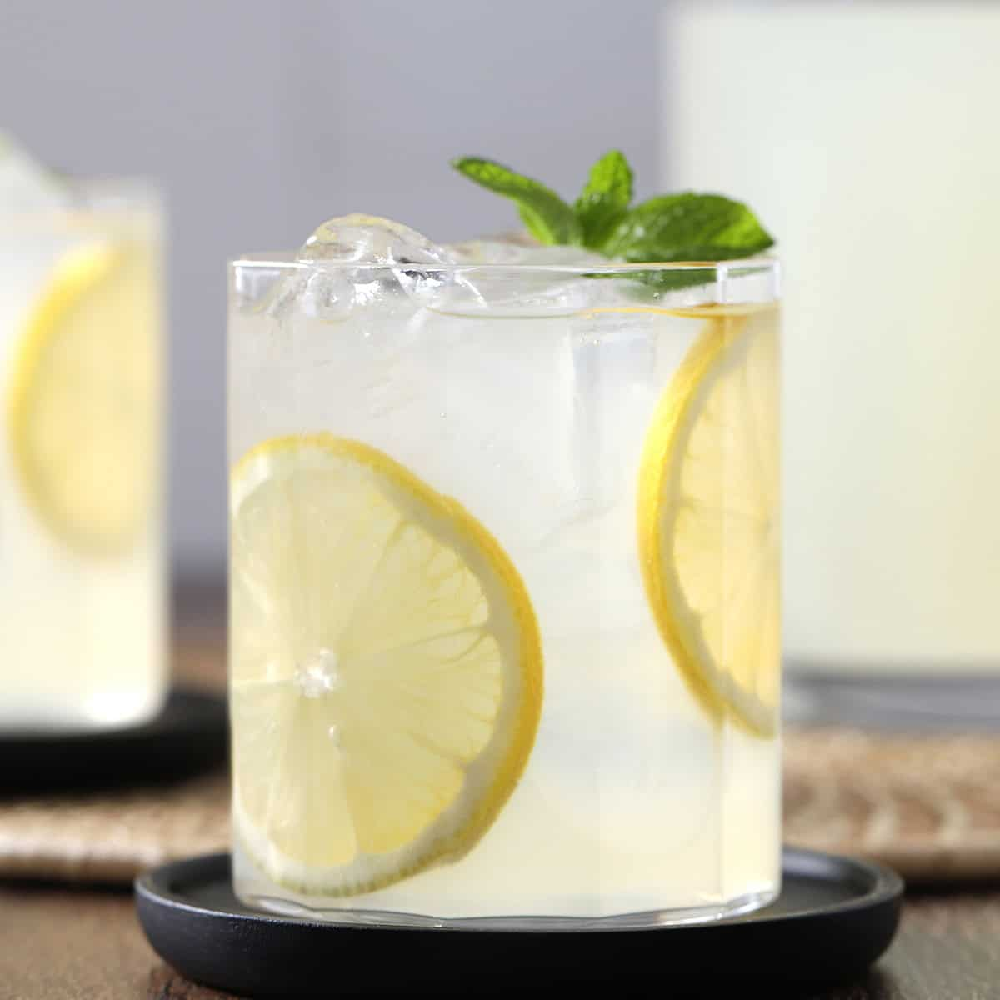

# Lemonade

*Properly tart fresh-squeezed lemonade, the kind that tastes nothing like the bottled stuff: sugar dissolved hot, lemon juice cold, water and ice to finish.*

**Serves:** 6 to 8

**Prep Time:** 10 minutes

**Cook Time:** 3 minutes (to dissolve the sugar)

## Overview
Real lemonade is three ingredients (lemons, sugar, water) and the only trick is getting them in proportion. You make a simple syrup first by dissolving sugar in a small amount of hot water, because granulated sugar refuses to mix cleanly into cold liquid and you'll end up with sweet sludge at the bottom of the jug if you skip this step. The lemons want to be at room temperature so they juice properly (roll them under your palm on the counter first) and you want as much pulp going in as you can be bothered to strain. The ratio that works for most palates is one part lemon juice to one part syrup to four parts water; sharpen or sweeten from there. Pour over plenty of ice, garnish with a wheel of lemon and a mint leaf, and drink it on a hot afternoon in the garden.

## Ingredients

### Simple syrup
- 200 g caster sugar
- 200 ml hot water (just-boiled, then taken off the heat)

### Lemonade
- 250 ml fresh lemon juice (from 6 to 8 lemons; room-temperature, rolled before juicing)
- 1 litre cold water (sparkling for fizz, still for the classic)
- Plenty of ice cubes

### To serve
- Lemon wheels
- Fresh mint sprigs (optional)

## Method

### Stage 1 - Make the syrup
1. Tip the sugar and hot water into a small saucepan over medium-low heat.
1. Stir for 1 to 2 minutes until the sugar has completely dissolved and the syrup is clear.
1. Take off the heat and leave to cool while you juice the lemons.

### Stage 2 - Juice the lemons
1. Roll each lemon firmly under your palm on the counter for a few seconds to break down the membranes.
1. Halve and juice them through a fine sieve into a measuring jug; you want 250 ml of strained juice. Keep a tablespoon of pulp aside if you like a cloudier lemonade.

### Stage 3 - Combine and serve
1. Pour the cooled syrup into a large jug.
1. Add the lemon juice and the cold water; stir well.
1. Taste and adjust: more syrup if too tart, more lemon if too sweet, more water if too intense.
1. Fill tall glasses with ice, pour the lemonade over, and garnish with a lemon wheel and a sprig of mint.

## Notes
- **Roll, don't squeeze cold.** Room-temperature lemons rolled on the counter give twice as much juice as fridge-cold ones squeezed straight.
- **Adjust to taste.** The 1:1:4 ratio (juice : syrup : water) is a starting point; some lemons are sharper than others, and personal palate varies.
- **Make the syrup once, drink lemonade all week.** Doubled or tripled syrup keeps in the fridge for a fortnight and mixes into cocktails, iced tea and fruit salads.

## Variations
- **Pink lemonade.** Add 2 tablespoons of pomegranate juice or muddled raspberries to the jug for the rose-pink colour and a faint berry note.
- **Lavender lemonade.** Steep 1 tablespoon of dried culinary lavender in the hot syrup for 10 minutes, then strain before combining.
- **Sparkling.** Use chilled sparkling water in place of still for a soda-like lift.

## Storage
- Best within 4 hours; the lemon juice oxidises and turns slightly bitter after that.
- Refrigerate up to 24 hours in a sealed jug.
- Freeze in ice-pop moulds for 2 months as lemonade lollies.
