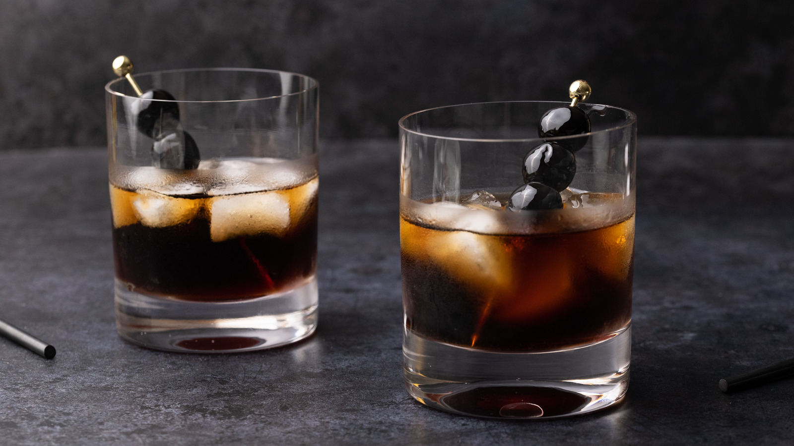

# Black Russian

*Vodka and Kahlúa over ice, two ingredients, served in a rocks glass: the 1949 cocktail that the White Russian later added cream to.*

**Serves:** 1

**Prep Time:** 1 minute

**Cook Time:** 0 minutes

## Overview
The Black Russian was invented in 1949 by Gustave Tops, a Belgian bartender at the Hotel Metropole in Brussels, in honour of the visiting American ambassador to Luxembourg. The "Russian" in the name comes from the vodka; the "black" from Kahlúa's deep brown colour. Two ingredients (vodka and Kahlúa), poured over ice in a rocks glass, stirred briefly, served. The cream-floated version (the [White Russian](white-russian.md)) came later, in the 1960s, and overtook the original in fame thanks to The Big Lebowski; the Black Russian is the original austere drink, more like an iced coffee with a kick. The 2:1 ratio (vodka to Kahlúa) is canonical; some bars push 3:1 for a drier drink, others 1:1 for sweeter. Drink as an after-dinner digestif or as a quiet evening drink with a film.

## Ingredients

### Per glass
- 50 ml vodka (any decent neutral one; Smirnoff is fine, Belvedere is overkill)
- 25 ml Kahlúa (or other coffee liqueur: Tia Maria, Mr Black)
- Plenty of ice cubes
- 1 large ice cube (for the rocks glass; optional but better than crushed)

### To serve (optional)
- 3 whole coffee beans
- 1 thin twist of orange peel

## Method

### Stage 1 - Build
1. Place a large ice cube (or several smaller cubes) in a rocks glass.
1. Pour in the vodka.
1. Pour in the Kahlúa on top.
1. Stir gently with a barspoon for 5 to 10 seconds to combine; the drink should turn a uniform dark coffee colour.

### Stage 2 - Garnish and serve
1. Drop 3 whole coffee beans on top, or twist an orange peel over the glass and rest it on the rim.
1. Serve immediately, no straw; sip slowly.

## Notes
- **Two ingredients, two adjustments.** The drink is so simple that the only variables are the ratio (2:1, 3:1 or 1:1) and the ice (one big cube melts slowest). Pick once, drink twice.
- **Quality coffee liqueur matters.** Kahlúa is the canonical choice; Mr Black is a newer, less-sweet alternative that gives a more coffee-forward drink (and is worth the upgrade for the same money as a mid-shelf Kahlúa).
- **Don't shake.** Same rule as the Negroni and Old Fashioned: shaking aerates the drink and chips the ice into shards that over-dilute. Stir, briefly.
- **Coffee beans, not a cherry.** The cherry-on-a-stick belongs on the White Russian and the Manhattan; the Black Russian's garnish is the coffee bean.

## Variations
- **White Russian.** Float 30 ml double cream on top after stirring; see [White Russian](white-russian.md).
- **Dirty Black Russian.** Replace 20 ml of the vodka with cold-brew coffee concentrate; deeper and more coffee-forward.
- **Tall Black Russian.** Top with chilled cola in a highball glass; turns it into a long drink, more party-friendly.
- **White Mexican.** Replace the vodka with tequila blanco; agave and coffee work surprisingly well.

## Storage
- Drink immediately.
- The vodka-Kahlúa pre-mix keeps in a sealed bottle in the freezer indefinitely; pour 75 ml over ice per glass, garnish fresh.
