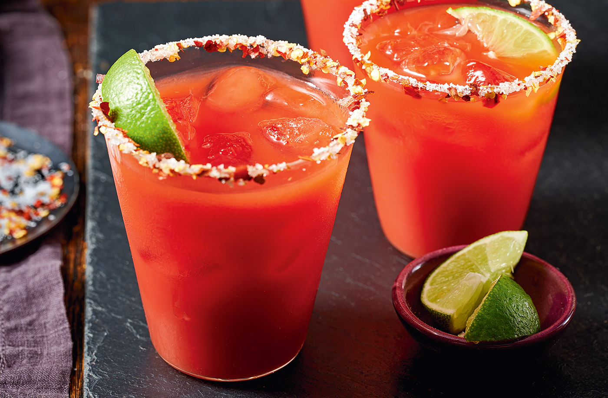

# Bloody Mary

*Vodka, tomato juice, lemon, Worcestershire, hot sauce, horseradish, celery salt, black pepper: a savoury cocktail dressed as a salad, served at brunch with a celery stick and a thousand variations.*

**Serves:** 1

**Prep Time:** 5 minutes

**Cook Time:** 0 minutes

## Overview
The Bloody Mary is the savoury cocktail, the brunch staple, and one of the most heavily customised drinks in the bar canon: half a dozen seasonings adjusted to taste, served over ice in a tall glass with a thicket of garnishes that can run from a simple celery stick to a full breakfast skewered onto a stick. The base build is vodka, tomato juice, fresh lemon, Worcestershire sauce, Tabasco (or another hot sauce), prepared horseradish, celery salt and black pepper. The drink is rimmed with celery salt; built directly in a tall glass over ice; stirred to combine; garnished with a celery stalk (the cocktail's drinking straw), a wedge of lemon, and whatever else you have in the fridge (olives, pickled jalapeños, cooked prawns, a slice of crispy bacon, a hard-boiled quail egg). The drink is the universal hangover remedy, the universal weekend brunch order, and the most forgiving cocktail to mess around with; everyone has a version. The Caesar (the Canadian variant) uses Clamato juice in place of tomato; the Bloody Maria swaps vodka for tequila.

## Ingredients

### Rim
- 1 teaspoon celery salt
- 1 wedge of lemon

### Per glass
- 60 ml vodka (any decent neutral one)
- 120 ml tomato juice (good quality; Big Tom and Sacla are bar standards in the UK)
- 15 ml fresh lemon juice
- 1 teaspoon Worcestershire sauce
- 4 to 6 dashes Tabasco (or another hot sauce; adjust to heat tolerance)
- ½ teaspoon prepared horseradish (sharp horseradish in a jar, not creamy)
- ¼ teaspoon celery salt
- ¼ teaspoon freshly ground black pepper
- A pinch of smoked paprika (optional)
- Plenty of ice cubes

### To serve
- 1 long celery stalk (with leaves attached if possible)
- 1 wedge of lemon
- Pickled green olives on a cocktail stick (optional)
- Anything else: bacon, prawns, pickled jalapeños

## Method

### Stage 1 - Rim the glass
1. Tip the teaspoon of celery salt onto a small saucer in a thin even layer.
1. Run the lemon wedge around the outside of a chilled tall highball glass; the lemon juice will help the salt stick.
1. Roll the wetted rim of the glass in the celery salt; the salt should be on the outside only.

### Stage 2 - Build the drink
1. Fill the rimmed glass with ice cubes.
1. Pour in the vodka.
1. Pour in the tomato juice.
1. Add the lemon juice, Worcestershire, Tabasco, horseradish, celery salt, black pepper and smoked paprika.

### Stage 3 - Stir or "roll"
1. The classic technique is "rolling" rather than shaking: pour the mixed drink from the glass into a shaker tin, then back into the glass, three or four times. This combines the ingredients without aerating them (shaking gives a foamy, light drink that loses the savoury body).
1. Alternatively, stir for 30 seconds with a long spoon to combine.

### Stage 4 - Garnish
1. Add a celery stalk standing tall in the drink; the leafy top is the visual highlight.
1. Notch a wedge of lemon onto the rim.
1. Spear pickled olives or anything else on a cocktail stick and balance across the rim.

### Stage 5 - Serve
1. Serve immediately, no straw (the celery stalk is the straw); the drink is meant to be sipped and chewed.

## Notes
- **Roll, don't shake.** Shaking aerates the tomato juice and gives a thin, foamy drink. Rolling (pouring between two vessels) combines without aerating.
- **Adjust seasoning to taste.** Bloody Mary recipes are individual; build it the traditional way once, then tweak. More horseradish if you like sinus-clearing heat; more Worcestershire for umami depth; more lemon for brightness.
- **Quality tomato juice.** Watery supermarket-basics tomato juice gives a thin, lifeless drink. Look for thick tomato juice (Big Tom, Sacla) or use passata diluted slightly.
- **Garnish as theatre.** A celery stalk is the minimum; a strip of crispy bacon, a pickled green bean, a fat king prawn, a small wedge of cheese on a cocktail stick all turn the drink into a small meal.

## Variations
- **Caesar.** Replace the tomato juice with Clamato (clam-and-tomato juice, available from Canadian or Mexican groceries); a Canadian classic, salty and briny.
- **Bloody Maria.** Replace the vodka with tequila blanco; deeper, slightly smoky.
- **Red Snapper.** Replace the vodka with gin; the original 1930s Harry's Bar Paris recipe, drier than the modern Bloody Mary.
- **Bloody Bull.** Add 60 ml of cold beef consommé alongside the tomato juice; richer and more savoury.
- **Spicy Bloody Mary.** Muddle 2 slices of jalapeño with the tomato juice; sharper, hotter.

## Storage
- Drink immediately for the brightest flavour.
- A Bloody Mary mix (everything except the vodka and the ice) keeps in a sealed jar in the fridge for 3 days and gets better as the flavours meld; add vodka at the glass.
- Don't store finished drinks; the ice melts and dilutes badly.
