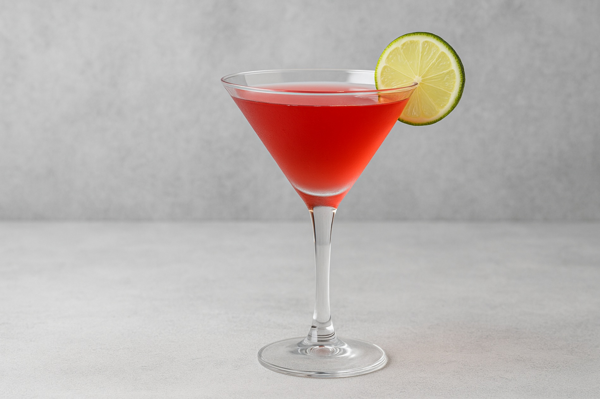

# Cosmopolitan

*Citron vodka, Cointreau, cranberry juice, fresh lime, shaken to a pale pink and strained into a chilled coupe: the cocktail that got famous on Sex and the City and never went away.*

**Serves:** 1

**Prep Time:** 3 minutes

**Cook Time:** 0 minutes

## Overview
The Cosmopolitan is the late-1980s American bar invention that became the 1990s symbol of urban sophistication when Sarah Jessica Parker ordered them on television. The build is citron vodka (lemon-infused vodka, Absolut Citron is the canon), Cointreau, fresh lime juice and just enough cranberry juice to turn the drink pink. The 2:1:1:1 ratio (vodka : Cointreau : lime : cranberry) is the classical recipe, though plain vodka with a slug of fresh lemon juice can substitute for the citron at a pinch. Shaken hard with ice, strained into a chilled coupe, garnished with a flamed orange peel (held over the glass with a match held under it; the orange oils ignite briefly and toast over the surface). It's a sharper, more grown-up drink than its reputation suggests; the citrus and the dryness of the cranberry counter the Cointreau's sweetness to give a drink that's properly sour rather than fruity-juice-like.

## Ingredients

### Per glass
- 45 ml citron vodka (Absolut Citron; or plain vodka + 1 teaspoon fresh lemon juice)
- 20 ml Cointreau (or triple sec)
- 20 ml fresh lime juice (from about 1 lime)
- 20 ml cranberry juice (the proper unsweetened-cranberry-cocktail kind, not "cranberry juice drink")
- Plenty of ice cubes

### To serve
- 1 wide strip of orange peel (for flaming, optional but classic)
- A chilled coupe glass

## Method

### Stage 1 - Chill the coupe
1. Place a coupe in the freezer for 10 minutes ahead, or fill with ice and water for 2 minutes then empty.

### Stage 2 - Shake
1. Fill a cocktail shaker with ice cubes.
1. Pour in the citron vodka, Cointreau, lime juice and cranberry juice.
1. Cap and shake hard for 12 to 15 seconds; the shaker will frost on the outside.

### Stage 3 - Strain
1. Double-strain through a fine sieve into the chilled coupe.
1. The drink should land a pale rose-pink with no ice shards.

### Stage 4 - Flame the orange peel (optional)
1. Hold the orange peel skin-side down 5 cm above the glass.
1. Light a match (or a kitchen lighter) and hold the flame between the peel and the drink.
1. Squeeze the peel firmly; the citrus oils squirt through the flame and ignite briefly in a quick yellow flash before landing on the surface.
1. Drop the peel into the drink.

### Stage 5 - Serve
1. Serve immediately, no ice in the glass.

## Notes
- **Citron vodka or plain + lemon.** Absolut Citron has a citrus depth that plain vodka lacks; if substituting, add a teaspoon of fresh lemon juice to the shake.
- **Proper cranberry, not "drink".** Ocean Spray "cranberry juice cocktail" is mostly sugar water with red colour; look for 100% cranberry juice or unsweetened cranberry concentrate (the 100% kind is sharp on its own, perfect for cocktails).
- **Flaming the orange peel is the show.** The oils ignite briefly and the toasted citrus aroma is the bit that lifts a Cosmo from "pink shot" to "proper cocktail". Use a long match or a kitchen lighter for safety; keep your fingers clear of the flame.
- **Shake hard.** Same rule as every other shaken sour.

## Variations
- **White Cosmo.** Replace the cranberry juice with white cranberry juice; same drink, clear rather than pink.
- **Cosmopolitan-style with grapefruit.** Replace the cranberry with 15 ml pink grapefruit juice; brighter, less sweet.
- **Frozen Cosmo.** Blend all the ingredients with crushed ice; a slushie version.

## Storage
- Drink immediately.
- The vodka-Cointreau base can be pre-batched and stored in the freezer; add fresh lime and cranberry per glass and shake.
- Don't store finished cocktails; the lime oxidises.
