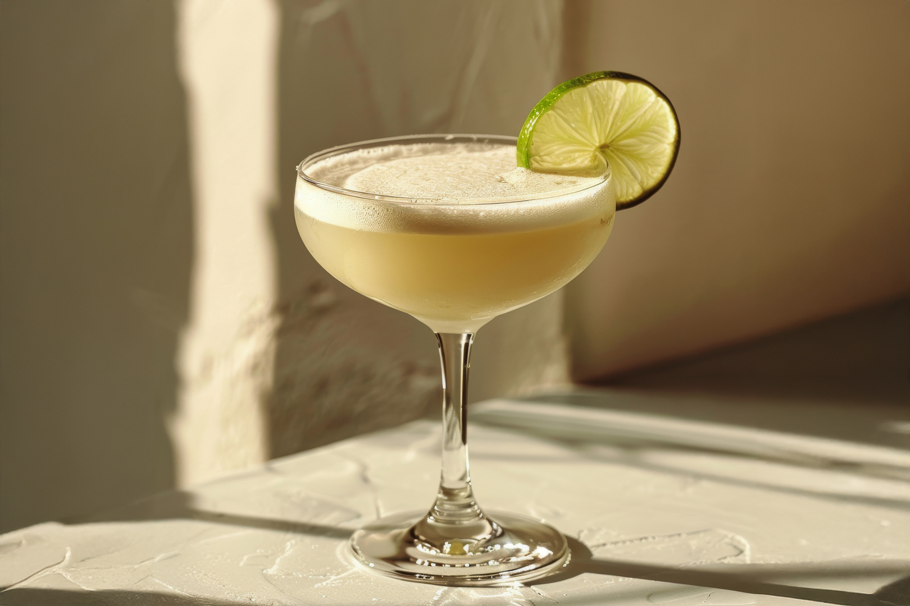

# Daiquiri

*White rum, fresh lime, sugar syrup: three ingredients shaken hard over ice and strained into a chilled coupe. The Cuban classic, not the slushie.*

**Serves:** 1

**Prep Time:** 3 minutes

**Cook Time:** 0 minutes

## Overview
The original Daiquiri (named for the village near Santiago de Cuba where an American mining engineer invented it in 1898) is the platonic ideal of a three-ingredient cocktail: white rum, fresh lime juice, sugar syrup, shaken hard over ice, strained into a chilled coupe. Hemingway drank his at El Floridita in Havana in the 1940s and ordered them double-strength with grapefruit juice and no sugar; that variant is the "Hemingway Daiquiri" or "Papa Doble" and is its own drink. The classical one is the unmessed version: rum, lime, sugar, served up. Don't confuse with the blender-frozen strawberry Daiquiri that turned up in 1970s American beach bars; that's a different drink wearing the same name. The trick is balance: the 2:1:¾ ratio (rum : lime : syrup) is canon, but lime sharpness varies, so taste before serving and adjust. Garnish with a lime wheel on the rim or float a sliver of lime peel.

## Ingredients

### Per glass
- 60 ml white rum (Havana Club 3-year, Bacardi Carta Blanca, Plantation 3 Stars)
- 25 ml fresh lime juice (from 1 to 2 limes)
- 15 ml simple syrup (1:1 sugar dissolved in water)
- Plenty of ice cubes

### To serve
- 1 lime wheel or a thin twist of lime peel
- A chilled coupe glass

## Method

### Stage 1 - Chill the coupe
1. Place a coupe in the freezer for 10 minutes ahead, or fill with ice and water for 2 minutes then empty.

### Stage 2 - Shake
1. Fill a cocktail shaker with ice cubes.
1. Pour in the rum, lime juice and simple syrup.
1. Cap and shake hard for 12 to 15 seconds; the outside of the shaker will frost.

### Stage 3 - Strain and serve
1. Double-strain through a fine sieve into the chilled coupe; the double-strain catches lime pulp and small ice shards.
1. The drink should land pale and slightly cloudy from the agitation.

### Stage 4 - Garnish
1. Either float a lime wheel on top or twist a sliver of lime peel over the surface to express the oils, then drop in.

## Notes
- **Fresh lime juice, always.** Same rule as the Margarita: bottled lime juice is the most common Daiquiri killer at home. Squeeze fresh.
- **Simple syrup, not granulated sugar.** Granulated sugar refuses to dissolve cold; pre-make a 1:1 dissolve and keep in a bottle.
- **Shake hard.** A weak shake gives an under-cold, under-diluted drink. 12 to 15 seconds of full-arm shake.
- **Adjust to your lime.** Some limes are sharper than others. Taste before serving and adjust the syrup by 5 ml increments if needed.

## Variations
- **Hemingway Daiquiri (Papa Doble).** Double the rum, no sugar, add 10 ml fresh grapefruit juice and 5 ml maraschino liqueur. Drier, more grown-up, the version Hemingway drank.
- **Frozen Strawberry Daiquiri.** Blend the standard build with 4 fresh strawberries and a generous scoop of crushed ice; serve in a wide glass with a straw. The Tex-Mex beach version; not at all the classic but worth knowing.
- **Mary Pickford.** Cuban-invented Daiquiri variant named for the silent film star: replace the lime juice with pineapple juice and add a teaspoon of grenadine.
- **Aged Rum Daiquiri.** Use an aged Jamaican or Barbadian rum (Appleton 12, Mount Gay XO) instead of white rum; deeper, woodier, very good.

## Storage
- Drink immediately.
- Pre-mix rum, lime juice and syrup (no ice) in a sealed bottle for 24 hours in the fridge; shake fresh with ice per glass.
- Don't store fully made Daiquiris; the lime oxidises and the drink goes flat.
