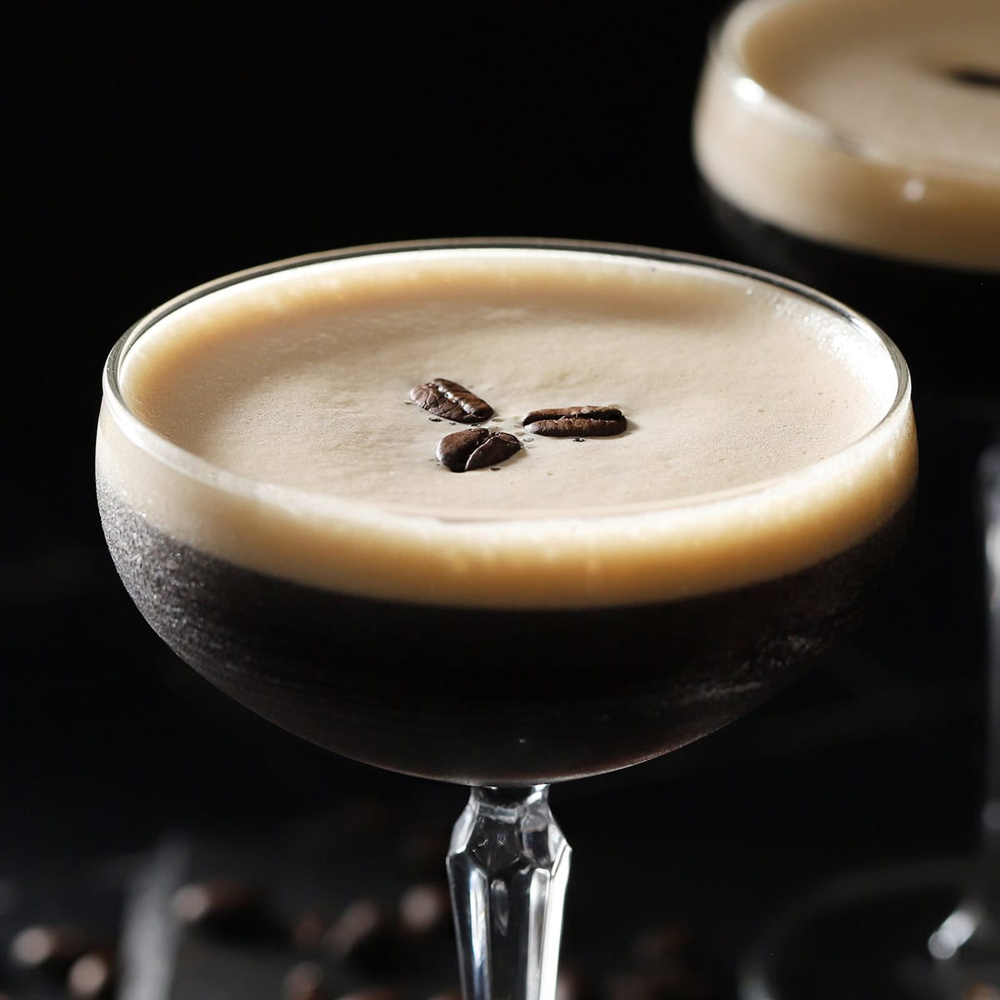

# Espresso Martini

*Vodka, fresh espresso, coffee liqueur, sugar syrup, shaken hard for the foamy top: the 1980s London invention that made a comeback and never left.*

**Serves:** 1

**Prep Time:** 4 minutes

**Cook Time:** 2 minutes (to pull the espresso)

## Overview
The Espresso Martini was invented in 1983 by Dick Bradsell at Soho Brasserie in London when a model walked in and asked for something that would "wake me up and then mess me up". Vodka, freshly pulled espresso, Kahlúa or another coffee liqueur, a touch of sugar syrup, shaken hard with ice until the surface develops a thick crema-like foam, strained into a chilled coupe and garnished with three coffee beans floating on the foam. The drink works because the espresso has to be fresh and hot (the heat is what creates the foam when shaken with the cold liqueurs and ice; cold-brewed coffee gives no foam at all). The vodka can be any decent neutral one (Belvedere, Grey Goose, Ketel One); the coffee liqueur should be a proper one (Kahlúa is the traditional choice). Three coffee beans on the foam is the traditional garnish, said to represent "health, wealth, and happiness".

## Ingredients

### Per glass
- 50 ml vodka (Belvedere, Grey Goose, Ketel One, Absolut Elyx)
- 30 ml freshly pulled espresso (still hot; from a machine or a moka pot)
- 25 ml Kahlúa (or other coffee liqueur: Tia Maria, Mr Black, etc.)
- 10 ml simple syrup (1:1; adjust to taste, the espresso adds bitterness)
- Plenty of ice cubes

### To serve
- 3 whole coffee beans (for the foam garnish; "health, wealth, happiness")
- A chilled coupe glass

## Method

### Stage 1 - Chill the coupe and pull the espresso
1. Place a coupe glass in the freezer for 10 minutes ahead, or fill with ice and water for 2 minutes then empty.
1. Pull a fresh shot of espresso into a small cup. It needs to be hot, not cold-brew; the heat is what creates the foam in the shaker.

### Stage 2 - Shake hard
1. Fill a cocktail shaker with ice cubes.
1. Pour in the vodka, espresso, Kahlúa and simple syrup.
1. Cap and shake hard for 15 to 20 seconds; the espresso emulsifies with the spirits and creates a foam under the agitation.
1. The shaker will frost fast because of the espresso's heat hitting the ice; this is normal.

### Stage 3 - Strain
1. Double-strain through a fine sieve into the chilled coupe glass; the double-strain catches ice shards that would punch through the foam.
1. The drink should land with a 1 cm thick beige-tan foam crown.

### Stage 4 - Garnish
1. Float 3 whole coffee beans on the foam, in a triangle.

### Stage 5 - Serve
1. Serve immediately, no straw; the foam settles within 5 minutes.

## Notes
- **Hot espresso, not cold-brew.** The heat is what makes the foam. Cold-brewed coffee gives a thinner, foamless drink.
- **Shake very hard.** A weak shake gives a thin foam that disappears in a minute. Full-arm shake for 15 to 20 seconds.
- **Three coffee beans, not more.** Tradition. They're a garnish, not a flavour input.
- **Coffee liqueur quality matters.** Kahlúa is the standard; Mr Black is a newer, less sweet alternative that gives a more coffee-forward drink (and is worth the upgrade).

## Variations
- **Salted Caramel Espresso Martini.** Add 10 ml of salted caramel syrup; gives a sweeter, dessertier drink. Garnish with a few sea-salt flakes on the foam.
- **Vegan/dairy-free.** No dairy in the original; already vegan with a proper Kahlúa.
- **Decaf.** Use a decaf espresso shot; same recipe, no caffeine punch. Good for late-night dinners.

## Storage
- Drink immediately; the foam settles in 5 minutes and the espresso flavour fades.
- Don't pre-batch with the espresso; the espresso needs to be hot at shaking. The vodka-Kahlúa-syrup mix can be batched and held in the freezer; add fresh espresso and shake per glass.
