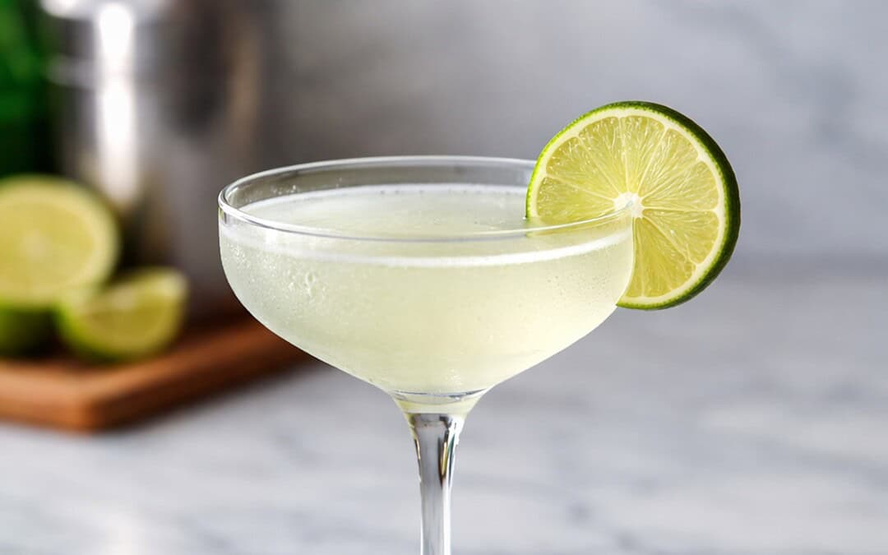

# Gimlet

*Gin, fresh lime, a touch of sugar syrup, stirred over ice and strained into a chilled coupe with a thin twist of lime peel: the Navy cocktail that ended up at the gentleman's club bar.*

**Serves:** 1

**Prep Time:** 3 minutes

**Cook Time:** 0 minutes

## Overview
The Gimlet was invented by the Royal Navy in the 19th century as a way to make scurvy-preventing lime juice palatable to sailors; the original was equal parts gin and Rose's lime cordial (a sweetened, preserved lime cordial), stirred and drunk in the wardroom. The modern recipe uses fresh lime juice with a small amount of simple syrup instead, which gives a sharper, more lively drink, though purists still insist on Rose's. Three or four parts gin to one part lime, plus a teaspoon of sugar syrup; shaken or stirred (both are seen, though stirring is technically more correct for an all-spirit-and-citrus drink), strained into a chilled coupe, garnished with a thin twist of lime peel expressed over the surface. Cleaner and drier than a Margarita, more focused than a Tom Collins, the Gimlet is a connoisseur's drink masquerading as a simple one.

## Ingredients

### Per glass
- 60 ml gin (London dry; Tanqueray, Beefeater, Plymouth)
- 20 ml fresh lime juice (from 1 lime)
- 10 ml simple syrup (or 15 ml Rose's lime cordial in place of the lime + syrup, for the traditional drink)
- Plenty of ice cubes

### To serve
- 1 thin twist of lime peel
- A chilled coupe glass

## Method

### Stage 1 - Chill the coupe
1. Place a coupe in the freezer for 10 minutes ahead, or fill with ice and water for 2 minutes then empty.

### Stage 2 - Shake or stir
1. Fill a shaker with ice cubes.
1. Pour in the gin, lime juice and simple syrup (or Rose's if using).
1. Cap and shake hard for 10 to 12 seconds. (Alternatively, stir in a mixing glass for 30 seconds for a silkier drink.)

### Stage 3 - Strain
1. Double-strain through a fine sieve into the chilled coupe.

### Stage 4 - Garnish
1. Pare a thin strip of lime peel with a vegetable peeler.
1. Hold skin-side down over the glass; squeeze and twist; rub the peel around the rim, then drop in.

### Stage 5 - Serve
1. Serve immediately, no ice in the glass.

## Notes
- **Fresh lime + syrup vs Rose's cordial.** Fresh is sharper and more interesting; Rose's is the classic Navy drink and gives a sweeter, more old-fashioned version. Try both; they're different drinks under the same name.
- **Gin matters.** A juniper-forward London dry is the right choice. New-wave craft gins with strong floral notes can work but change the drink.
- **Shake vs stir.** Shaken gives a slightly more aerated, cloudy drink with a thin head; stirred gives a silkier, clear drink. Both correct.
- **Lime peel twist, not a wheel.** A wheel of lime sat in the drink turns the gin bitter. A twist provides just the oils.

## Variations
- **Vodka Gimlet.** Replace the gin with vodka; cleaner, less complex.
- **Tequila Gimlet.** Replace the gin with tequila blanco; a different kind of dry drink.
- **Frozen Gimlet.** Blend the build with crushed ice for a slushie version.

## Storage
- Drink immediately.
- The gin and Rose's pre-mix (for the traditional Gimlet) keeps in a sealed bottle in the freezer indefinitely; pour 80 ml over no ice for a Vesper-style Gimlet.
- Fresh-lime Gimlets don't pre-mix well past 6 hours; the lime oxidises.
