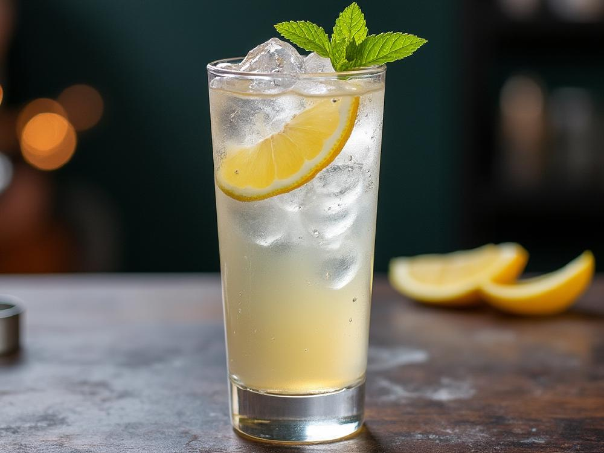

# Gin Sling

*Gin, fresh lemon, sugar syrup, a dash of Angostura, topped with cold soda water over ice: the simple long drink that's been on every English bar list for two hundred years.*

**Serves:** 1

**Prep Time:** 3 minutes

**Cook Time:** 0 minutes

## Overview
The Gin Sling is one of the oldest classes of cocktail in the canon (the term "sling" appears in print as early as 1794, predating the word "cocktail" itself) and the platonic template for a long gin-and-citrus-and-fizz drink. The build is gin, fresh lemon juice, a touch of sugar syrup, a few dashes of Angostura bitters and a top of cold soda water, over ice in a tall glass with a lemon-wheel garnish. The Singapore Sling at the Long Bar of the Raffles Hotel (1915-ish, made famous by Somerset Maugham and the rest of the Singapore expat literary scene) is its better-known cousin, a sweeter, more elaborate cherry-and-pineapple-juice variant; the plain Gin Sling is the older, austerer drink. London dry gin is the traditional choice. Sweeter palates can lean the syrup heavier or replace it with cherry liqueur; drier palates can drop the syrup and add an extra dash of Angostura. Like the Tom Collins, this is a hot-afternoon long drink rather than a sipper.

## Ingredients

### Per glass
- 50 ml London dry gin (Tanqueray, Beefeater, Plymouth)
- 25 ml fresh lemon juice
- 15 ml simple syrup
- 3 dashes Angostura bitters
- 100 ml chilled soda water
- Plenty of ice cubes

### To serve
- 1 wheel of fresh lemon
- 1 maraschino cherry on a cocktail stick (optional)
- A tall highball or Collins glass

## Method

### Stage 1 - Shake the base
1. Fill a cocktail shaker with ice cubes.
1. Pour in the gin, lemon juice, simple syrup and Angostura bitters.
1. Cap and shake hard for 8 to 10 seconds; the shaker will frost.

### Stage 2 - Build
1. Fill a tall Collins glass or highball with fresh ice cubes.
1. Strain the shaken gin-lemon-syrup-bitters mixture into the glass over the ice.

### Stage 3 - Top with soda
1. Top with chilled soda water, pouring slowly down the side of the glass to preserve the fizz.
1. Stir very gently once with a long spoon to combine; don't deflate the bubbles.

### Stage 4 - Garnish
1. Notch a lemon wheel onto the rim of the glass.
1. Drop a maraschino cherry on a cocktail stick into the drink if using.

### Stage 5 - Serve
1. Serve immediately with a long stirring spoon and a paper straw.

## Notes
- **The classical Gin Sling is plain.** No cherry liqueur, no pineapple juice; that's the Singapore Sling. This recipe is the elder.
- **Angostura is the backbone.** Three dashes give the drink its characteristic herbaceous, slightly bitter complexity. Without them, this is just a gin fizz.
- **Fresh lemon juice, simple syrup.** Same rules as the Tom Collins; bottled lemon kills the drink.
- **Adjust the syrup to taste.** Some palates want a fully tart drink; some want a 20 ml pour. Start at 15 ml.

## Variations
- **Singapore Sling.** Add 15 ml cherry brandy (Heering or Cherry Heering), 5 ml Cointreau, 5 ml Bénédictine, 15 ml grenadine and replace the soda water with pineapple juice. The Raffles Long Bar version that became the Singapore tourist standard; sweet, fruity, complex.
- **Sloe Gin Sling.** Replace half the gin with sloe gin; pink, slightly sweeter, an autumn variant.
- **Whiskey Sling.** Replace the gin with bourbon; an American variant from the 1860s.
- **Brandy Sling.** Replace the gin with cognac; a French variant, slightly richer.

## Storage
- Drink immediately; the soda goes flat within 10 minutes.
- The shaken gin-lemon-syrup-bitters base can be pre-mixed in a sealed bottle for 24 hours; pour over fresh ice and top with soda at the glass.
