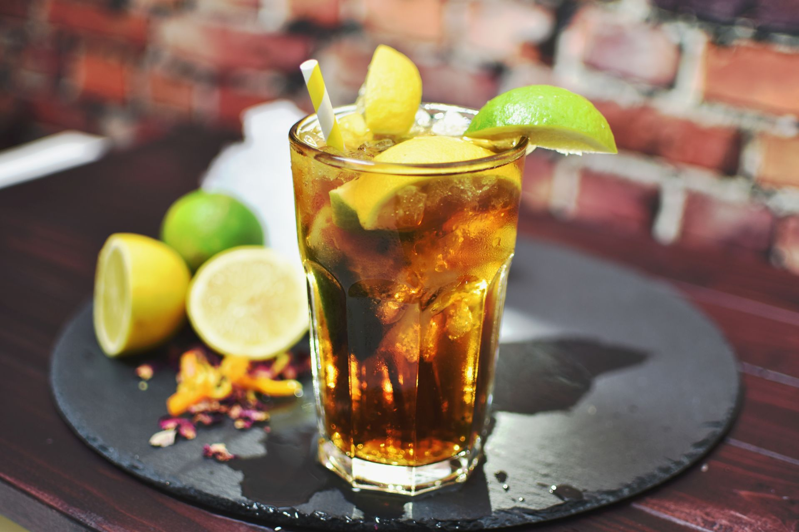

# Long Island Iced Tea

*Five clear spirits, a sour mix and a splash of cola that turns the whole drink tea-coloured: the 1970s American invention designed to taste of nothing in particular and hit you anyway.*

**Serves:** 1

**Prep Time:** 4 minutes

**Cook Time:** 0 minutes

## Overview
The Long Island Iced Tea was invented in the early 1970s on Long Island and is the cocktail equivalent of a magic trick: five different white spirits go into a glass with sour mix and a top-up of cola, and somehow the drink ends up tasting like iced tea with no tea in it. The cola provides the colour, the lemon and sugar provide the iced-tea-like sweet-sour balance, and the spirits all stay out of each other's way. The danger is exactly the appeal: it tastes light and refreshing, hides the alcohol completely, and most people find that out the hard way an hour later. Equal small pours of vodka, gin, white rum, blanco tequila and triple sec; lemon juice; simple syrup; built directly in a tall glass over ice, topped with a splash (not a lot) of cola. Garnish with a lemon wedge and a paper straw; warn the drinker.

## Ingredients

### Per glass
- 15 ml vodka
- 15 ml gin
- 15 ml white rum
- 15 ml tequila blanco
- 15 ml triple sec (or Cointreau)
- 25 ml fresh lemon juice
- 15 ml simple syrup
- Plenty of ice cubes
- 60 ml cola (just enough to colour and top; not enough to dilute heavily)

### To serve
- 1 lemon wedge
- A paper straw

## Method

### Stage 1 - Build over ice
1. Fill a tall highball glass with ice cubes; the more, the slower the dilution.
1. Pour in the vodka, gin, white rum, tequila and triple sec in turn.
1. Add the lemon juice and simple syrup.
1. Stir briefly with a long spoon to combine.

### Stage 2 - Top with cola
1. Pour the cola slowly down the side of the glass on top of the spirits; aim for a 1 cm dark top layer.
1. The cola sinks down through the drink and turns the whole thing tea-coloured.
1. Give one gentle stir to even out the colour; don't deflate the cola's fizz.

### Stage 3 - Serve
1. Notch a lemon wedge onto the rim of the glass.
1. Add a paper straw.
1. Serve immediately, ideally with food on the way; this drink hits faster than it tastes.

## Notes
- **Cola is a splash, not a full top.** The cola is for colour and a small lift of sweetness; too much makes the drink syrupy and obscures the spirits' presence (and absence of flavour).
- **Five small pours, not five large ones.** 15 ml of each spirit (75 ml total) is the traditional build; doubling the pours turns it into a public-safety hazard.
- **Fresh lemon juice, simple syrup.** Same rules as every other shaken sour: bottled lemon and granulated sugar kill the drink.
- **Don't drink three.** Famous warning, repeated for a reason.

## Variations
- **Long Beach Iced Tea.** Replace the cola with cranberry juice; pink, slightly sharper, less sweet.
- **Tokyo Iced Tea.** Replace the cola with Midori (melon liqueur) and a top-up of lemonade; pale green, more fruit-forward.
- **Adios Motherfucker (AMF).** Same five spirits, but blue curaçao replaces the triple sec, and the top is lemon-lime soda; turns the drink electric blue. 1980s tiki bar classic, equally lethal.

## Storage
- Drink immediately.
- The five-spirit pre-mix (no cola, no citrus) batches well in a sealed bottle in the freezer; pour 75 ml per glass over ice, add fresh lemon juice and syrup, top with cola.
- Don't pre-build the full drink; the cola goes flat and the lemon oxidises.
