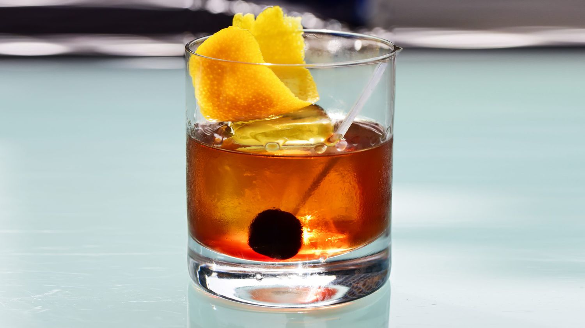

# Manhattan

*Rye whiskey, sweet vermouth and a dash of Angostura, stirred over ice and strained into a chilled coupe with a maraschino cherry: the dark older sibling of the Martini.*

**Serves:** 1

**Prep Time:** 3 minutes

**Cook Time:** 0 minutes

## Overview
The Manhattan was invented in 1870s New York and codified the cocktail format that the Martini would later borrow: spirit, vermouth, bitters, stirred over ice, strained up. Where the Martini went pale and herbal with gin and dry vermouth, the Manhattan went dark and rich with rye whiskey and sweet vermouth, finished with a single dash of Angostura bitters. The 2:1 whiskey-to-vermouth ratio is traditional (though some bars push 3:1 for a drier version). Rye is the classical choice (sharper, spicier, the original American whiskey of the 1870s); bourbon works but gives a sweeter, more rounded drink. Maraschino cherry is the traditional garnish; a single proper Luxardo, not the dyed-red supermarket version. Stirred not shaken, like the Martini and the Negroni. The drink should taste of warm whiskey first, then a slow second wave of vermouth and bitters; the cherry at the bottom is a small reward.

## Ingredients

### Per glass
- 60 ml rye whiskey (Rittenhouse, Bulleit Rye, Sazerac; or bourbon for a softer version)
- 30 ml sweet red vermouth (Cocchi Storico, Carpano Antica, Martini Rosso)
- 2 dashes Angostura bitters
- Plenty of ice cubes (for the mixing glass)
- 1 maraschino cherry (Luxardo; the proper kind)

## Method

### Stage 1 - Chill the coupe
1. Place a coupe glass in the freezer for 10 minutes ahead, or fill with ice and water for 2 minutes then empty.

### Stage 2 - Stir
1. Fill a mixing glass two-thirds with ice cubes.
1. Pour in the rye whiskey, sweet vermouth and Angostura bitters.
1. Stir with a long barspoon for 30 to 40 seconds; the drink should chill and dilute properly.
1. The outside of the mixing glass will frost.

### Stage 3 - Strain
1. Place a Julep or Hawthorne strainer over the mixing glass.
1. Strain into the chilled coupe.

### Stage 4 - Garnish
1. Drop a single Luxardo maraschino cherry into the drink.
1. If you want extra theatre, dip the cherry into a teaspoon of the syrup from the jar before dropping; the syrup will swirl around the drink.

### Stage 5 - Serve
1. Serve immediately, no ice in the glass.

## Notes
- **Rye vs bourbon.** The Manhattan started with rye; bourbon became dominant during Prohibition when rye was harder to come by. Try rye first for the spicier, drier original; bourbon for a rounder, sweeter version.
- **Sweet red vermouth.** Same rules as the Negroni: this is the sweet "Italian" vermouth, not the dry "French" vermouth.
- **Luxardo cherry only.** The dyed-red supermarket maraschinos are mostly red dye and sugar; the proper Luxardos are dark, intense, with a slight bitter-almond edge from the marasca cherries.
- **Stir, don't shake.** Same logic as the Martini and Negroni: stirring keeps the drink silky; shaking aerates and over-dilutes.

## Variations
- **Perfect Manhattan.** Use 15 ml each of sweet AND dry vermouth (instead of 30 ml sweet); the resulting drink is drier and more nuanced. Garnish with a lemon twist instead of a cherry.
- **Rob Roy.** Replace the rye with Scotch whisky; a Scottish Manhattan, smokier and less spicy.
- **Bobby Burns.** A Rob Roy with the addition of a small dash of Benedictine; a herbaceous variant.
- **Black Manhattan.** Replace the sweet vermouth with Averna or another Italian amaro; bittersweet, deeper, very good with rye.

## Storage
- Drink immediately.
- Manhattan batches well: combine 200 ml rye, 100 ml sweet vermouth and 6 dashes of bitters in a bottle; store sealed in the freezer; pour 90 ml per glass over no ice, garnish fresh.
