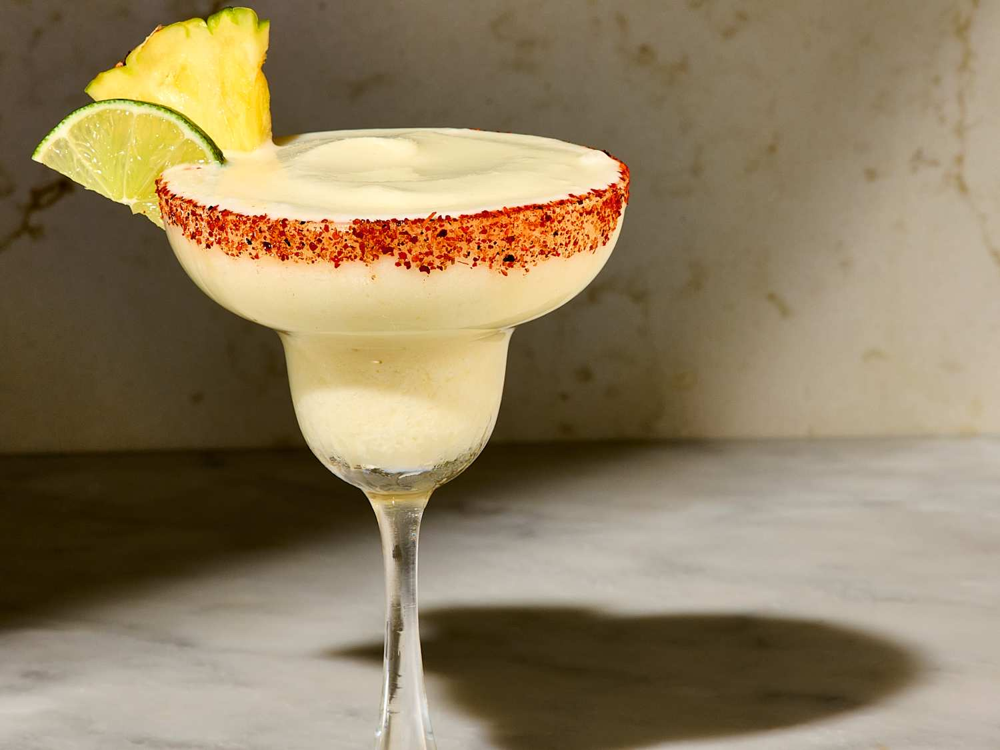

# Margarita

*Tequila, lime, triple sec, salted rim, shaken hard over ice and strained: the Mexican classic that the whole world drinks on Friday nights.*

**Serves:** 1

**Prep Time:** 4 minutes

**Cook Time:** 0 minutes

## Overview
The margarita has an uncertain origin (multiple Mexican bars claim it in the late 1930s and 1940s) but a settled recipe: tequila, lime juice, orange liqueur (Cointreau is the standard; triple sec at a pinch), shaken hard with ice to chill and dilute, strained into a salt-rimmed glass. The salt rim isn't optional; the saltiness on the lips against the sour-sweet drink is the entire experience. Fresh lime juice is non-negotiable; bottled lime juice tastes oxidised and one-note. The 3:2:1 ratio (tequila : lime : orange liqueur) is the canon, scaled to taste. Serve "on the rocks" (strained over fresh ice in a rocks glass) or "up" (strained into a chilled margarita glass with no ice). Both correct. Skip the frozen blender-version that turned the drink into a slushie in 1970s Tex-Mex bars; the proper margarita is sharp, properly cold, and very small.

## Ingredients

### Salt rim
- 1 tablespoon flaky sea salt or kosher salt (not table salt; the crystals matter)
- 1 lime wedge (for wetting the rim)

### Per glass
- 60 ml tequila blanco (100% agave; Tapatío, Olmeca Altos, Espolòn, Don Julio)
- 30 ml fresh lime juice (from 1 to 2 limes)
- 20 ml Cointreau (or triple sec; Cointreau is the classier choice)
- Plenty of ice cubes for the shaker

### To serve
- A wedge of lime
- A rocks glass (or chilled margarita glass for "up")
- Cubed ice if serving on the rocks

## Method

### Stage 1 - Salt the rim
1. Pour the salt onto a small saucer or shallow plate, in a thin even layer.
1. Run the lime wedge around the outside rim of a chilled rocks glass (or chilled margarita coupe).
1. Roll the wetted rim of the glass in the salt; the salt sticks only to the wetted edge, not the inside.
1. Set the glass aside.

### Stage 2 - Shake
1. Fill a cocktail shaker with ice cubes (more is better; you want the drink properly cold and the ice cold-shocking).
1. Pour in the tequila, lime juice and Cointreau.
1. Cap and shake hard for 10 to 12 seconds; the shaker will frost on the outside and you should hear the ice change pitch.

### Stage 3 - Strain and serve
1. If serving on the rocks: fill the prepared salt-rimmed glass with fresh ice cubes, strain the drink over.
1. If serving up: strain into a chilled margarita coupe (no ice in the glass).
1. Either way, garnish with a wedge of lime; serve immediately.

## Notes
- **Salt rim only on the outside.** Roll the rim in the salt only on the outer surface; the salt should be on your lips, not in the drink. If salt falls into the drink, the cocktail goes savoury fast.
- **Fresh lime juice, always.** Bottled lime juice is the most common margarita killer at home bars. Squeezing two limes takes 30 seconds and is the single biggest improvement.
- **100% agave tequila.** Mixto tequilas with caramel colouring give a harsh drink. Blanco (silver) is the canonical choice; reposado works for a slightly oaky version; añejo is wasted here.
- **Shake hard.** A weak shake gives a barely-cold drink that hasn't diluted properly. 10 seconds of full-arm shake is right.

## Variations
- **Spicy margarita.** Muddle 2 thin slices of jalapeño in the shaker before adding the spirits; sharp and good.
- **Frozen margarita.** Blend all the ingredients with a generous amount of crushed ice and a teaspoon of sugar. Tex-Mex classic, sometimes worth it on a hot afternoon.
- **Tommy's margarita.** Skip the Cointreau entirely; replace with 1 tablespoon agave syrup. The San Francisco bartender Julio Bermejo's classic, lets the tequila shine.
- **Cadillac margarita.** Float 10 ml of Grand Marnier on top after pouring; the "luxury" version.

## Storage
- Drink immediately; a margarita that's been sitting goes dull within 10 minutes.
- Pre-mix the tequila, lime juice and Cointreau in a bottle for batch service; refrigerate up to 24 hours, shake fresh with ice per glass.
- Salt the rims of multiple glasses ahead and stand them on a tray; the salt stays put.
