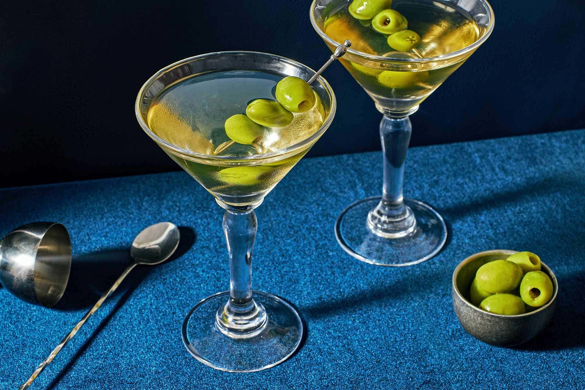

# Martini

*Gin, dry vermouth, stirred over ice and strained into a chilled coupe with a twist of lemon: the most opinionated cocktail in the world.*

**Serves:** 1

**Prep Time:** 3 minutes

**Cook Time:** 0 minutes

## Overview
The Martini has more arguments per ounce than any other cocktail: gin or vodka, dry or dirty, shaken or stirred, olive or twist, how-much-vermouth, what-ratio. The classical answer is gin, dry vermouth, stirred (never shaken; that's a Bond affectation and over-dilutes), strained into a properly chilled coupe (the V-shaped "martini glass" is 1930s American; the coupe is more elegant), garnished with a lemon twist or a single olive depending on the day. Ratios run anywhere from 2:1 gin-to-vermouth (a "wet" Martini, modern bar default) to 7:1 (a "dry" Martini, Hemingway-style) to vermouth-just-rinsed-around-the-glass (Winston Churchill apparently "glanced at" the bottle). The middle ground for most palates is 5:1, which lets the vermouth provide an herbal undercurrent without taking over. Stirring (not shaking) is the canonical method: shaking aerates the drink, chips the ice into shards that over-dilute, and gives a cloudy "bruised" result. A James Bond Vesper Martini is a different drink entirely.

## Ingredients

### Per glass
- 60 ml London dry gin (Tanqueray, Beefeater, Plymouth; or vodka for a Vodka Martini)
- 10 ml dry vermouth (Noilly Prat or Dolin Dry; the wetter you like it, the more vermouth)
- Plenty of ice cubes (for the mixing glass)
- 1 wide strip of lemon peel (pith-free; pared off with a vegetable peeler)
- 1 olive on a cocktail stick (optional, alternative garnish; green pitted, not stuffed with anchovy)

## Method

### Stage 1 - Chill the coupe
1. Place the coupe (or martini glass) in the freezer for at least 10 minutes ahead, or fill with ice and water for 2 minutes then empty.
1. The colder the glass, the longer the drink stays in shape.

### Stage 2 - Stir
1. Fill a mixing glass two-thirds with ice cubes.
1. Pour in the gin and dry vermouth.
1. Stir with a long barspoon in a smooth circular motion for 30 to 40 seconds; the longer stir gives the right dilution for a properly cold but not watery drink.
1. You'll see the outside of the mixing glass frost.

### Stage 3 - Strain
1. Place a Julep strainer or Hawthorne strainer over the mixing glass.
1. Strain into the chilled coupe.

### Stage 4 - Garnish
1. For a lemon twist: hold the lemon peel skin-side down over the glass, squeeze and twist; you'll see citrus oils mist over the surface. Rub around the rim, then drop in.
1. For an olive: spear on a cocktail stick, drop in.
1. Choose one; never both at once.

### Stage 5 - Serve
1. Serve immediately, no ice in the glass; the drink stays cold from the stirring and the chilled glass.

## Notes
- **Stir, don't shake.** Bond was wrong. Shaking aerates and chips the ice; the drink ends up cloudy ("bruised") and too watery. The classical method, and the one that gives a properly silky drink, is to stir.
- **Quality gin is the point.** A Martini is essentially gin in a glass; the gin's botanicals are what you're drinking. Tanqueray, Beefeater, Plymouth, Hendrick's, or a juniper-forward craft gin all give different but excellent drinks.
- **Vermouth matters.** A bottle of dry vermouth in the cupboard for 18 months has gone off. Vermouth is wine; keep it in the fridge after opening, replace every 6 to 8 weeks.
- **Twist or olive, not both.** The drink dressers go one way; the olive goes the other (more savoury). Pick one.

## Variations
- **Dirty Martini.** Add 1 to 2 teaspoons of olive brine to the mix; garnish with an olive. Savoury and slightly muddy.
- **Vodka Martini.** Replace the gin with vodka. Cleaner, less complex; a different drink.
- **Vesper.** James Bond's invention: 60 ml gin, 20 ml vodka, 10 ml Lillet Blanc, shaken (Bond's mistake) until very cold, strained, garnished with a lemon peel.
- **Gibson.** A Martini with a pickled cocktail onion instead of an olive or twist.

## Storage
- Drink immediately; a Martini that's been sitting goes warm and unappealing within 5 minutes.
- Batched gin-and-vermouth keeps in the freezer indefinitely (high-proof, doesn't freeze); pour direct from the freezer over no ice for a ready-to-drink chilled Martini, garnish fresh.
