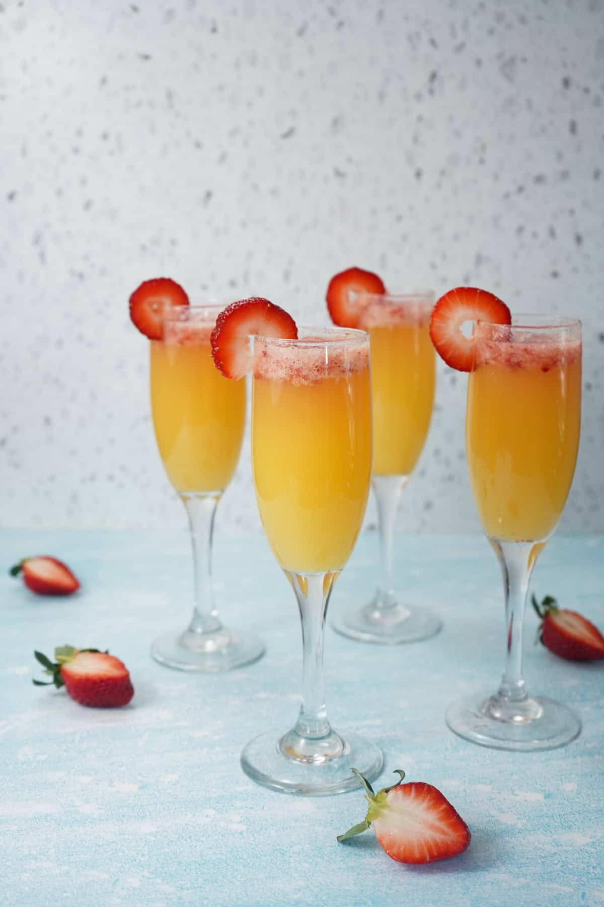

# Mimosa

*Chilled Champagne (or any decent sparkling wine) and fresh orange juice, equal parts, poured into a flute: the universal brunch cocktail.*

**Serves:** 1

**Prep Time:** 2 minutes

**Cook Time:** 0 minutes

## Overview
The Mimosa was invented at the Hotel Ritz Paris in 1925 and named for the bright yellow blossoms of the mimosa tree (which is what the drink ends up looking like in the glass). The build is the simplest of all the great cocktails: equal parts cold Champagne and fresh orange juice, poured into a flute, drunk while sitting in the sun with eggs Benedict on the way. The original recipe is 50:50; modern variants run anywhere from 60:40 in favour of the Champagne (for the punchier brunch experience) to 60:40 in favour of the orange juice (for the more breakfast-y, less alcoholic glass). Champagne is the classical wine but a decent dry sparkling wine works perfectly well, and is what most weekend brunches actually use (Prosecco, Cava, English sparkling). The orange juice has to be freshly squeezed; carton juice gives a flat, sweet drink with none of the brightness of the original. Garnish is a thin twist of orange peel expressed over the surface, or nothing at all.

## Ingredients

### Per flute
- 75 ml cold Champagne (or Prosecco, Cava, or any decent dry sparkling wine)
- 75 ml fresh orange juice (see [Fresh Orange Juice](../fruit/fresh-orange-juice.md); 100% squeezed, not carton)
- 1 thin strip of orange peel (optional, for the twist)

## Method

### Stage 1 - Chill everything
1. The Champagne should be properly cold; refrigerate at least 4 hours ahead, or 20 minutes in an ice bucket.
1. The orange juice should also be cold (the colder the juice, the less it dilutes the wine).

### Stage 2 - Build
1. Pour the orange juice into a chilled flute first; about half-fill (75 ml).
1. Pour the Champagne slowly down the side of the glass on top of the juice; the wine will mix on contact but stay mostly on top.
1. Do not stir; the bubbles do the mixing as they rise.

### Stage 3 - Garnish (optional)
1. Pare a thin strip of orange peel.
1. Hold skin-side down over the glass, squeeze and twist to express the oils, then drop in (or notch over the rim).

### Stage 4 - Serve
1. Serve immediately; the bubbles fade fast.

## Notes
- **Fresh orange juice over carton.** This is the single most common Mimosa failure: carton juice gives a flat, dull drink. Squeezing two oranges takes 60 seconds.
- **Champagne or sparkling wine.** A bottle of Veuve Clicquot in a Mimosa is wasted; a midrange Champagne or a decent dry Prosecco gives an indistinguishable result. Spend the money on the orange juice.
- **Don't stir.** The bubbles mix the drink; stirring deflates the wine and you lose the sparkle.
- **Adjust the ratio to taste.** 50:50 is traditional. Heavier on the Champagne gives a drier, more alcoholic drink; heavier on the juice gives a breakfast version that's almost virgin.

## Variations
- **Bellini.** Replace the orange juice with white peach purée; the Venetian variant invented at Harry's Bar in 1948. Made with Prosecco rather than Champagne, the regional touchstone.
- **Buck's Fizz.** The British 1921 version of the Mimosa: two parts Champagne to one part orange juice, sometimes with a dash of grenadine.
- **Poinsettia.** Replace the orange juice with cranberry juice and add a splash of Cointreau; a winter / holiday version.
- **Kir Royale.** Replace the orange juice with crème de cassis (blackcurrant liqueur); a more aperitif-like cocktail.

## Storage
- Drink immediately; once poured, a Mimosa has about 10 minutes of fizz before it falls flat.
- Don't pre-mix in a bottle; the sparkling wine loses its bubbles fast outside its own bottle.
- The orange juice can be squeezed ahead and refrigerated for up to 24 hours; pour at the glass.
