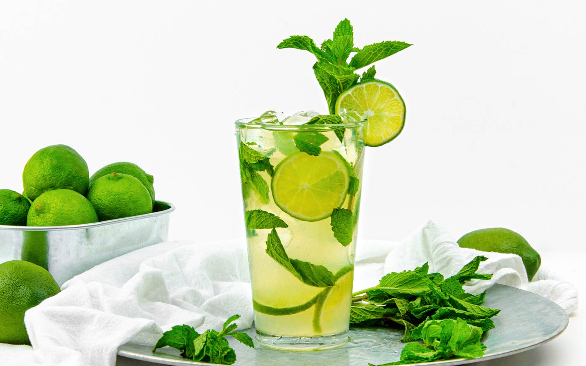

# Mojito

*White rum, fresh lime, mint muddled hard with sugar, soda water and crushed ice: Havana in a tall glass.*

**Serves:** 1

**Prep Time:** 5 minutes

**Cook Time:** 0 minutes

## Overview
The mojito is Cuba's national cocktail and one of the great hot-weather drinks: white rum, fresh mint and lime over a small mountain of crushed ice, topped with soda water and stirred from the bottom up. Hemingway drank his at La Bodeguita del Medio in Havana during the 1950s, and the recipe has barely changed since the 1800s when it was made with rough rum and called a "draquecito" after Francis Drake. The build is identical to the [virgin mojito](../mocktails/virgin-mojito.md) on the mocktails shelf but with 50 ml of white rum poured in after the muddle. Cuban-style mojitos use Havana Club rum (or any soft white rum); American-bar mojitos sometimes use a gold or aged rum for more depth. The trick is muddling the mint properly: hard enough to bruise the leaves and release the oils, gentle enough not to shred them into the drink. Crushed ice slows the dilution the way cubed ice can't. Garnish with a fat sprig of mint slapped between your palms and a wedge of lime.

## Ingredients

### Per glass
- 8 fresh mint leaves (plus a fat sprig for garnish)
- ½ lime (cut into 4 wedges)
- 2 teaspoons caster sugar (or 1 tablespoon simple syrup)
- 50 ml white rum (Havana Club 3-year, Bacardi Carta Blanca, Plantation 3 Stars)
- Crushed ice (a small mountain per glass)
- 100 ml chilled soda water

### To serve
- A fat sprig of mint
- A lime wedge
- A paper straw

## Method

### Stage 1 - Muddle
1. Put the mint leaves, lime wedges and sugar into a tall sturdy glass.
1. Press down with a muddler or the end of a wooden spoon and twist, lightly bruising the mint and squeezing the lime.
1. Don't pulverise; you want bruised, not shredded.

### Stage 2 - Add rum and ice
1. Pour in the white rum.
1. Fill the glass to the brim with crushed ice.
1. Stir from the bottom upwards with a long spoon to lift the sugar and mint through the drink.

### Stage 3 - Top with soda
1. Top with chilled soda water, pouring slowly down the side of the glass to preserve the fizz.
1. Stir once more very gently to combine; don't deflate the bubbles.

### Stage 4 - Garnish
1. Slap a fat mint sprig once between your palms to wake the oils; tuck into the top of the ice.
1. Notch a lime wedge onto the rim of the glass.
1. Add a paper straw.

### Stage 5 - Serve
1. Serve immediately, ideally outdoors on a hot day; if available, a Cuban band playing in the background.

## Notes
- **Crushed ice, not cubed.** The crushed ice melts slower because of its larger surface area dilution maths (counterintuitive but true) and packs tighter in the glass. Wrap cubes in a tea towel and bash with a rolling pin if you don't have a crusher.
- **Slap, don't tear the mint.** Slapping the garnish sprig between your palms releases the volatile oils; tearing bruises it dark and dull.
- **Fresh mint, every time.** Tired mint gives a flat drink. Buy a bunch the day of.
- **White rum is the canon.** Cuban-style uses soft white rum; American bars sometimes use gold rum for more depth (acceptable). Spiced or aged rum doesn't work; the spice fights the mint.

## Variations
- **Strawberry mojito.** Muddle 3 sliced strawberries with the mint and lime. Pink, fruitier, summer-Sunday version.
- **Coconut mojito.** Replace the soda water with chilled coconut water; tropical, slightly sweeter, very good.
- **Apple mojito.** Use cloudy apple juice instead of soda water; autumnal.

## Storage
- Drink immediately; the soda goes flat in 10 minutes and the mint discolours.
- Mojito mix (rum, lime, sugar muddled together with mint) can be pre-mixed and held in the fridge 1 hour ahead; top with ice and soda at serving time.
