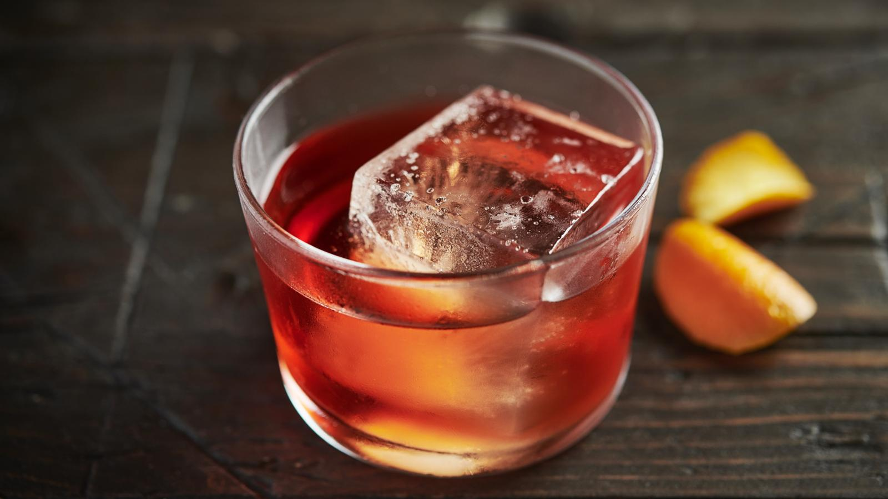

# Negroni

*Equal parts gin, Campari and sweet vermouth, stirred over ice with an orange peel: the Italian aperitivo that bitters your palate awake before dinner.*

**Serves:** 1

**Prep Time:** 2 minutes

**Cook Time:** 0 minutes

## Overview
The Negroni was invented in Florence in 1919 when Count Camillo Negroni asked his bartender at Caffè Casoni to "strengthen" his Americano by replacing the soda with gin. The result is the traditional Italian aperitivo: equal parts gin, Campari and sweet vermouth, stirred with ice, served in a rocks glass with a fat orange peel expressed over the top. The bitterness is the whole point; it's a drink that prepares your palate for a meal rather than entertaining it, which is why it's served before dinner across Italy. The 1:1:1 ratio is famously memorable and famously assertive; if it's your first Negroni, dial the gin down to ¾ part to ease in. A proper London dry gin (Tanqueray, Beefeater), Campari (orange-red and bitter), and a sweet red vermouth (Cocchi Storico Vermouth di Torino, Carpano Antica) are the traditional three. Stir, never shake; shaking dilutes too fast and aerates a drink that wants to be still and dense.

## Ingredients

### Per glass
- 30 ml London dry gin (Tanqueray, Beefeater, Bombay Sapphire; or a juniper-forward craft gin)
- 30 ml Campari
- 30 ml sweet red vermouth (Cocchi Storico, Carpano Antica, Martini Rosso)
- Plenty of ice cubes (for the mixing glass)
- 1 large ice cube (for the rocks glass)
- 1 wide strip of orange peel (pith-free)

## Method

### Stage 1 - Stir
1. Fill a mixing glass with ice cubes (a tall pint glass works fine if you don't have a proper mixing glass).
1. Pour in the gin, Campari and sweet vermouth.
1. Stir with a long barspoon in a smooth circular motion for 20 to 30 seconds; the drink should chill and dilute slightly. You'll see condensation on the outside of the mixing glass when it's ready.

### Stage 2 - Strain and garnish
1. Place a single large ice cube into a chilled rocks glass.
1. Strain the Negroni over the ice using a julep strainer (or a Hawthorne strainer; either works).
1. Express the orange peel: hold it skin-side down 5 cm above the glass and squeeze; you'll see a fine mist of citrus oils land on the surface.
1. Rub the peel around the rim of the glass, then drop it in.

### Stage 3 - Serve
1. Serve immediately, no straw; the Negroni is a sipper.
1. Pair with a small plate of olives, salty crisps, or anything else aperitivo-style.

## Notes
- **Equal parts is the traditional recipe.** 1:1:1 (30 ml each) is what you'll get in Florence. Some bars push the gin to 45 ml for a stronger drink; the original is the equal split.
- **Stir, don't shake.** Shaking aerates the drink and chips the ice into tiny shards that over-dilute. Stirring keeps the drink silky and dense.
- **Sweet red vermouth, not dry.** Dry vermouth (Noilly Prat, Dolin Dry) makes a totally different drink (a Martini variant). For a Negroni you want the sweet red version (sometimes labelled "Rosso" or "Italian vermouth").
- **Express the peel, don't just drop it.** The citrus oils on the surface are 70 percent of the orange garnish's contribution.

## Variations
- **Boulevardier.** Replace the gin with bourbon or rye; a richer, more autumnal version invented in 1920s Paris by Erskine Gwynne. Equal parts apply.
- **Negroni Sbagliato.** Replace the gin with prosecco; "sbagliato" means "mistaken" in Italian, the drink was invented by a Milanese bartender who reached for the wrong bottle. Lighter, easier to drink in summer.
- **White Negroni.** Replace Campari with Suze (a French gentian liqueur) and the sweet vermouth with Lillet Blanc; gold-coloured and more floral.
- **Mezcal Negroni.** Replace the gin with mezcal; smoky and deeply weird, in the best sense.

## Storage
- Drink immediately.
- Negroni batches well: combine 200 ml of each ingredient in a bottle (no ice, no peel), seal, refrigerate up to 1 month; pour 90 ml of the batch over ice and express a fresh orange peel per glass.
- Frozen Negroni: pour a batch directly into the freezer in a sealed bottle (high-proof, doesn't freeze); pour straight out of the freezer for a ready-to-drink slushie.
