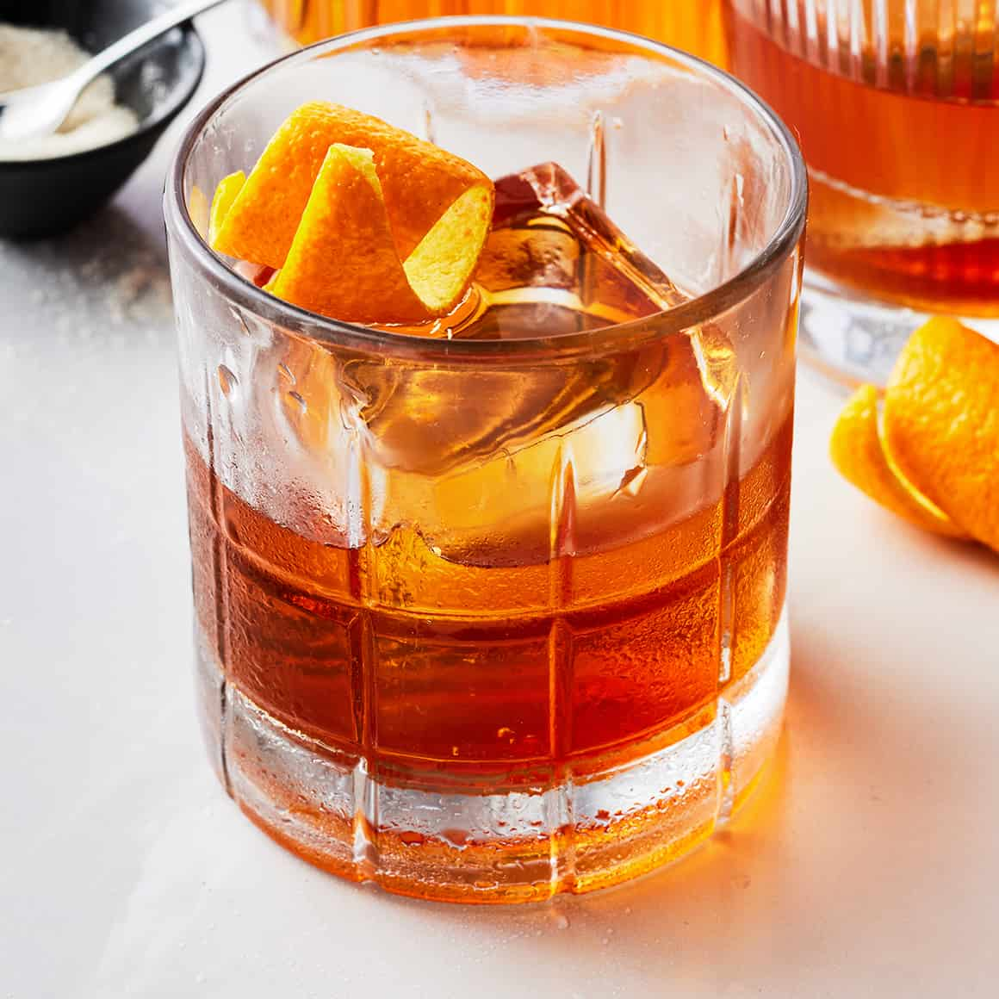

# Old Fashioned

*Bourbon, a sugar cube doused in bitters, an orange peel, a large rock of ice: the original cocktail, named when "cocktail" still meant exactly four ingredients.*

**Serves:** 1

**Prep Time:** 4 minutes

**Cook Time:** 0 minutes

## Overview
The Old Fashioned is the drink that gave the word "cocktail" its meaning: a spirit, sugar, water and bitters, mixed in a glass and served on ice. Anything more is gilding. The build hasn't changed since the 1880s and shouldn't: a sugar cube saturated with Angostura bitters in the bottom of a heavy rocks glass, muddled with a splash of water to dissolve, a generous pour of bourbon (or rye, if you want sharper), one large rock of ice (or a sphere if you're feeling fancy; the larger the cube the slower the dilution), and a fat strip of orange peel expressed over the top so the citrus oils float on the surface. Stir gently with a barspoon; the drink should taste of whiskey first, then the soft sweet-bitter undercurrent of the sugar-and-bitters base. Don't ruin it with a cherry unless the cherry is a proper Luxardo, and even then think hard.

## Ingredients

### Per glass
- 1 brown sugar cube (or 1 teaspoon caster sugar)
- 3 dashes Angostura bitters
- 1 teaspoon cold water
- 60 ml bourbon (Buffalo Trace, Maker's Mark, Woodford Reserve; or rye for a sharper drink)
- 1 large ice cube (a 5 cm sphere or square; the bigger the better)
- 1 wide strip of orange peel (pared off with a vegetable peeler; pith-free)

### To serve (optional)
- 1 Luxardo maraschino cherry (the proper kind in syrup, not the supermarket dyed ones)

## Method

### Stage 1 - Build the base
1. Place the sugar cube (or teaspoon of sugar) in the bottom of a heavy-based rocks glass.
1. Add the 3 dashes of Angostura bitters directly onto the sugar; the cube should absorb them.
1. Add the teaspoon of cold water.
1. Muddle gently with the back of a barspoon or a muddler until the sugar has dissolved into a wet paste in the bottom of the glass.

### Stage 2 - Add the spirit and ice
1. Pour in the bourbon.
1. Add the large ice cube; the bigger and clearer the ice, the better the drink looks and the slower it dilutes.
1. Stir gently with a long barspoon for 15 to 20 seconds; the drink should chill and dilute slightly.

### Stage 3 - Express the peel
1. Hold the orange peel strip skin-side down over the glass, about 5 cm above the surface.
1. Squeeze and twist it; you'll see a fine mist of orange oils land on the drink. This is the entire point of the garnish.
1. Rub the peel around the rim of the glass, then drop it into the drink.
1. Add a single Luxardo cherry if using.

### Stage 4 - Serve
1. Serve immediately with no straw; the Old Fashioned is sipped slowly, neat from the glass.

## Notes
- **Bourbon vs rye.** Both correct. Bourbon (corn-heavy mash) gives a softer, sweeter drink; rye gives a sharper, drier one. The original was almost certainly rye; bourbon became the dominant choice in the 20th century.
- **One large ice cube, not many small ones.** Surface area matters: a single 5 cm cube has far less melting surface than 8 small cubes, so the drink stays at the right strength as you sip.
- **Express the peel, don't just drop it in.** The orange oils on the surface are 80 percent of what you taste from the garnish. Squeeze hard with the skin facing the glass.
- **No fruit salad.** No muddled orange slice, no maraschino cherries in syrup, no soda water. Those are bar-rail Old Fashioneds from the 1970s; the original is austere.

## Variations
- **Wisconsin Old Fashioned.** Muddle a slice of orange and a maraschino cherry with the sugar; top with a splash of soda. The Midwestern version, often made with brandy instead of whiskey. Different drink, also good.
- **Mezcal Old Fashioned.** Swap the bourbon for mezcal; the smoke transforms the drink completely.
- **Maple Old Fashioned.** Replace the sugar cube with 1 teaspoon dark maple syrup; warmer, more autumnal.

## Storage
- Drink immediately; the dilution curve is the whole point.
- The sugar-and-bitters base can be muddled into a glass in advance and the whiskey added at serving time.
- No batched make-ahead; the freshness of the orange-peel expression is non-negotiable.
