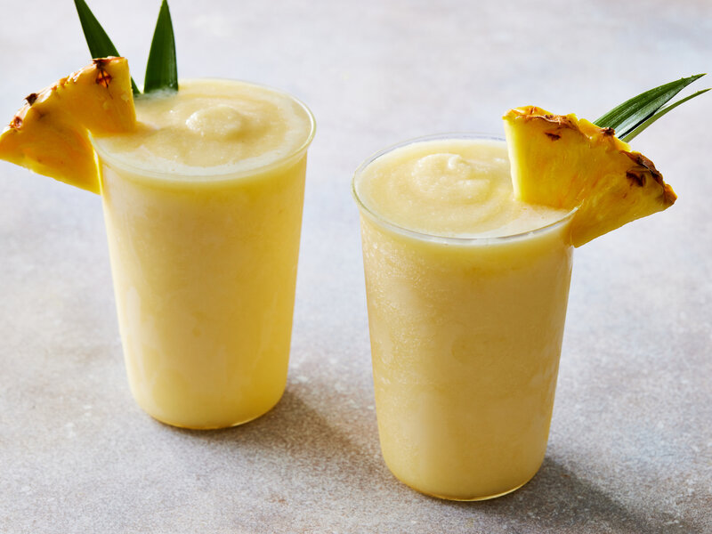

# Piña Colada

*White rum, pineapple juice, cream of coconut, frozen and blended into the Puerto Rican classic that became the unofficial drink of summer in the 1970s.*

**Serves:** 2

**Prep Time:** 5 minutes

**Cook Time:** 0 minutes

## Overview
The Piña Colada was invented at the Caribe Hilton in San Juan, Puerto Rico, in 1954 by bartender Ramón "Monchito" Marrero and became Puerto Rico's national drink in 1978. The build is white rum, pineapple juice, and cream of coconut (sweetened thick coconut cream, Coco Lopez is the canonical brand), blended with ice into a frosty, thick, properly sweet long drink. The "colada" part of the name means "strained" in Spanish, referring to the strained pineapple juice; "piña" is the pineapple itself. The drink should be thick enough to need a straw, not thin enough to be a thinned-out cocktail. Garnish is a wedge of fresh pineapple on the rim and a maraschino cherry on a stick, sometimes with a paper umbrella for the full poolside-tiki effect. The non-alcoholic version is the [Virgin Piña Colada](../mocktails/virgin-pina-colada.md); this is the boozy original.

## Ingredients

### Per blender (makes 2 glasses)
- 100 ml white rum (Bacardi Carta Blanca, Havana Club 3-year, Plantation 3 Stars)
- 200 ml pineapple juice (good quality; from a tin is fine, freshly pressed is better)
- 100 ml cream of coconut (Coco Lopez is the canonical brand; not the same as coconut milk)
- 200 g frozen pineapple chunks (or 6 ice cubes if you don't have frozen pineapple)
- 25 ml fresh lime juice (optional, balances the sweetness)

### To serve
- 2 wedges of fresh pineapple (rind on, for the rim)
- 2 maraschino cherries on cocktail sticks
- 2 paper umbrellas (optional, traditional)
- Wide hurricane glasses or tall tumblers

## Method

### Stage 1 - Blend
1. Tip the rum, pineapple juice, cream of coconut, frozen pineapple and lime juice (if using) into a blender.
1. Blend on high for 30 to 45 seconds until smooth and thick.
1. The drink should be the consistency of a thin milkshake; thick enough to need a straw, not thin enough to pour fast.

### Stage 2 - Adjust
1. Taste; cream of coconut is heavily sweetened, so the drink usually doesn't need more sugar.
1. If too thick, add a splash more pineapple juice; if too thin, add more frozen pineapple.

### Stage 3 - Serve
1. Pour into two wide hurricane glasses or tall tumblers.
1. Notch a wedge of fresh pineapple onto each rim; perch a maraschino cherry on a cocktail stick on the rim too.
1. Add a paper umbrella if you're committing fully.
1. Serve with wide straws (thin straws clog).

## Notes
- **Cream of coconut, not coconut milk.** Coco Lopez (and similar brands) is a heavily sweetened thick coconut cream, the specific ingredient that defines the Piña Colada. Coconut milk gives a thinner, less sweet drink; cream of coconut is what you want.
- **Frozen pineapple over ice cubes.** Same logic as smoothies: ice waters the drink down; frozen pineapple thickens without diluting. Frozen pineapple from the freezer aisle works perfectly.
- **White rum is canonical.** Some bars use a mix of white and aged rum for more depth (50 ml of each); aged rum alone gives a deeper, more wood-forward drink some prefer.
- **Drink within 5 minutes.** A Piña Colada that sits melts into something thin and sweet; the texture only works while frosted.

## Variations
- **Strawberry Piña Colada.** Add 200 g frozen strawberries to the blender; turns the drink pink, balances some of the coconut sweetness.
- **Banana Piña Colada.** Add 1 ripe banana to the blender; richer and silkier.
- **Coconut-and-rum Old School.** Skip the blender, build over crushed ice in a tall glass with a long pour; less frosty, more cocktail-like.
- **Painkiller (a different drink, similar family).** Replace white rum with dark Pusser's rum, add orange juice; a darker, spicier sibling.

## Storage
- Drink immediately; the texture goes within 15 minutes.
- The rum + pineapple juice + cream of coconut mix can be pre-batched in a sealed jar in the fridge for 24 hours; blend with fresh frozen pineapple per serve.
- Pour leftovers into ice-pop moulds for 2 months as Piña Colada lollies; the alcohol limits how solid they freeze, which is actually fine for the pop.
