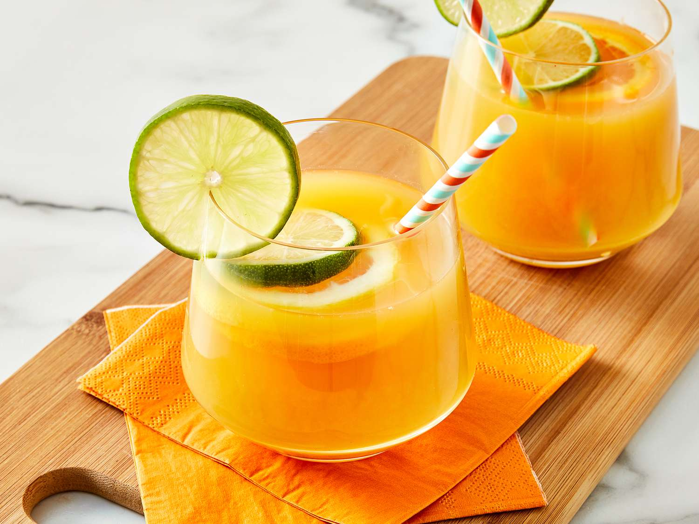

# Rum Punch

*Caribbean rum punch the Trinidadian way: one of sour, two of sweet, three of strong, four of weak, finished with grated nutmeg and a slow pour over a tall glass of crushed ice.*

**Serves:** 4 to 6 (makes about 1 litre)

**Prep Time:** 5 minutes

**Cook Time:** 0 minutes

## Overview
Caribbean rum punch is the drink the whole region has its own version of, and the rhyme that pins the ratio is the easiest cocktail formula in the world: "one of sour, two of sweet, three of strong, four of weak". The sour is fresh lime juice; the sweet is a heavy sugar syrup or, more authentically, grenadine; the strong is dark Caribbean rum (Mount Gay from Barbados, Appleton Estate from Jamaica, El Dorado from Guyana, all good); the weak is fruit juice (orange and pineapple are the classic blend, sometimes with a splash of passion fruit). The whole punch builds in a jug, gets chilled, and pours over a tall glass of crushed ice with a heavy grating of fresh nutmeg over the top, an Angostura-bitters dot or two for the proper finish. Each island makes it slightly differently (Trinidad and Tobago leans into grenadine; Barbados toward demerara sugar; Jamaica adds a splash of overproof rum on top for a kick); the ratio survives them all. Serve at a barbecue, on a hot afternoon, at a Caribbean party that's still going at 2am.

## Ingredients

### Punch (makes about 1 litre)
- 100 ml fresh lime juice (the "sour"; from 4 to 5 limes)
- 200 ml grenadine or simple syrup (the "sweet"; grenadine is the Trinidadian classic, syrup is the everyday substitute)
- 300 ml dark Caribbean rum (the "strong"; Mount Gay, Appleton Estate, El Dorado, Plantation Original Dark)
- 200 ml fresh orange juice (part of the "weak")
- 200 ml pineapple juice (the other half of the "weak")
- 6 dashes Angostura bitters
- Plenty of ice cubes for the jug

### To serve
- Plenty of crushed ice (per glass)
- Grated fresh nutmeg
- Slices of orange and lime
- Maraschino cherries on cocktail sticks (optional)
- A small wedge of pineapple per glass (optional)

## Method

### Stage 1 - Build the punch
1. Combine the lime juice, grenadine (or syrup), rum, orange juice, pineapple juice and Angostura bitters in a large jug.
1. Stir with a long spoon until well combined; the punch should look a deep pink-amber colour.
1. Taste; some limes are sharper than others. Adjust with a splash more grenadine if too tart, a squeeze more lime if too sweet.

### Stage 2 - Chill
1. Add a generous handful of ice cubes to the jug; stir to chill.
1. Alternatively refrigerate the jug for at least an hour ahead so it's properly cold by serving time.

### Stage 3 - Serve over crushed ice
1. Fill tall glasses with crushed ice up to the brim.
1. Pour the punch over the ice slowly; the drink will dilute slightly as the ice melts, which is part of the design.
1. Grate a generous amount of fresh nutmeg over the top of each glass.
1. Add a slice of orange and lime, a maraschino cherry on a cocktail stick, and a small wedge of pineapple if using.
1. Serve immediately with a paper straw.

## Notes
- **The rhyme is the recipe.** "One of sour, two of sweet, three of strong, four of weak" works whatever scale you're cooking on. For a party-sized batch, multiply the ml figures up by 3 or 4 and use the same jug system.
- **Dark Caribbean rum is the right rum.** Mount Gay, Appleton Estate, El Dorado all carry the molasses and warmth that defines the drink. Don't substitute light white rum (that's a daiquiri territory); spiced rum gives a different but acceptable drink.
- **Fresh nutmeg grated at the glass.** This is the trick that lifts a rum punch from "fruity boozy juice" to "actual Caribbean drink". A microplane and a whole nutmeg are the right tools.
- **Crushed ice slows dilution.** Cubed ice melts too fast; crushed has more surface area and packs tighter, keeping the drink cold and proportionate as you sip.

## Variations
- **Planter's Punch.** Jamaican classic: replace the grenadine with falernum (a lime-and-clove syrup) and add a float of overproof rum on top. Stronger, more spice-forward.
- **Bajan Rum Punch.** Barbados-style: use demerara sugar syrup instead of grenadine, and add a tablespoon of orange curaçao. Sharper, less sweet.
- **Trinidadian Rum Punch.** As written above with grenadine; the recipe most Trinidadians grew up with.
- **Spicy Rum Punch.** Add a small wedge of fresh ginger muddled at the bottom of each glass; warms the drink without changing the rhyme.

## Storage
- The pre-mixed punch (no ice) keeps in a sealed jug in the fridge for 24 hours; the flavour gets slightly deeper on day two.
- Pour over fresh ice and grate fresh nutmeg per glass at the moment of serving; the nutmeg dulls fast once on the surface.
- For a party, batch up to triple quantity in a big punch bowl with a block of ice (frozen in a small bowl ahead) sitting in the centre; the block melts slower than cubes and keeps the punch cold for hours.
