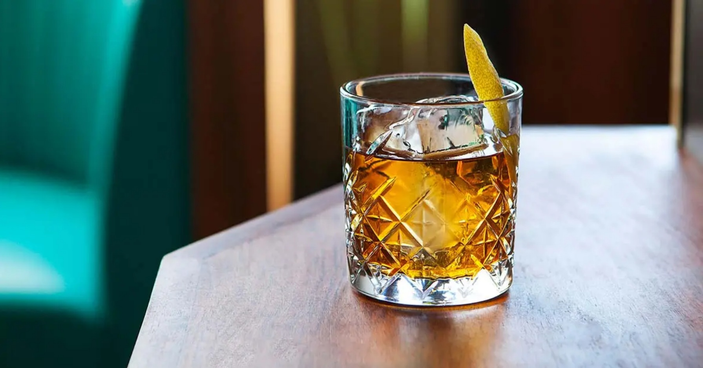

# Rusty Nail

*Scotch whisky and Drambuie over a large rock of ice with a twist of lemon: a two-ingredient Highlands classic that drinks like a fireside read.*

**Serves:** 1

**Prep Time:** 2 minutes

**Cook Time:** 0 minutes

## Overview
The Rusty Nail is a two-ingredient Scottish-American cocktail of Scotch whisky and Drambuie (a Scotch-based liqueur sweetened with heather honey and herbs); the recipe was codified in 1937 at the British Industries Fair in New York and named "Rusty Nail" in the 1960s, supposedly because the colour matched. It's a deeply autumnal, fireside drink: the Scotch carries the smoke and grain (a blended Scotch like Famous Grouse or a lightly peated Highland like Glenmorangie both work; a heavy Islay like Laphroaig is too aggressive against the sweet Drambuie), the Drambuie adds honey and herbs, and a single twist of lemon over the top gives just enough citrus to brighten the long finish. Built directly in a rocks glass over a single large ice cube; no shaking, barely any stirring. Sip slowly with a book, late on a winter evening.

## Ingredients

### Per glass
- 45 ml Scotch whisky (blended like Famous Grouse, or a lightly peated single malt like Glenmorangie 10)
- 25 ml Drambuie (a single bottle goes a long way; sweetened Scotch-based liqueur)
- 1 large ice cube (a 5 cm sphere or square; the bigger the better)
- 1 thin strip of lemon peel

## Method

### Stage 1 - Build
1. Place the large ice cube in the bottom of a rocks glass.
1. Pour in the Scotch.
1. Pour in the Drambuie on top.
1. Stir very gently with a barspoon for 5 seconds; just enough to combine, no more. The drink is meant to be undiluted.

### Stage 2 - Garnish
1. Pare a thin strip of lemon peel with a vegetable peeler.
1. Hold skin-side down over the glass; squeeze and twist; you'll see citrus oils mist over the surface.
1. Rub the peel around the rim, then drop in.

### Stage 3 - Serve
1. Serve immediately, no straw; sip slowly.

## Notes
- **2:1 ratio is traditional.** 45 ml Scotch to 25 ml Drambuie is the standard; some bars push it to 3:1 for a drier, more whisky-forward drink ("Smoky Nail"); 1:1 gives a sweet drink some palates prefer.
- **One large ice cube, not multiple small ones.** Surface area matters; a big cube melts slowly and keeps the drink concentrated.
- **Drambuie matters.** This is not a generic honey liqueur; Drambuie has a specific Scotch-and-honey-and-herbs flavour that defines the drink. There are no good substitutes.
- **Don't shake.** Shaking aerates and over-dilutes a drink that's meant to be neat and full-bodied.

## Variations
- **Smoky Nail.** Use a heavily peated Islay Scotch (Laphroaig, Lagavulin) and push the ratio to 3:1 (45 ml Scotch, 15 ml Drambuie). Bold, smoky and only a little sweet.
- **Hot Rusty Nail.** Add 30 ml of hot water and serve in a heatproof mug; a winter version closer to a hot toddy.
- **Rusty Bob.** Replace the Scotch with bourbon for a sweeter, less smoky version.

## Storage
- Drink immediately.
- The pre-mix of Scotch and Drambuie keeps in a sealed bottle in the cupboard indefinitely; pour 70 ml per glass over a large ice cube; garnish fresh.
