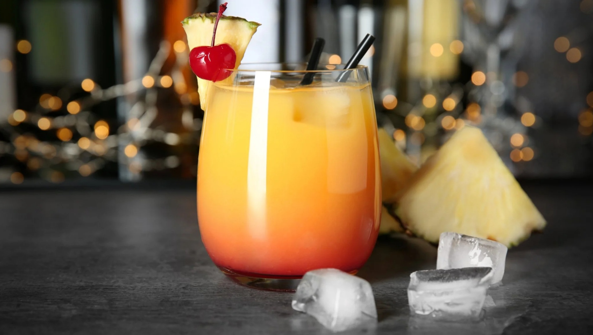

# Sex on the Beach

*Vodka, peach schnapps, cranberry and fresh orange juice over a tall glass of ice: the 1980s Spring Break invention that everyone has ordered at least once.*

**Serves:** 1

**Prep Time:** 3 minutes

**Cook Time:** 0 minutes

## Overview
Sex on the Beach was invented in 1987 at Confetti's, a now-closed Fort Lauderdale bar, by a bartender competing in a peach schnapps sales contest; the drink had to use the schnapps, the name had to be memorable, and the brand sponsor wanted to push the bottle. He won. The recipe has barely changed: vodka, peach schnapps, cranberry juice, fresh orange juice, all built over a tall glass of ice with no measuring beyond "an even pour". The build creates a soft sunset gradient from red cranberry at the bottom to peachy orange at the top, similar to a Tequila Sunrise but pinker. Garnish is a slice of orange and a maraschino cherry on a stick; sometimes a small paper umbrella for the full poolside-bar effect. The drink is genuinely fruity rather than booze-heavy, which is half its problem and half its appeal: drinks fast, masks the alcohol, leads to one or two more.

## Ingredients

### Per glass
- 40 ml vodka
- 20 ml peach schnapps (Archers, DeKuyper, Wild Knight)
- 60 ml fresh orange juice
- 60 ml cranberry juice (proper unsweetened cranberry-cocktail kind)
- Plenty of ice cubes

### To serve
- 1 slice fresh orange
- 1 maraschino cherry on a cocktail stick
- A small paper umbrella (optional, traditional)
- A paper straw

## Method

### Stage 1 - Build over ice
1. Fill a tall highball glass with ice cubes; right up to the brim slows the dilution.
1. Pour in the vodka.
1. Pour in the peach schnapps.
1. Stir briefly with a long spoon to combine the spirits.

### Stage 2 - Add the juices
1. Pour the orange juice over the spirits.
1. Pour the cranberry juice slowly down the side of the glass; it sinks through the orange-juice layer and creates a soft red-to-orange gradient.

### Stage 3 - Garnish
1. Notch a slice of orange onto the rim of the glass.
1. Drop a maraschino cherry on a cocktail stick into the drink, or perch it on the rim.
1. Add a paper umbrella if you have one.
1. Add a paper straw.

### Stage 4 - Serve
1. Serve immediately; the gradient mixes within a few minutes regardless.

## Notes
- **Peach schnapps is the right kind.** This is the sweet-and-syrupy 1980s liqueur, not a proper peach brandy. Archers (UK) and DeKuyper (US) are the traditional choices.
- **Fresh orange juice over carton.** Same rule as the Tequila Sunrise; carton juice tastes flat. Squeezing two oranges takes 60 seconds.
- **Real cranberry, not "drink".** The "cocktail" variety is mostly red sugar water. Look for 100% cranberry juice or unsweetened cranberry concentrate.
- **The gradient is the show.** Pouring the cranberry slowly down the side of the glass is the trick that gives the drink its layered look; pouring it in fast just gives uniform pink.

## Variations
- **Sex on the Beach Frozen.** Blend the whole thing with crushed ice; a slushie variant.
- **Sex in the Driveway.** Use blue curaçao + lemon-lime soda in place of the cranberry; turns the drink electric green-blue. (Bar joke: "sex on the beach is impractical in winter, so we moved it indoors.")
- **Woo Woo.** A simpler relative: vodka, peach schnapps, cranberry juice (no orange juice). Three ingredients, faster build, equally bright pink.

## Storage
- Drink immediately.
- The vodka-schnapps pre-mix keeps in a sealed bottle in the freezer; juices fresh per glass.
- Don't pre-make the full drink; the orange juice oxidises within an hour.
