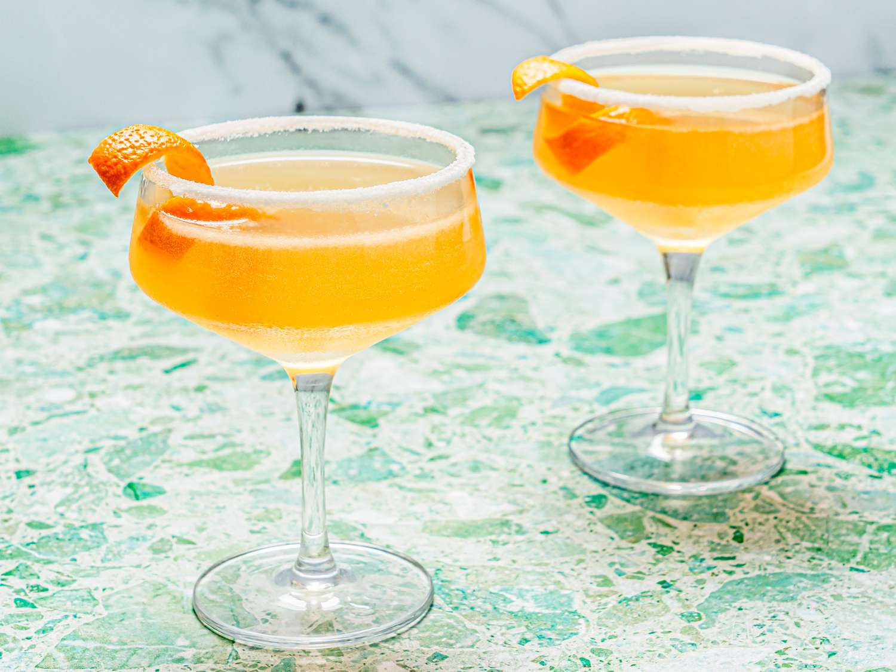

# Sidecar

*Cognac, Cointreau, fresh lemon: a brandy sour with the rim sugared, born during World War I in Paris and sipped through every decade since.*

**Serves:** 1

**Prep Time:** 3 minutes

**Cook Time:** 0 minutes

## Overview
The Sidecar is one of the great sour cocktails and a member of the same family as the Margarita (replace cognac with tequila, sugar with salt, and you basically have a Margarita); both descend from a 1920s template of "spirit + orange liqueur + citrus, shaken and served up". The original recipe is attributed to either Harry's New York Bar in Paris or the Ritz, in either 1923 or 1922; the truth is lost. The build is simple: cognac (a decent VS or VSOP, not a fine XO that would be wasted in the shaker), Cointreau (orange liqueur, not triple sec; quality matters here), and fresh lemon juice. The 3:1:1 ratio is the traditional "French" version (1.5 oz cognac, 0.75 oz each Cointreau and lemon); some bars dial back the cognac to 2:1:1 for a sweeter "English" version. Sugar-rimmed coupe is the classical glass; the rim is optional in modern bars. Garnish is a thin twist of orange peel expressed over the surface.

## Ingredients

### Sugar rim (optional but classical)
- 1 tablespoon caster sugar
- 1 lemon wedge

### Per glass
- 45 ml cognac (VS or VSOP; Hennessy, Martell, Rémy Martin VSOP)
- 20 ml Cointreau
- 20 ml fresh lemon juice
- Plenty of ice cubes

### To serve
- 1 thin strip of orange peel
- A chilled coupe glass

## Method

### Stage 1 - Sugar the rim (optional)
1. Tip the sugar onto a small saucer in a thin even layer.
1. Run the lemon wedge around the outside of a chilled coupe; the lemon juice will help the sugar stick.
1. Roll the wetted rim of the glass in the sugar; only the outside, not the inside.

### Stage 2 - Shake
1. Fill a cocktail shaker with ice cubes.
1. Pour in the cognac, Cointreau and lemon juice.
1. Cap and shake hard for 12 to 15 seconds; the shaker will frost.

### Stage 3 - Strain
1. Double-strain through a fine sieve into the sugar-rimmed coupe.

### Stage 4 - Garnish
1. Pare a thin strip of orange peel with a vegetable peeler.
1. Hold skin-side down over the glass, squeeze and twist to express the oils, then drop in.

### Stage 5 - Serve
1. Serve immediately, no ice in the glass.

## Notes
- **Cognac vs brandy.** Cognac is the classical spirit; any decent brandy works but cognac's softer, fruitier profile is what defines the drink. American brandy gives a sweeter, simpler version; Spanish brandy is too oaky.
- **Cointreau, not triple sec.** Cointreau has a depth and balance that supermarket triple sec lacks. The drink is mostly about the interaction between cognac and orange liqueur; the orange liqueur matters.
- **The rim is optional.** The sugar rim is classical and worth doing once for the experience; many modern bars drop it because the drink is already balanced.
- **Shake hard.** Same rule as every sour.

## Variations
- **Boulevardier (different drink, same family).** Whiskey + Campari + sweet vermouth; a Negroni cousin.
- **Brandy Crusta.** The cocktail the Sidecar evolved from: lemon-wrapped glass, sugar rim, brandy, maraschino, citrus and bitters. New Orleans, 1850s. The "first cocktail" in the modern sense.
- **Boston Sidecar.** Equal parts cognac, white rum, Cointreau and lemon juice; richer.
- **Apple Sidecar.** Replace the cognac with Calvados (French apple brandy); a more autumnal version.

## Storage
- Drink immediately.
- The cognac-Cointreau pre-mix keeps in a sealed bottle in the freezer indefinitely; add fresh lemon and shake at the glass.
