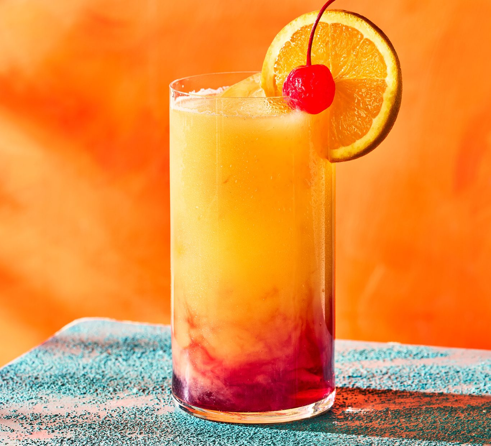

# Tequila Sunrise

*Tequila over ice with fresh orange juice and a slow pour of grenadine that sinks through to make the sunrise gradient: the 1970s poolside classic, named for what it looks like in the glass.*

**Serves:** 1

**Prep Time:** 3 minutes

**Cook Time:** 0 minutes

## Overview
The Tequila Sunrise is a drink that's about the visual as much as the flavour: tequila, fresh orange juice and a teaspoon of grenadine slowly poured down the inside of the glass, where it sinks to the bottom because it's denser than the juice, creating a red-to-orange gradient that does actually look like a sunrise. The drink was invented at the Trident in Sausalito in the early 1970s and got famous when the Rolling Stones drank them on tour. The trick to keeping it from being just a sweet OJ is to use a proper blanco tequila (100% agave, not the mixto stuff with caramel colouring) and to use freshly squeezed orange juice; carton juice gives a muddy, lifeless drink. Grenadine should be the real pomegranate kind. Garnish with a slice of orange and a maraschino cherry, on the rim, the way they did it in the 70s. Drink it before the gradient mixes itself away.

## Ingredients

### Per glass
- 50 ml tequila blanco (100% agave; Olmeca Altos, Tapatío, Espolòn)
- 120 ml fresh orange juice (see [Fresh Orange Juice](../fruit/fresh-orange-juice.md); 100% pressed, not from concentrate)
- 1 tablespoon grenadine (pomegranate-based; not red syrup)
- Plenty of ice cubes

### To serve
- 1 slice fresh orange
- 1 maraschino cherry on a cocktail stick (Luxardo if you have one)

## Method

### Stage 1 - Build
1. Fill a tall highball or hurricane glass with ice cubes; right up to the brim slows the dilution.
1. Pour in the tequila.
1. Pour the fresh orange juice slowly on top of the tequila; stir briefly with a long spoon to combine.

### Stage 2 - The sunrise pour
1. Hold the back of a barspoon (or a teaspoon) just above the surface of the drink.
1. Slowly pour the grenadine over the back of the spoon; it should sink in a thin red stream through the juice to the bottom of the glass.
1. Do not stir. The whole point is the gradient: red at the bottom, fading through orange to lighter at the top.

### Stage 3 - Garnish
1. Notch a slice of orange onto the rim of the glass.
1. Drop a maraschino cherry into the drink on a cocktail stick, or perch it on the rim.

### Stage 4 - Serve
1. Serve immediately, no straw (the straw mixes the gradient).
1. The drinker stirs once before drinking, watching the colours blend.

## Notes
- **100% agave tequila only.** Mixto tequilas (the "gold" stuff with caramel colouring) give a muddy, sharp drink. Reposado tequila works too, gives more depth. Aged añejo is wasted on a Sunrise.
- **Fresh OJ matters.** Carton juice gives a drink that tastes flat and one-note. Squeezing 2 oranges takes 60 seconds.
- **Pour the grenadine slowly.** Fast pouring mixes everything to pink. The grenadine has to sink slowly through the orange juice to form the layers.
- **Drink within 5 minutes.** The gradient is the entire point; once mixed, you have an orange-and-tequila that's still good but no longer photogenic.

## Variations
- **Bourbon Sunrise.** Replace the tequila with bourbon for a deeper, smokier drink; some bars call this a "Country Sunrise".
- **Tequila Sunset.** Use blackberry liqueur (Chambord) instead of grenadine for an indigo-to-orange version. Different drink, equally pretty.
- **Hot weather Sunrise.** Add 1 tablespoon of lime juice in with the orange; cuts the sweetness, brightens everything.

## Storage
- Drink immediately; the gradient is the point.
- Make ahead of time: pre-mix tequila and orange juice (ratios scaled up) in a bottle in the fridge, then pour over ice and float the grenadine at serving time.
