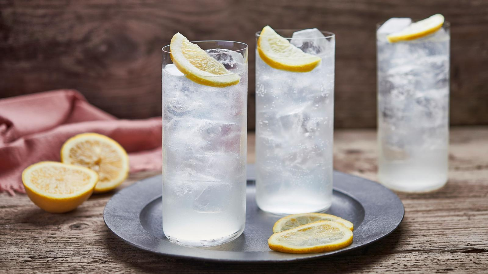

# Tom Collins

*Gin, fresh lemon, sugar syrup, topped with cold soda water in a tall glass over ice: the 1870s long drink that the Collins glass was named for.*

**Serves:** 1

**Prep Time:** 3 minutes

**Cook Time:** 0 minutes

## Overview
The Tom Collins is one of the great long drinks: gin, fresh lemon juice, sugar syrup, soda water, served over ice in a tall glass with a slice of lemon and a maraschino cherry. The drink was named in a famous 1870s American prank (the "Great Tom Collins Hoax") where strangers would walk into a bar and ask if a man named Tom Collins had been in talking about them, and the bartender, in on the joke, would point next door; the cocktail was invented to give bartenders something to actually serve when the punchline-seekers came looking. The recipe itself was already in use under other names. The Tom Collins is the original gin-and-citrus-and-fizz template; once you know it, you've got Tom Collins's many cousins (John Collins with whiskey, Pedro Collins with rum, Sandy Collins with Scotch). Old Tom gin (slightly sweetened) was the original spirit; modern London dry works perfectly well and is closer to what you'll find at the bar.

## Ingredients

### Per glass
- 50 ml gin (Old Tom if you can find it; London dry like Tanqueray or Beefeater otherwise)
- 25 ml fresh lemon juice
- 15 ml simple syrup
- 100 ml chilled soda water
- Plenty of ice cubes

### To serve
- 1 slice fresh lemon
- 1 maraschino cherry on a cocktail stick (Luxardo)
- A tall "Collins glass" (or any tall highball)

## Method

### Stage 1 - Shake the base
1. Fill a cocktail shaker with ice cubes.
1. Pour in the gin, lemon juice and simple syrup.
1. Cap and shake for 8 to 10 seconds; the shaker will frost slightly.

### Stage 2 - Build over ice
1. Fill a tall Collins glass with fresh ice cubes.
1. Strain the shaken gin-lemon-syrup mixture into the glass over the ice.

### Stage 3 - Top with soda
1. Top with chilled soda water, pouring slowly down the side of the glass to preserve the fizz.
1. Stir once very gently with a long spoon to combine; don't deflate the bubbles.

### Stage 4 - Garnish
1. Notch a slice of lemon onto the rim of the glass.
1. Drop a maraschino cherry on a cocktail stick into the drink, or perch it on the rim.

### Stage 5 - Serve
1. Serve immediately with a long stirring spoon; the drinker stirs once before drinking.

## Notes
- **Old Tom gin vs London dry.** Old Tom is the historical gin used in the 1870s, slightly sweetened with sugar. Modern London dry is drier and is what most bars use today. Hayman's Old Tom or Ransom Old Tom give the historically accurate version.
- **Fresh lemon, simple syrup.** Same rules as every other shaken citrus cocktail.
- **Don't over-soda.** A 100 ml top is plenty; pouring more dilutes the drink past the sweet spot.
- **Glass matters.** A Collins glass is a tall, narrow highball; the name has been borrowed for the glass shape. Any tall thin tumbler works.

## Variations
- **John Collins.** Replace the gin with bourbon or rye whiskey; the whiskey version. Slightly drier and warmer.
- **Pedro Collins.** Replace the gin with white rum; a Cuban variant.
- **Sandy Collins.** Replace the gin with Scotch whisky; a more autumnal version.
- **Vodka Collins.** Replace the gin with vodka; cleaner, less complex.

## Storage
- Drink immediately; the soda goes flat within 10 minutes.
- The shaken gin-lemon-syrup mixture can be batched in advance; pour over fresh ice and top with soda at the glass.
