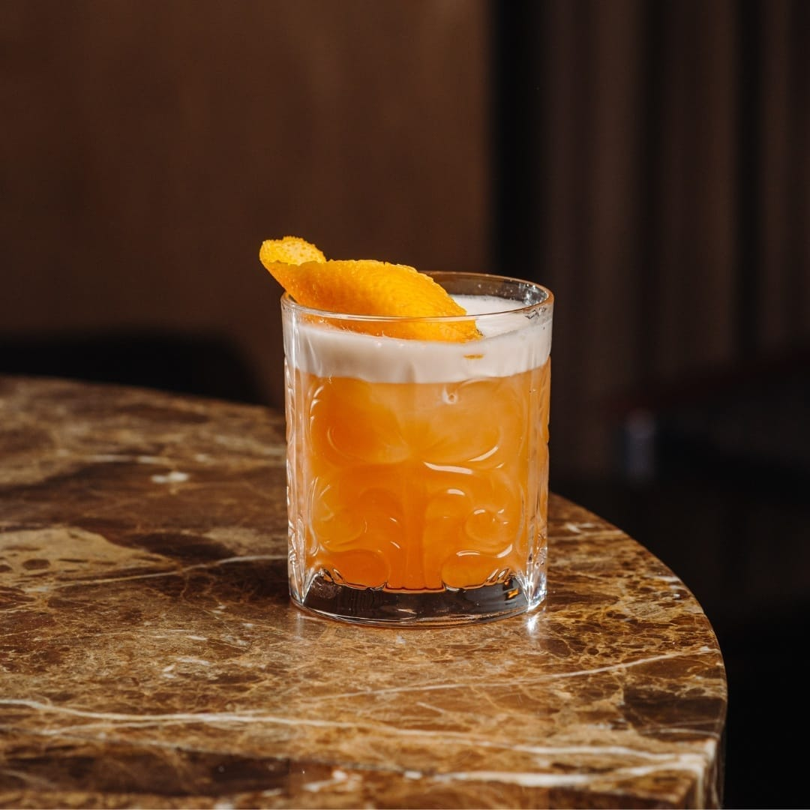

# Whisky Sour

*Bourbon, fresh lemon juice, sugar syrup, an egg white shaken hard for the silky foam: the great sweet-sour whiskey classic, born in 1860s New York.*

**Serves:** 1

**Prep Time:** 4 minutes

**Cook Time:** 0 minutes

## Overview
The Whisky Sour is the easiest entry into shaken cocktails, and the one that taught the rest of the world what an egg white does in a drink. The build is whisky, lemon juice, sugar (as a syrup), egg white, shaken first without ice (a "dry shake" to whip the white into foam) and then with ice to chill. The result has a creamy white head on top that takes an Angostura-bitters dot or two as a decoration; the drink underneath is sour and warm, the egg white smoothing out the bourbon's edges without you really tasting it. Skipping the egg white gives an "egg-less sour" which is fine but flatter. For the boozy who don't do raw egg, aquafaba (the chickpea brine from a tin) works almost identically. The garnish is a sliver of lemon peel and an optional maraschino cherry on a stick balanced across the rim.

## Ingredients

### Per glass
- 60 ml bourbon (or rye, or any decent whiskey)
- 25 ml fresh lemon juice
- 15 ml simple syrup (1:1 sugar dissolved in water; see [Lemonade](../classic/lemonade.md))
- 1 egg white (or 25 ml aquafaba/chickpea brine)
- Plenty of ice cubes
- 2 to 3 drops Angostura bitters (for decoration)

### To serve
- 1 wide strip of lemon peel
- 1 maraschino cherry on a cocktail stick (optional)
- A rocks glass with a single large ice cube

## Method

### Stage 1 - Dry shake
1. Pour the bourbon, lemon juice, simple syrup and egg white (or aquafaba) into a cocktail shaker.
1. Cap and shake hard for 15 seconds without ice; this whips the egg white into foam.
1. Listen for the change: the slosh starts thin and gets denser as the foam builds.

### Stage 2 - Wet shake
1. Open the shaker; add a generous handful of ice cubes.
1. Re-cap and shake hard for another 15 seconds; this chills and dilutes the drink while preserving the foam.

### Stage 3 - Strain
1. Double-strain through a fine sieve into a chilled rocks glass with a single large ice cube; the double-strain catches small ice shards that would punch through the foam.
1. The drink should land with a thick white foam crown.

### Stage 4 - Decorate
1. Drop 2 or 3 small drops of Angostura bitters on the surface of the foam; use a pin or a cocktail stick to drag them into swirls or hearts.
1. Express the lemon peel over the drink and tuck it on the rim.
1. Add a maraschino cherry on a cocktail stick if using.

### Stage 5 - Serve
1. Serve immediately, no straw; the foam is the point.

## Notes
- **Dry shake then wet shake.** The dry shake (no ice) whips the foam; the wet shake (with ice) chills the drink. Skipping the dry shake gives a thinner foam.
- **Aquafaba works.** For raw-egg avoiders or vegans, 25 ml of chickpea brine from a tin (drained, no chickpeas) gives an identical foam. Doesn't taste of chickpeas.
- **Fresh lemon juice always.** Same rule as the margarita; bottled lemon kills the drink.
- **Simple syrup, not granulated sugar.** Sugar refuses to dissolve cold; make the syrup once (a 1:1 dissolve of sugar in warm water) and keep it in a bottle for weeks.

## Variations
- **Amaretto Sour.** Replace the bourbon with amaretto (almond liqueur); slightly sweeter, slightly more almond. Bonus: float 5 ml bourbon on top for the boozy hybrid.
- **New York Sour.** A Whisky Sour with 15 ml of red wine (a Malbec or Shiraz) floated on top after shaking; the wine sinks slowly and creates a red layer at the bottom.
- **Pisco Sour.** Peruvian variant: replace the bourbon with pisco (Peruvian grape brandy) and add a dash of Angostura on the foam.
- **Boston Sour.** Same drink, served in a rocks glass without the egg white; called "boston" because Bostonians apparently don't trust raw egg.

## Storage
- Drink immediately; the foam settles in 5 minutes.
- A pre-mix of bourbon, lemon and syrup (sealed bottle, no egg) keeps in the fridge 2 weeks; shake fresh with the egg white per glass.
