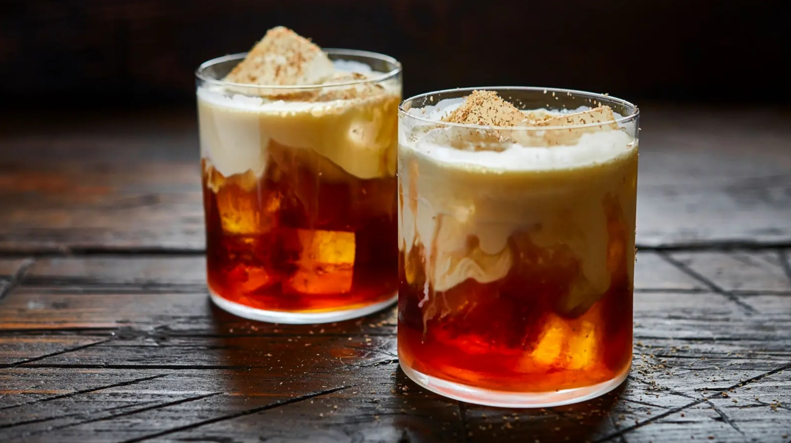

# White Russian

*Vodka, coffee liqueur, double cream floated on top: the after-dinner cocktail that the Dude drank twice in The Big Lebowski and the rest of us drank afterwards.*

**Serves:** 1

**Prep Time:** 2 minutes

**Cook Time:** 0 minutes

## Overview
The White Russian is the indulgent cousin of the Black Russian (vodka and Kahlúa over ice) made richer by floating double cream on top. The drink isn't Russian and wasn't invented in Russia; the name supposedly comes from the Russian-coded vodka in the build. The 1960s recipe used to come with the cream stirred in, but the modern bar style is to float it on top so the drinker stirs once at the table and watches the cream marble through. The build is simple: vodka and Kahlúa over a rocks glass full of ice, double cream poured slowly over the back of a barspoon so it sits in a layer on top. Garnish is optional; a few coffee beans or a sprinkle of cocoa work. The drink is unapologetically sweet and dessert-like; serve as a digestif after dinner, or as a quiet evening drink with a book and a film.

## Ingredients

### Per glass
- 50 ml vodka (any decent neutral one; Smirnoff is fine, Belvedere is overkill)
- 25 ml Kahlúa (or other coffee liqueur)
- 30 ml double cream (or single cream for a less rich drink)
- Plenty of ice cubes

### To serve (optional)
- 3 whole coffee beans
- A pinch of cocoa powder
- A grating of dark chocolate

## Method

### Stage 1 - Build the base
1. Fill a rocks glass with ice cubes.
1. Pour in the vodka.
1. Pour in the Kahlúa; stir briefly with a barspoon to combine.

### Stage 2 - Float the cream
1. Hold the back of a barspoon (or a teaspoon) just above the surface of the drink, rounded side up touching the ice.
1. Slowly pour the double cream over the back of the spoon; it should sit in a 1 cm layer on top of the vodka-Kahlúa mixture, white and slightly off-white where it kisses the dark liqueur.

### Stage 3 - Garnish and serve
1. If using, drop 3 coffee beans on top of the cream, dust with cocoa, or grate over a small amount of dark chocolate.
1. Serve immediately, no straw.
1. The drinker stirs once gently with the barspoon before drinking, watching the cream marble through.

## Notes
- **Double cream gives the right texture.** Single cream is too thin; whipping cream is too thick. Double cream sits well in a layer and stirs in cleanly.
- **Float, don't stir in.** The visual layer is the modern style; stirring everything in gives a uniform pale-brown drink that's less dramatic but still tastes good (this is the "Caucasian" the Dude orders).
- **Kahlúa or a coffee liqueur.** Kahlúa is the classic; Mr Black or Tia Maria work for less-sweet alternatives.
- **No straw.** The cream-and-vodka layers are the experience; a straw drags everything together.

## Variations
- **Black Russian.** Skip the cream entirely; vodka and Kahlúa over ice. The original 1949 recipe.
- **Mudslide.** Add Baileys Irish Cream and blend with ice; turns the drink into a dessert-style frozen drink.
- **White Mexican.** Replace the vodka with tequila blanco; the agave and coffee work surprisingly well together.
- **Coffee-toned White Russian.** Add a tablespoon of cold-brewed coffee with the Kahlúa for a more coffee-forward drink.

## Storage
- Drink immediately.
- The vodka-Kahlúa pre-mix keeps in a sealed bottle in the freezer indefinitely; add fresh cream on top per glass.
- Don't refrigerate finished drinks; the cream curdles in contact with the alcohol overnight.
