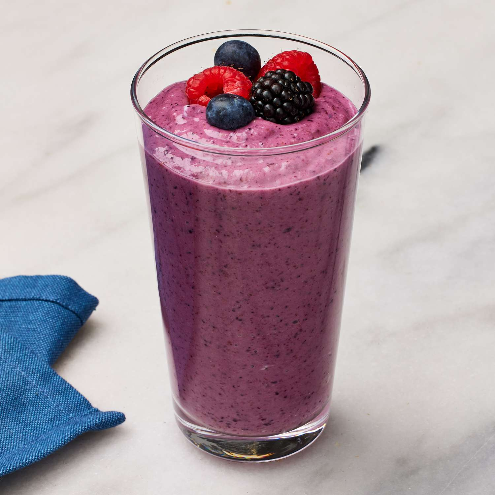

# Berry Smoothie

*Frozen mixed berries, full-fat yogurt, banana, a swirl of honey, blitzed thick enough to eat with a spoon.*

**Serves:** 2

**Prep Time:** 5 minutes

**Cook Time:** 0 minutes

## Overview
The smoothie that earns its keep on a Tuesday morning when breakfast feels like an obligation: frozen mixed berries do the chilling so you don't need ice (ice waters down the flavour), full-fat yogurt and a banana between them carry the creaminess, and a spoonful of honey takes the sharp edge off any tart fruit. The trick is the freezing: berries from the freezer aisle work brilliantly, but if you've got fresh berries that need using up, spread them on a tray and freeze them for an hour first; the texture goes from runny shake to thick spoonable smoothie in one step. Add a small splash of milk only if it won't blend; you want it thick. Pour into glasses with wide rims so the smoothie pours rather than sticks, top with a few extra berries and a drizzle of honey, and have a spoon ready in case it's properly thick.

## Ingredients

### Smoothie
- 300 g frozen mixed berries (or fresh berries frozen on a tray for an hour)
- 1 ripe banana (frozen is fine if you have one)
- 250 g full-fat plain yogurt (Greek-style ideal)
- 2 tablespoons runny honey (or maple syrup)
- 100 ml whole milk (or oat milk; add only if needed to get the blender moving)
- ½ teaspoon vanilla extract (optional)
- Pinch of fine salt

### To serve
- A small handful of fresh berries (for the top)
- A drizzle of honey
- A few mint leaves (optional)

## Method

### Stage 1 - Blend
1. Tip the frozen berries, banana, yogurt, honey, vanilla and salt into a blender.
1. Start on low for 5 seconds to break the frozen fruit, then ramp up to high for 30 to 45 seconds.
1. If the blender struggles or the smoothie won't move, add the milk a tablespoon at a time until it blends; don't add too much or you'll lose the thickness.

### Stage 2 - Adjust
1. Taste; some berries are sweeter than others. Add more honey if too tart, more lemon juice or yogurt if too sweet.
1. Check the consistency: it should be thick enough to coat a spoon but pour slowly from the blender jug.

### Stage 3 - Serve
1. Pour into two wide-rimmed glasses.
1. Scatter a few fresh berries on top, drizzle a little extra honey, and add a mint leaf if you have one.
1. Drink immediately or eat with a spoon if it ended up extra thick.

## Notes
- **Frozen fruit is the trick.** Ice waters the smoothie down; frozen fruit thickens it without diluting. Always have a bag of mixed berries in the freezer.
- **Banana does the heavy lifting.** Even half a banana adds creaminess and a natural sweetness. Frozen bananas (peeled, snapped in half, bagged) are one of the most useful things in a freezer.
- **Full-fat yogurt for body.** Low-fat reads thin and watery in a smoothie; if you don't want yogurt, swap in a tablespoon of nut butter for body.

## Variations
- **Berry and beetroot.** Add 50 g cooked beetroot (vacuum-packed is fine); turns the smoothie deep magenta and adds earthy depth.
- **Berry and chia.** Stir in 1 tablespoon of chia seeds before blending; gives the smoothie a faintly textured, pudding-like quality.

## Storage
- Best within 10 minutes of blending; separates and oxidises after that.
- Pour leftovers into ice-pop moulds and freeze for 2 months as fruit lollies.
- Don't refrigerate overnight: the smoothie thins, browns, and tastes flat the next day.
