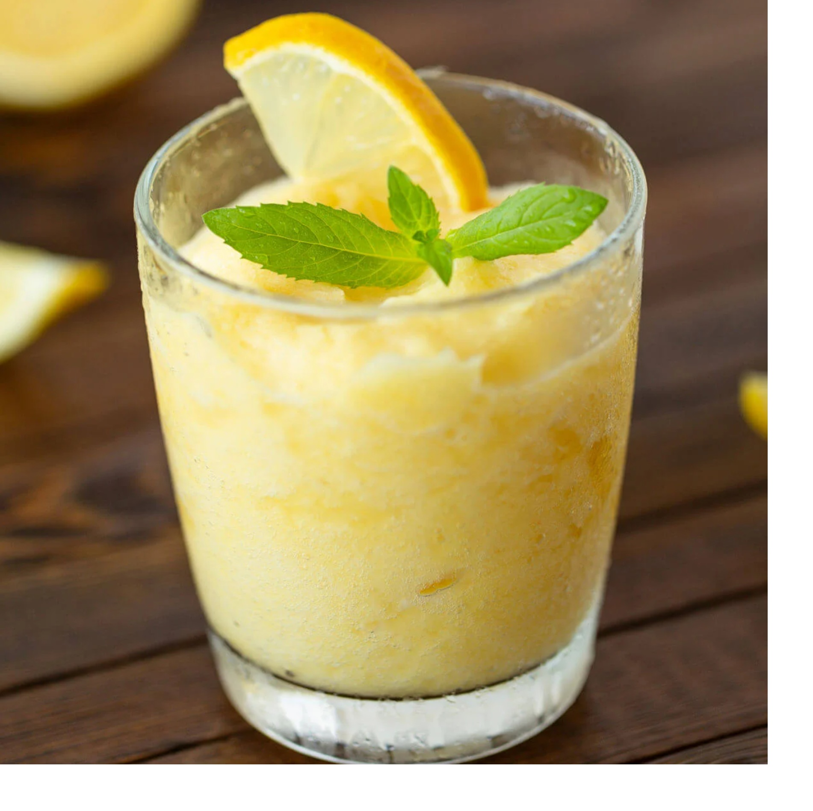

# Frozen Lemonade

*Lemonade taken to the blender: fresh lemon juice, sugar syrup, cold water and a tall pile of ice, blitzed to a thick pale-yellow slush. Sip-able through a thick straw, scoop-able with a spoon. The summer-fair / boardwalk drink, done properly at home.*

**Serves:** 4 tall glasses

**Prep Time:** 5 minutes

**Cook Time:** 0 minutes

## Overview
Frozen lemonade is essentially lemonade plus ice plus a blender. The two technical tricks that separate good frozen lemonade from a watery mess: (1) make a proper sugar syrup first by stirring sugar into hot water until dissolved, so the sweetness is pre-integrated and no gritty crystals sit at the bottom of the glass; (2) use enough ice - a serious quantity, blitzed hard with the lemonade base into a thick slush. The result is a deeply cold, sweet-tart, pale-yellow drink that's almost a sorbet you drink. American boardwalk stalls add yellow food colouring to make it more vivid; the homemade version skips the colouring and lets the natural pale-yellow of fresh lemons speak. Some versions add fresh strawberry purée (becomes strawberry-frozen lemonade) or fresh basil for sophistication; the plain version is the bedrock.

## Ingredients

- 200 ml fresh lemon juice (from 5-6 lemons)
- 150 g caster sugar
- 100 ml just-off-the-boil water (for making the syrup)
- 400 ml cold water
- 8 large handfuls of ice cubes (about 1 kg of ice - yes, that much)
- A pinch of fine salt

### To serve
- 4 tall glasses, chilled in the freezer for 10 minutes
- 4 thick straws
- Optional: a lemon wheel per glass

## Method

### Stage 1 - Make the sugar syrup
1. In a small heatproof jug, stir the sugar into the just-off-the-boil water until completely dissolved. The syrup will be clear and sweet.
1. Cool the syrup to room temperature (about 15 minutes), or speed-cool by adding a few ice cubes to it.

### Stage 2 - Combine the base
1. In a large jug, combine the cooled syrup, fresh lemon juice, cold water and pinch of salt.
1. Stir well.
1. Taste: it should be sharply sweet-tart. Adjust with more sugar (if too tart) or more lemon (if too sweet); the diluting effect of ice will dampen these, so over-correct slightly.

### Stage 3 - Blend with ice
1. Pour about a quarter of the lemonade base into a high-powered blender along with 2 large handfuls of ice.
1. Blitz on high for 30 seconds until thick and slushy.
1. Add another quarter of base and another 2 handfuls of ice; blitz again.
1. Continue in batches until all the base and ice are blended. The final consistency should be a thick pale-yellow slush - coat-a-spoon thick, with a slight slushie sluggish flow.

### Stage 4 - Serve
1. Pour into the chilled tall glasses.
1. Garnish with a lemon wheel on the rim if you like.
1. Serve immediately with thick straws - frozen lemonade melts fast.

## Notes
- **Sugar syrup first.** Skipping the syrup step and just dumping sugar in cold lemonade gives a gritty, badly-mixed drink. The hot-dissolve step matters.
- **Enough ice.** Frozen lemonade needs a serious amount of ice - about 250 g per glass. Less and you've made cold lemonade rather than frozen.
- **High-powered blender.** A weak blender struggles to crush this much ice. Vitamix or similar handles it; cheaper blenders may need to be done in 3-4 batches.
- **Salt pinch.** Amplifies the lemon brightness. Don't skip.

## Variations
- **Strawberry frozen lemonade.** Add 200 g hulled fresh strawberries to the blender at the same time as the lemonade base. Pink, sweeter, summer-festival style.
- **Mint frozen lemonade.** Add 8-10 fresh mint leaves to the blender. Bright herbal lift.
- **Basil frozen lemonade.** As above but with basil; more grown-up flavour.
- **Watermelon frozen lemonade.** Add 200 g chopped watermelon to the blender; reduce the lemon juice slightly.
- **Boozy version.** Add 30 ml vodka or limoncello per glass at the blending stage. The adult summer-cocktail version.

## Storage
- The lemonade base (without ice) keeps 3 days in the fridge sealed. The frozen / blended version doesn't store - it melts and separates within 30 minutes. Always blitz with ice to order.
