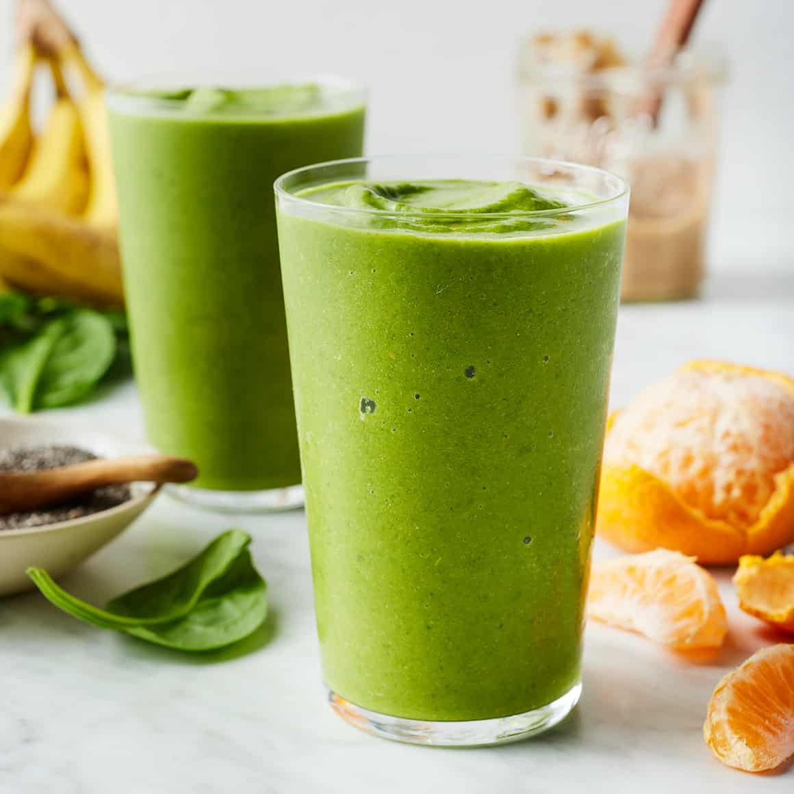

# Green Smoothie

*Spinach, banana, apple, lime, ginger, blitzed to a properly green and properly drinkable smoothie that doesn't taste like a lawn.*

**Serves:** 2

**Prep Time:** 5 minutes

**Cook Time:** 0 minutes

## Overview
A green smoothie done badly is liquid lawn; done well it's bright and tropical and you forget the spinach is in it. The trick is the ratio: about three parts fruit (banana for body, apple for sweetness, pineapple or mango if you have it) to one part greens, with a squeeze of lime to keep the colour from going brown and a knob of fresh ginger to give the back of the throat something to do. Frozen banana is the secret weapon, doing the chilling and the thickening together. Baby spinach is the right green to start with because it disappears completely; kale and chard are stronger and need scaling back until you've built up a tolerance. The drink should taste sweet and fruity first, herbaceous second, never grassy. Pour into a tall glass with a wide rim; drink it fast before the colour fades.

## Ingredients

### Smoothie
- 2 large handfuls baby spinach (about 60 g)
- 1 ripe banana (frozen ideal; peel, snap in half, bag and freeze ahead)
- 1 crisp apple (Granny Smith for sharpness, Pink Lady for sweetness; cored and chopped)
- ½ ripe avocado (optional, for silkier body)
- 200 ml cold apple juice (cloudy is more interesting than clear) or coconut water
- 100 g pineapple chunks (fresh or frozen)
- 1 tablespoon fresh lime juice
- 1 cm fresh ginger (peeled, finely grated)
- 1 tablespoon honey or maple syrup (optional, depends on the apple)
- 6 ice cubes (skip if using frozen banana and pineapple)

### To serve
- A slice of lime
- A few mint leaves
- A tablespoon of toasted seeds (pumpkin, sunflower, hemp; optional)

## Method

### Stage 1 - Layer the blender
1. Tip the apple juice into the blender first; liquid at the bottom helps the blade get going.
1. Add the spinach, banana, apple, avocado (if using), pineapple, lime juice, ginger and honey.
1. Top with the ice if needed.

### Stage 2 - Blend
1. Start on low for 5 seconds to break the spinach, then ramp up to high.
1. Blend for 45 to 60 seconds until completely smooth and uniformly green; if the spinach is still visible as flecks, give it another 15 seconds.

### Stage 3 - Adjust and serve
1. Taste; if too tart, add a teaspoon more honey; if too thick, splash in more apple juice or water.
1. Pour into two tall glasses.
1. Garnish with a slice of lime, a couple of mint leaves, and a scatter of toasted seeds if using.

## Notes
- **Frozen banana over ice.** Ice waters down; frozen banana thickens. If you don't have frozen banana, use 6 ice cubes plus an extra half banana fresh.
- **Spinach is the beginner green.** It blends to invisibility. Kale, chard, romaine and rocket are all options for the more adventurous; start at half quantity and build up.
- **Lime keeps it green.** Without it the smoothie turns brown within 5 minutes. Acid pauses the oxidation.
- **Ginger gives backbone.** Without it the drink can read sweet and floppy; a knob brings the whole thing to life.

## Variations
- **Tropical green.** Swap apple juice for coconut water, apple for mango, and add a teaspoon of grated turmeric for the bright yellow-green colour.
- **Protein green.** Add a scoop of vanilla or plain protein powder for a post-workout drink.

## Storage
- Drink within 10 minutes of blending; the colour browns and the smoothie separates after that.
- Pour leftovers into ice-pop moulds and freeze for 2 months as green lollies.
- Don't refrigerate overnight: the apple oxidises and the colour goes off.
