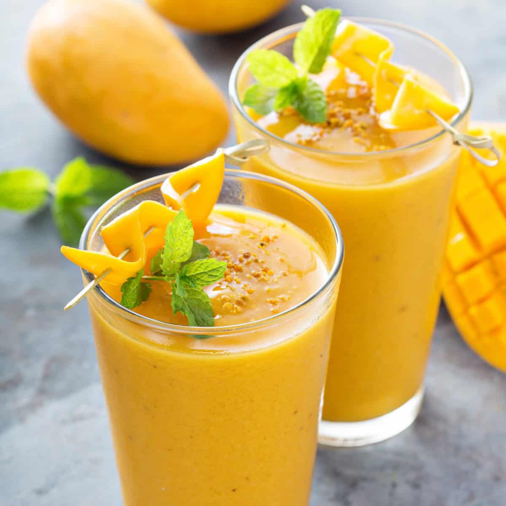

# Mango Smoothie

*The simplest, brightest mango drink: ripe mango blended with milk, a ripe banana for body, a touch of honey, vanilla and ice. Thick, golden, breakfast-friendly. The pure-mango answer to the question "what should I do with these ripe mangoes?"*

**Serves:** 4 tall glasses

**Prep Time:** 5 minutes

**Cook Time:** 0 minutes

## Overview
Where mango lassi leans on yogurt and cardamom for a South Asian profile, mango smoothie keeps things simple and lets the fruit speak. Ripe mango, cold milk (or oat / almond milk for a dairy-free version), one ripe banana for natural thickness and sweetness, a small spoon of honey, a few drops of vanilla, ice. Blend hard and you've got a deep gold, thick, drinkable smoothie that tastes mostly of mango with a soft banana background. Best with the truly ripe Ataulfo / Honey / Kent mangoes (they bend slightly to thumb pressure and smell sweet at the stem); fibrous unripe mangoes give a stringy, less interesting drink. Drink immediately from a tall glass with a wide straw; this is the smoothie that converts skeptics.

## Ingredients

- 2 ripe mangoes (Ataulfo / Honey / Kent — about 400 g of peeled flesh) OR 400 g tinned Alphonso / Kesar mango pulp
- 1 ripe banana, peeled
- 400 ml cold whole milk (or oat milk / almond milk for a dairy-free version)
- 2 tablespoons honey (or maple syrup for vegan)
- 1/2 teaspoon vanilla extract
- A pinch of fine salt
- A handful of ice cubes (about 8)

### To serve
- 4 tall glasses, chilled
- Optional: a small wedge of fresh mango on the rim
- Optional: a sprig of fresh mint

## Method

### Stage 1 - Prep the mango
1. Peel the mangoes, slice the flesh away from the central stone, and chop into rough chunks. Discard the stones (or chew the remaining flesh straight off them as a cook's reward).
1. If using tinned pulp, just open the tin.

### Stage 2 - Blend
1. Put the mango, banana, milk, honey, vanilla, salt and ice cubes into a high-powered blender.
1. Blitz on high for 45-60 seconds until completely smooth, thick and golden.

### Stage 3 - Taste and adjust
1. Taste. The smoothie should be sweet, distinctly mango-forward, with a gentle banana background. If too thick, add a splash more milk. If too tart (under-ripe mangoes), add another tablespoon of honey.

### Stage 4 - Serve
1. Pour into chilled tall glasses.
1. Garnish with a small wedge of fresh mango clipped on the rim and a mint sprig.
1. Serve immediately with a wide straw.

## Notes
- **Ripe mango is everything.** Under-ripe mango is stringy, fibrous and tart. Ripe mango is sweet, smooth and creamy. The smoothie can only be as good as the fruit.
- **Banana is the secret thickener.** A single ripe banana gives the smoothie its proper milkshake-like body without needing yogurt or ice cream. Don't skip.
- **Salt pinch.** A tiny pinch of salt amplifies the mango sweetness; without it the drink can taste flat.
- **Cold ingredients.** Milk from the fridge, ice from the freezer. Don't blend with room-temperature ingredients — the drink should be deeply cold from the first sip.

## Variations
- **With coconut milk.** Replace half the milk with full-fat coconut milk for a richer tropical version.
- **With ginger.** Add a 1 cm piece of fresh ginger to the blender for a brighter, slightly spicy lift.
- **Frozen.** Use frozen mango chunks and skip the ice. Thicker, more like a sorbet-drink.
- **Mango-passionfruit.** Add the pulp of 1 ripe passionfruit at the blending stage. Sharper acid balance.
- **Vegan.** Use oat milk + maple syrup instead of milk + honey.

## Storage
- Best fresh. Keeps 8 hours in the fridge sealed; the banana darkens the smoothie and the texture goes thin after that.
- Don't freeze; texture is destroyed.
