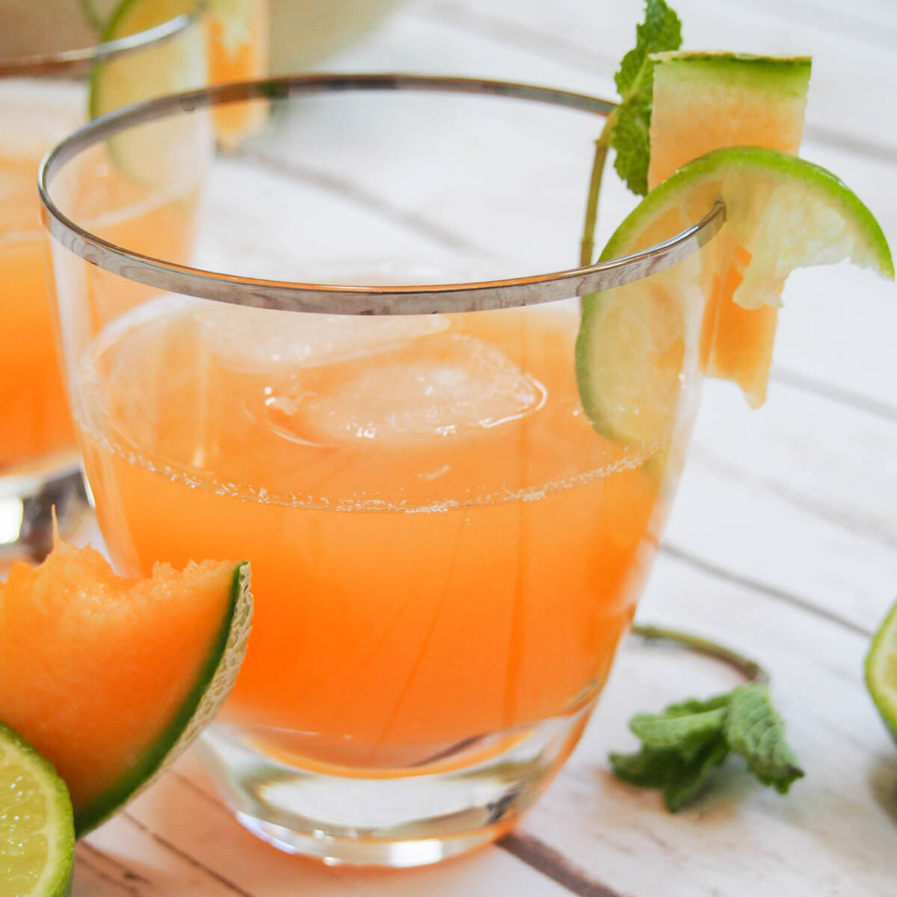

# Melon Agua Fresca

*Cool ripe cantaloupe (or honeydew) blended with cold water, a touch of lime and a small spoon of honey, strained through a sieve into a tall jug, served over ice with mint. Pale-coral or pale-green, faintly sweet, deeply refreshing, the Mexican summer drink that doesn't depend on hibiscus or tamarind.*

**Serves:** 6 tall glasses (makes 1.5 litres)

**Prep Time:** 10 minutes

**Cook Time:** 0 minutes

## Overview
Aguas frescas ("fresh waters") are the everyday Mexican fruit drinks, fruit blended with water, sweetened, strained, served cold. Where horchata uses rice and cinnamon, jamaica uses hibiscus, and tamarindo uses tamarind pods, melon agua fresca uses fresh melon. Cantaloupe gives a pale coral colour and a faintly musky-sweet flavour; honeydew gives a pale green colour and a cleaner, lighter sweetness; watermelon (with its own recipe in this section) is its own drink. The technique is the same as horchata: blend with water and sweetener, strain, chill, serve over ice. The drink is lighter than juice, the strain dilutes the fruit and lets the water do half the work. Common in Mexican taquerías as one of the daily aguas, sold in glass barrels alongside its more famous siblings.

## Ingredients

- 1 ripe cantaloupe or honeydew melon (about 1.5 kg whole; ripe means the stem-end yields to thumb pressure and smells sweet)
- 1 litre cold water
- Juice of 2 limes
- 3 to 4 tablespoons honey (or agave syrup, or caster sugar), to taste
- A pinch of fine salt

### To serve
- Plenty of ice cubes
- 6 tall glasses, chilled
- 6 mint sprigs
- Optional: a small slice of melon on each rim

## Method

### Stage 1 - Prep the melon
1. Halve the melon, scoop out the seeds and discard.
1. Slice the flesh away from the rind and chop into rough chunks. You should get about 800-1000 g of flesh.

### Stage 2 - Blend
1. Put the melon chunks, 500 ml of the cold water, lime juice, 3 tablespoons of honey and salt into a high-powered blender.
1. Blitz on high for 45 seconds until completely smooth.

### Stage 3 - Strain (optional)
1. For the cleaner Mexican-stall look: set a fine sieve over a large jug and pour the blend through, pressing the pulp gently with the back of a spoon. Discard the solids.
1. For the rustic version: skip the strain. Both are valid; Mexican taqueria versions are typically strained.

### Stage 4 - Dilute
1. Add the remaining 500 ml of cold water to the jug; stir well.
1. Taste: the drink should be lightly sweet, distinctly melon, with a faint lime brightness. Add another tablespoon of honey if too flat; another squeeze of lime if too cloying.

### Stage 5 - Chill
1. Refrigerate at least 1 hour. The flavour deepens slightly cold.

### Stage 6 - Serve
1. Fill chilled tall glasses with ice cubes.
1. Pour the chilled agua fresca over.
1. Garnish with a mint sprig and (optionally) a small slice of melon on the rim.
1. Serve immediately.

## Notes
- **Ripe melon is essential.** Under-ripe melon gives a flat, watery drink. The stem-end should yield to thumb pressure and smell sweet through the rind.
- **Salt pinch.** Tiny amount amplifies the natural melon sweetness. Don't skip.
- **Strain optional.** Strained = café/stall look; unstrained = rustic with more body. Both work.
- **Don't over-sweeten.** Aguas frescas are properly light; they shouldn't taste like fruit juice. 3 tablespoons of honey to 1.5 litres is the right starting point.

## Variations
- **With cucumber.** Add half a cucumber (peeled, seeded) to the blender. Lighter, more refreshing; common Mexican variant.
- **Watermelon-melon mix.** Half cantaloupe, half watermelon. Pale pink, sweeter, kids' favourite.
- **With basil or mint.** Add 8-10 fresh basil or mint leaves to the blender. Bright herbal twist; works especially well with honeydew.
- **Sparkling.** Top each glass with cold soda water for a fizzy version. Less traditional but lovely on hot days.

## Storage
- Refrigerate up to 2 days in a sealed jug. After day 2 the melon flavour fades and the drink develops a slightly off taste.
- Shake or stir well before pouring, the melon pulp settles in unstrained versions.
