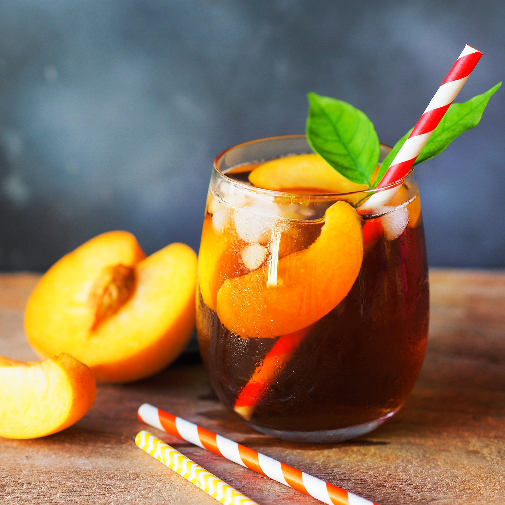

# Peach Iced Tea

*Tea brewed strong with fresh peach slices and a strip of lemon peel, sweetened while hot, chilled and poured over ice with fresh peach pieces floating in the glass. Brighter and more peach-forward than the bottled version, with none of the syrup-sweetness.*

**Serves:** 6 tall glasses (makes 1.5 litres)

**Prep Time:** 10 minutes

**Cook Time:** 8 minutes (plus 3 hours chilling)

## Overview
Bottled peach iced tea has the right idea but the execution is mostly sugar syrup and peach flavouring. The homemade version is a different drink: strong black tea brewed with sliced ripe peaches steeping alongside, sweetened lightly while hot, chilled hard, then served over ice with fresh peach pieces floating in each glass. The peach flavour comes from real fruit, the tea base is properly bracing rather than swamped, and you can adjust sweetness to taste. White tea or green tea work for a more delicate version; black tea (English Breakfast, Ceylon, or a Southern Sweet Tea-style blend) gives the proper iced-tea body. The drink improves overnight in the fridge as the peaches macerate further.

## Ingredients

- 6 black tea bags (or 4 tablespoons loose black tea, Ceylon, English Breakfast, or a similar everyday black)
- 4 ripe peaches (white or yellow flesh; should yield to gentle thumb pressure)
- A 5 cm strip of unwaxed lemon peel
- 1.5 litres water
- 80 to 120 g caster sugar, to taste
- Juice of 1 lemon
- A pinch of fine salt

### To serve
- Plenty of ice cubes (crushed gives the best Southern look)
- 6 tall glasses, chilled
- Optional: fresh mint sprigs

## Method

### Stage 1 - Slice the peaches
1. Wash and slice 3 of the peaches into rough 1 cm chunks (skin on is fine; the colour and flavour are in the skin). Reserve the 4th peach to slice fresh for serving.

### Stage 2 - Brew
1. Bring 500 ml of the water to a hard rolling boil.
1. Place the tea bags (or loose tea in a sieve), 3 chopped peaches, lemon peel and pinch of salt into a heatproof jug.
1. Pour the boiling water over and let steep 5 minutes, strong, dark brew, with the peaches releasing their juices into the hot water.

### Stage 3 - Sweeten and combine
1. Remove the tea bags (squeeze gently to extract).
1. While the brew is still hot, stir in 80 g of sugar until fully dissolved. Taste, peach iced tea is properly sweet but not as sweet as full Southern sweet tea; start at 80 g for 1.5 litres and adjust up to 120 g.
1. Add the remaining 1 litre of cold water to the jug; stir in the lemon juice.

### Stage 4 - Strain and chill
1. Strain the brew through a fine sieve into a clean pitcher, pressing the peach pieces gently to extract every drop of juice. Discard the spent peach solids and lemon peel.
1. Refrigerate at least 3 hours, ideally overnight. The flavour deepens as it cools.

### Stage 5 - Serve
1. Slice the reserved fresh peach into thin slices.
1. Fill chilled tall glasses with crushed ice.
1. Pour the chilled peach tea over.
1. Add 2-3 fresh peach slices to each glass; optionally a mint sprig.
1. Serve immediately with a long spoon or a wide straw.

## Notes
- **Ripe peaches.** Under-ripe peaches give a flat, less interesting tea. Ripe peaches yielding to thumb pressure are right; over-ripe peaches with bruises also work as long as the flesh isn't off.
- **Skin on.** The peach skin contains most of the flavour compounds. Don't peel.
- **Sweet while hot.** Sugar dissolves into hot brew cleanly; cold sugar sits gritty at the bottom. Always sweeten at the brew stage.
- **Salt pinch.** Tiny amount of salt amplifies the peach sweetness without being noticeable. Don't skip.

## Variations
- **With green tea.** Use 4 green tea bags instead of black; more delicate, brighter, less tannic. Brew for 3 minutes (not 5).
- **With white tea.** Same as green but even more delicate. Best with very ripe white peaches.
- **Sparkling peach iced tea.** Pour over ice and top each glass with cold soda water for a fizzy version.
- **With ginger.** Add a 3 cm piece of sliced ginger to the brew. Sharper, more sophisticated.
- **With basil.** Add 5-6 fresh basil leaves to the chilled jug for an hour before serving. The fancy summer-supper version.

## Storage
- Refrigerate up to 5 days in a sealed pitcher. The flavour stays bright for the first 3 days, then mellows.
- The fresh peach slices added at serving don't store; add them per-glass.
