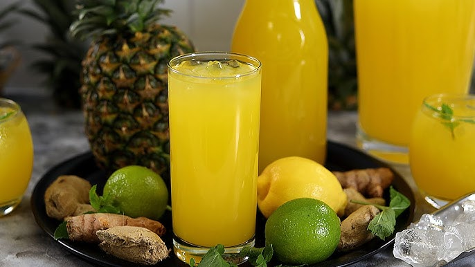

# Pineapple Ginger Juice

*The vivid yellow morning glass: ripe fresh pineapple blended with a generous chunk of ginger, a squeeze of lime, a touch of honey, strained and served deeply cold over ice. Sweet, bright, sharply ginger-warm. The post-workout drink, the smoothie-cleanse drink, the just-tastes-good drink.*

**Serves:** 4 tall glasses

**Prep Time:** 8 minutes

**Cook Time:** 0 minutes

## Overview
Pineapple and ginger sit together naturally - the sweet pineapple meets the bright ginger heat, lime juice ties them together with acid, a touch of honey rounds the edges. The result is a vivid yellow drink that drinks like a fresh juice but with a clean ginger snap on the back of the throat. Strain it through a fine sieve for the smooth juice-bar version, or leave the pulp in for a textured drink with body. Either way it's deeply hydrating and built for a hot afternoon or a slow morning. Used as the base for the Caribbean classic "Jamaican pineapple ginger drink" and in modern juice-bar cleanse menus across the West.

## Ingredients

- 1 large ripe pineapple (about 1 kg whole; gives roughly 600 g of flesh)
- 40 g fresh ginger, peeled and sliced
- Juice of 1 lime
- 2 tablespoons honey (or maple syrup for vegan)
- 400 ml cold water
- A pinch of fine salt
- Plenty of ice cubes

### To serve
- 4 tall glasses, chilled
- Optional: a thin slice of fresh pineapple per glass
- Optional: a mint sprig per glass

## Method

### Stage 1 - Prep the pineapple
1. Cut the top and base off the pineapple. Slice off the skin (cutting downward, removing the eyes). Quarter lengthwise and trim out the tough central core.
1. Chop the flesh into rough chunks.

### Stage 2 - Blend
1. Put the pineapple chunks, ginger slices, lime juice, honey, water and salt into a high-powered blender.
1. Blitz on high for 60 seconds until completely smooth and pale yellow-orange.

### Stage 3 - Strain (optional)
1. For the smooth juice-bar version: set a fine sieve over a large jug, pour the blend through, press the pulp with the back of a spoon to extract every drop.
1. For the textured version: skip the strain and pour straight from the blender.

### Stage 4 - Taste and adjust
1. Taste. The drink should be sweet, distinctly pineapple-forward, with a clear ginger kick. Add more honey if too sharp (under-ripe pineapples can taste flat); add more ginger if you want extra heat.

### Stage 5 - Serve
1. Pour over ice into tall glasses.
1. Garnish with a slice of fresh pineapple and a mint sprig if using.
1. Serve immediately.

## Notes
- **Ripe pineapple is essential.** Tap the pineapple at the side - a hollow ripe-pineapple sound is right; a dull thud means it's under-ripe. The base should smell sweet; that means it's ready.
- **Don't skip the core trim.** The tough central core of a pineapple is tough and gives the drink an off-putting fibrous texture even after blending. Trim it out.
- **Salt pinch.** Amplifies sweetness; without it the drink can taste flat.
- **Strain vs not.** Strained gives a clean juice-bar appearance; unstrained is rustic and has more body / fibre. Both are valid.

## Variations
- **With turmeric.** Add a 2 cm piece of fresh turmeric root to the blender. Deeper golden colour, earthy warmth; popular in modern wellness drinks.
- **With mint.** Add 10-15 fresh mint leaves to the blender. Bright herbal twist.
- **Sparkling.** Strain, then top each glass with cold soda water at serving for a fizzy version.
- **Spicy.** Add a pinch of cayenne or a tiny piece of fresh chilli to the blender for a serious kick. The Caribbean "spicy ginger" variant.

## Storage
- Refrigerate up to 2 days in a sealed jug. The ginger and pineapple flavours stay bright for the first day, then mellow.
- The unstrained version separates fast (the pulp settles); shake before pouring.
