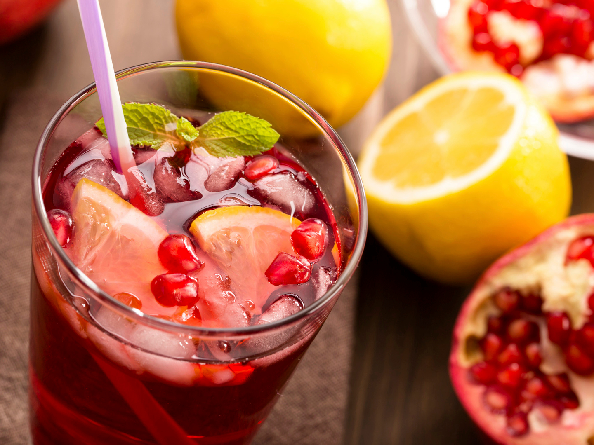

# Pomegranate Cooler

*Fresh pomegranate juice sharpened with lime, lightly sweetened with honey, topped with cold soda water and crowned with fresh pomegranate arils floating in the glass. Deep ruby-red, bright, faintly tart, sophisticated enough for a dinner-party non-alcoholic option.*

**Serves:** 4 tall glasses

**Prep Time:** 8 minutes

**Cook Time:** 0 minutes

## Overview
Pomegranate cooler is the elegant non-alcoholic drink - adult enough to serve at a dinner party, refreshing enough for an afternoon in the garden. The base is real pomegranate juice (extracted from fresh pomegranates if you've got the patience, or bought from the supermarket as 100% juice for the easier route). A squeeze of lime brightens the natural tartness; honey rounds the edges; cold soda water on top adds bubbles and dilutes the syrupy intensity of pure pomegranate juice. The finishing touch is a tablespoon of fresh pomegranate arils dropped into each glass - they sink to the bottom and you fish them out with a long spoon as you drink. The drink reads beautifully visually (deep ruby with ruby-jewel arils floating) and works equally well at brunch, lunch and a late-evening before bed.

## Ingredients

- 600 ml fresh pomegranate juice (from about 4 ripe pomegranates, OR 600 ml of 100% pomegranate juice from a bottle - Pom Wonderful brand is reliable)
- Juice of 2 limes
- 3 to 4 tablespoons honey, to taste (more if your juice is very tart)
- 400 ml cold sparkling / soda water
- 4 tablespoons fresh pomegranate arils (from 1 small pomegranate, set aside)
- A pinch of fine salt

### To serve
- Plenty of ice cubes
- 4 tall glasses, chilled
- Optional: fresh mint sprigs

## Method

### Stage 1 - Prep the juice
1. If using fresh pomegranates: cut each in half, hold cut-side down over a bowl, and thwack the back of the pomegranate with a wooden spoon. The arils will fall out into the bowl. Once you have the arils, set aside 4 tablespoons of whole arils for garnish. Press the rest through a fine sieve with the back of a spoon to extract juice. You should get about 600 ml from 4 pomegranates.
1. If using bottled juice: just measure out 600 ml.

### Stage 2 - Mix the base
1. In a large jug, combine the pomegranate juice, lime juice, 3 tablespoons of honey and the pinch of salt.
1. Whisk until the honey dissolves fully.
1. Taste: it should be tart with a clean sweet finish. Add another tablespoon of honey if too sharp; another squeeze of lime if too sweet.

### Stage 3 - Chill the base
1. Refrigerate the base for at least 30 minutes; the flavours meld.

### Stage 4 - Build the glasses
1. Fill 4 chilled tall glasses three-quarters full with ice cubes.
1. Pour the chilled pomegranate base over the ice, filling each glass about two-thirds.
1. Top each with about 100 ml of cold sparkling water.
1. Scatter 1 tablespoon of fresh pomegranate arils into each glass - they sink and float intermittently as you drink.
1. Garnish each with a mint sprig if using.

### Stage 5 - Serve
1. Stir lightly with a long spoon before serving.
1. Drink with a wide straw and a spoon for fishing the arils.

## Notes
- **Real pomegranate juice.** Use 100% pomegranate juice or fresh-extracted. "Pomegranate-flavoured" cocktail mixers are mostly sugar syrup with food colouring; they won't give the right flavour.
- **Salt pinch.** Amplifies the natural sweetness without being noticeably salty. Don't skip.
- **Sparkling at the glass, not the jug.** If you pre-mix the sparkling water into the base, the bubbles dissipate within 10 minutes. Always add sparkling water at the glass.
- **Fresh arils as garnish.** The arils are half the visual appeal. Don't substitute with dried cranberries or anything else - fresh pomegranate seeds are the right thing.

## Variations
- **With rose water.** Add 1/2 teaspoon of rose water to the base. Floral, Middle Eastern lift.
- **With basil.** Add 6-8 fresh basil leaves to the base before chilling; strain before serving. Sophisticated dinner-party version.
- **With ginger.** Add a 2 cm piece of fresh ginger to the base; muddle gently or strain after 30 minutes of chilling. Adds warmth.
- **Cocktail version.** Add 30 ml vodka or gin per glass. Becomes a pomegranate spritz.

## Storage
- The pre-mixed base (without sparkling water) keeps 3 days sealed in the fridge.
- Don't add the sparkling water in advance; assembled drinks go flat fast.
- Fresh pomegranate arils keep 5 days in a sealed container in the fridge.
